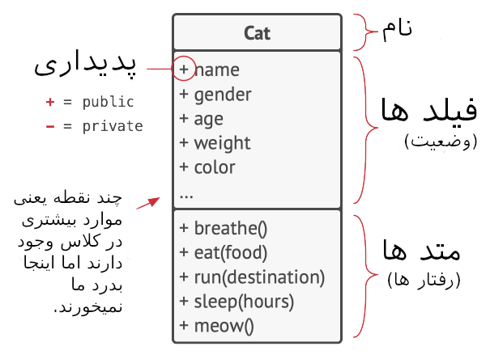
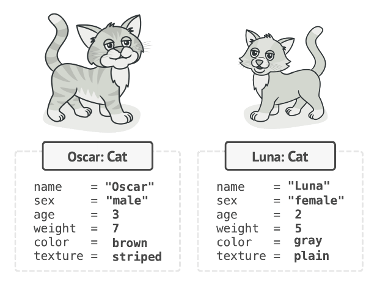
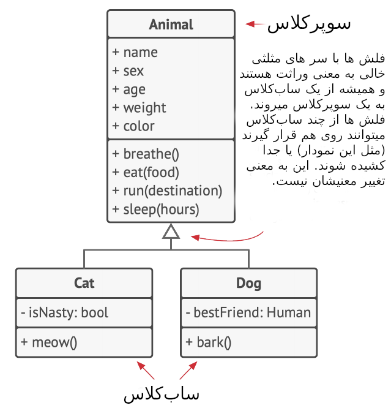
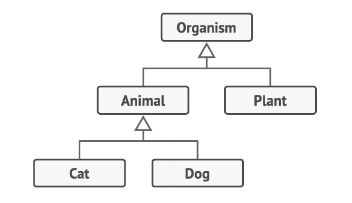
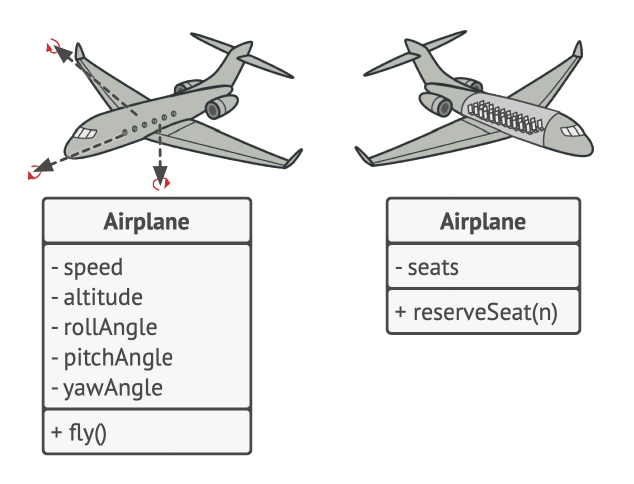
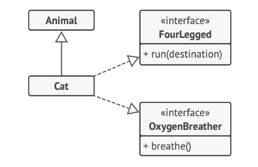
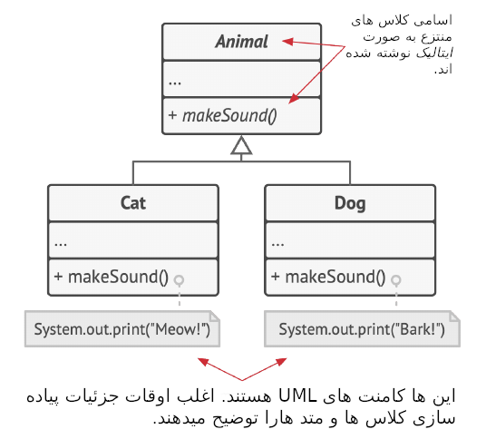
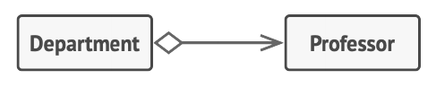
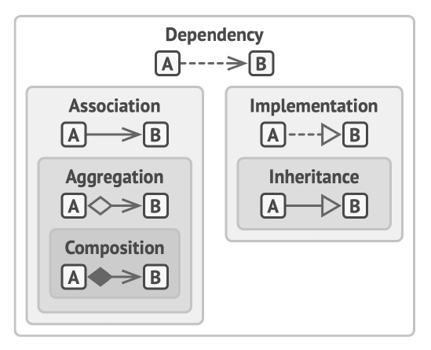

# مقدمه ای بر OOP
## مبانی OOP
برنامه نویسی شیء گرا یا OOP(**O**bject **O**riented **P**rogramming) یک الگو بر پایه بسته بندی تکه های اطلاعات، و رفتار های مرتبط با آن ها، در دسته های مخصوصی به نام **اشیاء** که از "طرح اولیه" ای ساخته شده توسط برنامه نویس به نام **کلاس** ها ایجاد می شوند، است.  

 ### اشیاء، کلاس ها

از گربه ها خوشتان میاید ؟ امیدوارم که اینطور باشد چون سعی می کنم مباحث OOP را با استفاده کردن از گربه ها یاد بدهم.



*این یک نمودار کلاس UML است. چنین نمودار هایی را در کتاب زیاد خواهید دید.*

برای مثال، تصور کنید گربه ای به نام Oscar دارید. Oscar یک شیء است، یک نمونه از کلاس Cat. هر `cat` صفت های استاندارد بسیاری دارد : اسم، سن، جنسیت، وزن، رنگ، غذای موردعلاقه و غیره.این ها فیلد(Field) های کلاس هستند.
همه گربه ها نیز رفتار مشابهی دارند: نفس می کشند، غذا می خورند، می‌دوند، می‌خوابند و میو میو می‌کنند. این ها متد(Method) های کلاس هستند.
در مجموع، فیلد ها و متد ها به عنوان  اعضاء کلاس نیز شناخته می‌شوند.
اطلاعات ذخیره شده در فیلد های شیء معمولا به نام وضعیت شناخته می‌شوند و تمامی متد های شیء رفتار آن را تعریف می کنند.



*اشیاء نمونه های کلاس ها هستند.* 

لونا، گربه ی دوستتان، نیز نمونه ای از  کلاس `Cat` است. همان صفت های Oscar را دارد. تفاوتشان در مقادیر این صفت هاست. جنس آن ماده است، رنگ متفاوت و وزن کمتری دارد.
پس یک *کلاس* مانند یک طرح اولیه است که ساختار اشیاء را که نمونه های واقعی آن کلاس هستند، را تعریف می کند. 
## سلسله مراتب کلاس ها
وقتی در مورد یک کلاس صحبت میکنیم همه چیز خوب و مرتب است. طبیعتاً یک برنامه ی واقعی شامل بیشتر از یک کلاس است. برخی از این کلاس ها ممکن است در سلسله مراتب کلاس ها سازماندهی شوند. بیاید بفهمیم این به چه معناست.
تصور کنید همسایه‌تان سگی به اسم Fido دارد. به نظر می‌رسد، سگ ها و گربه ها اشتراکات زیادی دارند: اسم، جتسیت، سن و رنگ صفات مشترک گربه ها و سگ ها است. سگ ها می‌توانند مثل گربه ها نفس بکشند، بخوابند و بدوند. پس انگار که ما می‌توانیم کلاس پایه `Animal` را تعریف کنیم که صفات و رفتار های مشترک را لیست کند. 
یک کلاس والد، مانند کلاسی که به تازگی تعریف کردیم،  یک **سوپرکلاس** است. کلاس های فرزند، **ساب‌کلاس** هستند.  ساب‌کلاس ها رفتار و وضعیتشان را از والدشان به ارث می‌برند و فقط صفات یا رفتارهایی را تعریف می‌کنند که متفاوت است. بنابراین، کلاس  `Cat` متد `meow‍` را دارد، و کلاس `Dog` متد `bark`.



*نمودار UML یک سلسله مراتب کلاس. تمامی کلاس های این نمودار بخشی از سلسله مراتب کلاس `Animal` هستند.*
 
با فرص اینکه ما یک پیشنیاز کاری مرتبط داریم، می‌توانیم از این هم فراتر رویم و یک کلاس عمومی تر برای تمامی موجودات زنده به نام `Organism`  بسازیم که تبدیل به یک سوپرکلاس برای `Animals` و `Plants` می‌شود. اینچنین هرم کلاس  ها، **سلسله مراتب** است. در چنین سلسله ای، کلاس `Cat` همه چیز را  از هردو کلاس `Animal` و `Organism` به ارث می‌برد.



*کلاس ها در یک نمودار UML می‌توانند ساده شوند اگر نشان دادن روابط آنها مهم تر از محتوای آنها باشد.* 

ساب‌کلاس ها می‌توانند رفتار هایی که به ارث می‌ برند را از نو نویسی کنند. یک ساب‌کلاس می تواند کاملا تمامی رفتار های پیشفرض را جایگزین کند یا تنها چند چیز اضافه کند. 
# اصول OOP


برنامه نویسی شیء گرا بر چهار اصل استوار است، مفاهیمی که آن را از بقیه ی الگوهای برنامه نویسی متمایز می کند. 
## (Abstraction) انتزاع
بسیاری  از اوقات هنگامی که یک برنامه  OOP می سازید، اشیاء برنامه را بر اساس اشیاء دنیای واقعی شکل می دهید. اما، اشیاء در برنامه ها، اشیاء دنیای واقعی را با دقت 100٪ نشان نمی‌ دهند ( و به ندرت لازم است که بدهند). 
در عوض، اشیاء شما فقط ویژگی ها و رفتار های اشیاء واقعی را در یک زمینه خاص *مدل سازی* میکنند و بقیه را نادیده می‌گیرند.  
برای مثال، یک  کلاس `Airplane` میتواند هم در یک شبیه ساز پرواز و هم در یک برنامه ی رزرو پرواز وجود داشته باشد.  در حالی که کلاس اولی جزئیات مربوط به پرواز را داشته باشد، اما کلاس دومی فقط نقشه صندلی ها و اینکه کدام صندلی ها در دسترس هستند.



*مدل های مختلفی از یک شیء یکسان واقعی.*

انتزاع مدلی از یک شیء یا پدیده ای در دنیای واقعی، محدود به زمینه ای خاص است که تمامی جزئیات مرتبط با این زمینه را با دقت بسیار زیاد نمایش و مابقی را حذف میکند.

## (Encapsulation) کپسوله‌ سازی
* برای روشن کردن موتور خودرویی، فقط باید کلیدی را بچرخانید یا دکمه ای را فشار دهید.  نیازی به اتصال سیم ها به زیر کاپوت، چرخاندن میل لنگ و سیلندرها و شروع چرخه قدرت موتور ندارید.  این جزئیات زیر کاپوت ماشین مخفی اند. شما فقط یک رابط ساده دارید: یک دکمه، یک فرمان و چند پدال. این نشان میدهد که چگونه هر شیء یک رابط دارد - یک جزء عمومی شیءای که برای تعامل با اشیاء دیگر باز است. 
کپسوله سازی توانایی یک شیء است  برای پنهان کردن بخش هایی از وضعیت و رفتار های خود از اشیاء دیگر، و تنها در معرض قرار دادن یک رابط محدود به بقیه ی برنامه.
کپسوله کردن چیزی یعنی  `private` کردن آن، و بنابراین تنها در دسترس بودن آن توسط خود متود های داخل کلاس خودش. حالتی کمتر محدود به نام `protected` وجود دارد که عضوی از یک کلاس را برای ساب‌کلاس ها نیز در دسترس قرار می‌دهد.  
اینترفیس ها و کلاس/متود های انتزاعی اکثر زبان های برنامه نویسی بر پایه مفاهیم انتزاعی و کپسوله سازی هستند. در زبان های برنامه نویسی شیء گرا مدرن، مکانیزم اینترفیس(معمولا با کلمه کلیدی `interface`  یا `protocol` تعریف میشود) به شما این امکان را میدهد که قواعد تعامل بین اشیاء را تعریف کنید.  این یکی از دلایلی است که  اینترفیس ها فقط  به رفتار اشیاء  اهمیت میدهند و اینکه چرا نمیتوانید  یک فیلد در اینترفیس ها  تعریف کنید.
این واقعیت که کلمه اینترفیس مخفف بخش عمومی یک شیء است، در حالی که نوع `interface` در اکثر زبان های برنامه نویسی وجود دارد، بسیار گیج کننده است و من در این مورد با شما موافقم.
تصور کنید اینترفیس `Flying Transport` همرا با متود `fly(origin, destination, passengers)` را دارید. هنگامی طراحی یک شبیه ساز حمل و نقل هوایی، میتوانید کلاس `Airport` را محدود کنید تا فقط با اشیایی که `FlyingTransport` را پیاده سازی میکنند کار کند. سپس، مطمئن خواهید بود که هر شیء  داده شده به شیء هواپیما، چه `Airplane` ، چه `Helicopter`  و چه یک `DomesticatedGryphon` خواهد توانست در این نوع فرودگاه، فرود بیاید یا از آن خارج شود.


*نمودار UML چند کلاس که یک رابط را پیاده سازی میکنند.* 

میتوانید پیاده سازی متود `fly` را در این کلاس ها به هر شیوه ای که میخواهید تغییر دهید. تا زمانی که امضای متود برابر همانی است که در رابط تعریف کردیم، تمامی نمونه های `Airport` میتوانند با اشیاء پرنده شما به راحتی و خوبی کار کنند. 
## (Inheritance)وراثت
‍‍‍*وراثت* قابلیت ساخت کلاس های جدید، بر روی کلاس های فعلی است. مهم ترین مزیت  وراثت، استفاده مجدد از کد است.  اگر میخواهید کلاسی بسازید که فقط کمی از کلاس فعلی متفاوت است، نیازی به کپی کردن کد نیست. در عوض، کلاس فعلی را  گسترش میدهید و  عملکرد اضافه را به ساب کلاسی که از آن گرفتید اضافه میکنید، که فیلد ها و متد های سوپرکلاس را به ارث میبرد. 
پیامد استفاده از وراثت این است که ساب‌کلاس ها دارای رابط یکسانی با کلاس والدشان هستند. شما نمیتوانید متدی را در ساب کلاسی پنهان کنید اگر در سوپرکلاس تعریف شده باشند. همچنین شما باید تمامی متود های انتزاعی را پیاده سازی کنید، حتی اگر برای ساب کلاس شما معنی نداشته باشند.



*نمودار UML گسترش یک کلاس واحد در مقابل پیاده سازی چندین رابط به طور همزمان.*

در اکثر زبان های برنامه نویسی یک ساب‌کلاس تنها میتواند یک سوپرکلاس را گسترش دهد. از آن طرف، هرکلاسی میتواند چندین رابط در آن واحد داشته باشد. اما، همانطور که قبلا گفتم، اگر یک سوپرکلاس رابطی را پیاده سازی کند، تمامی ساب کلاس هایش هم باید همینکار را انجام دهند.
## (Polymorphism) چند ریختی
بیایید به چند مثال `animal` نگاهی بیندازیم. بیشتر حیوانات میتوانند از خودشان صدا تولید کنند.  میتوانیم پیش بینی  کنیم که تمامی ساب‌کلاس ها نیاز خواهند داشت که متد پایه `makeSound`  را از نو نویسی کنند تا بتوانند  صدای  درستی را تولید کنند;  بنابراین می‌توانیم آن را فوراً انتزاعی اعلام کنیم. این به ما اجازه میدهد هر پیاده سازی پیشفرض متد را در سوپرکلاس نادیده، اما همه ی ساب‌کلاس ها را مجبور کنیم تا متد خودشان را ارائه دهند. 



تصور کنید چند گربه و سگ را در کیسه ی بزرگی گذاشتید. سپس، با چشمان بسته، حیوانات را یکی یکی بیرون میاوریم. پس از برداشتن یک حیوان از کیسه، مطمئن نیستیم که چه حیوانی است. اما، اگر به اندازه ی کافی آن را در آغوش بگیریم، حیوان بسته به کلاس واقعی خود، صدای شادی خاصی را تولید میکند.

``` c#
1   bag = [new Cat(), new Dog()];
2
3   foreach (Animal a : bag)
4     a.makeSound()
5
6   // Meow!
7   // Woof!  
```

برنامه هیچ ایده درمورد نوع واقعی شیء درون متغیر `a` ندارد; اما،  به خاطر مکانیزم ویژه ی *چندریختی*، برنامه میتواند  ساب‌کلاس شیء ای که متدش درحال فراخوانی شدن است را پیدا کند و رفتار مناسب را اجرا کند.
*چندریختی* قابلیت یک برنامه در تشخیص کلاس واقعی یک شیء و صدا زدن پیاده سازی آن است حتی اگر نوع واقعی آن در شرایط فعلی مشخص نیست. 
شما همچنین می توانید چندشکلی را به عنوان توانایی یک شی برای "تظاهر" به چیز دیگری در نظر بگیرید، معمولاً کلاسی که گسترش می دهد یا رابطی که پیاده سازی می کند. در مثال ما، سگ‌ها و گربه‌ها در کیسه وانمود می‌کردند که حیوانات عادی هستند.
# روابط بین اشیاء
علاوه بر *وراثت* و *پیاده‌سازی* که تا الان دیدیم، انواع دیگر روابط بین اشیاء وجود دارد که  هنوز درموردشان صحبت نکردیم.
## وابستگی


* وابستگی UML.  استاد به موارد درسی بستگی دارد.*

*وابستگی* ساده ترین و ضعیف ترین نوع وابستگی بین کلاس هاست. وابستگی ای بین دو کلاس وجود دارد اگر تغییرات در مفاهیم یک کلاس موجب تغییرات در کلاس دیگری شود. وابستگی بیشتر اوقات هنگامی رخ میدهد که از اسم های واقعی کلاس در کدتان استفاده میکنید. برای مثال،  هنگام تعیین انواع در امضاهای متد، هنگام نمونه سازی اشیا از طریق فراخوانی سازنده، و غیره. اگر کد خود را به جای کلاس های مشخص به رابط ها یا کلاس های انتزاعی وابسته کنید، می توانید وابستگی را ضعیف تر کنید.
معمولا، نمودار UML تمامی وابستگی هارا نشان نمیدهد-تعدادشان در کد های واقعی خیلی زیاد است. به جای شلوغ کردن نمودار با وابستگی ها، باید بسیار گزینش گر باشید و فقط آن‌هایی را نشان دهید که برای هر چیزی که در حال برقراری ارتباط با آن هستند مهم هستند. 
## ارتباط


 *ارتباط UML. پروفسور با دانش آموزان ارتباط برقرار میکند.*

ارتباط رابطه ای است که در آن یک شی از شی دیگر استفاده می کند یا با آن تعامل دارد. در نمودار های UML، رابطه ارتباط با یک فلش ساده از یک شی نشان داده می شود و به شی مورد استفاده آن اشاره می کند.  ضمناً داشتن یک ارتباط دو جهته یک امر کاملاً عادی است. در این حالت، فلش در هر انتها یک اشاره گر دارد. ارتباط میتواند به شکل نوع ویژه ای از وابستگی هم در نظر گرفته شود، جایی که یک شیء همیشه به اشیاء ای که با آنها تعامل دارد دسترسی دارد، در حالی که وابستگی ساده یک پیوند دائمی بین اشیا ایجاد نمی کند.
به طور کلی، شما از ارتباط، برای نمایش چیزی مانند یک فیلد در یک کلاس استفاده می کنید. پیوند همیشه وجود دارد، به این شکل که همیشه می توانید برای مشتری آن سفارش بخواهید. اما لازم نیست که همیشه یک فیلد باشد. اگر درحال مدل سازی کلاس خود از دید یک رابط هستید، میتواند فقط میتواند حضور متدی را نشان دهد که مشتری سفارش را بر می گرداند.
برای محکم تر کردن درکتان از تفاوت بین ارتباط و وابستگی، بیایید به مثال ترکیب شده ای نگاه کنیم. تصور کنید که کلاسی به اسم `Professor` داریم:
``` c#
1   class Professor is
2     field Student student
3     // ...
4     method teach(Course c) is
5       // ...
6       this.student.remember(c.getKnowledge())
```
به متد `teach` نگاهی بیندازید. آرگومانی از کلاس `Course` میگیرد، که بعدا در بدنه ی متد استفاده میشود. اگر کسی متد `getKnowledge` کلاس `Course` را تغییر دهد (اسمش را تغییر دهد، یا پارامتر های مورد نیاز به آن اضافه کند و غیره) کد ما درست کار نخواهد کرد. این یعنی وابستگی. حالا به فیلد `student` و اینکه چگونه در متد `teach` استفاده شده است نگاه بیندازید. میتوانیم با اطمینان بگوییم که کلاس `Student` نیز یک وابستگی برای `Professor` است: اگر متود `remember` ‍ تغییر کند، کد ‍`Professor` درست کار نخواهد کرد. اما، از آنجایی که فیلد `student` برای تمامی متد های `Professor` قابل دسترس است،  کلاس `Student` تنها یک وابستگی نیست، بلکه یک ارتباط هم هست.
## تجمع



*تجمع UML. دپارتمان پروفسور را در اختیار دارد.*

تجمع نوع خاصی از ارتباط است که رابطه های "one-to-many" ، ""many-to-many" یا "whole-part" را بین چندین شیء  نشان میدهد. 
اغلب اوقات، تحت تجمع، یک شیء "دارای" یک مجموعه از بقیه ی اشیاء است و به شکل یک کالکشن یا نگه دارنده رفتار میکند. محتوا میتواند بدون نگه دارنده وجود داشته باشد و همچنین میتواند به چندین نگه دارنده در آن واحد مرتبط باشد. در UML رابطه ی تجمع با یک خط و یک الماس خالی در طرف نگه دارنده و یک نشان گر در طرف محتوا نشان داده میشود. 
همانطور که درمورد ارتباط بین اشیاء صحبت میکنیم، به یاد داشته باشید که UML رابطه ی بین کلاس هارا نشان میدهد. این به این معنیست که یک شیء داشنگاه  ممکن است چندین دپارتمان داشته باشد در حالی که فقط یک بلاک برای هر چیز در نمودار میبینید.  نشان‌گذاری UML می‌تواند کمیت‌ها را در هر دو طرف روابط نشان دهد، اما اگر کمیت‌ها واضحا مشخص باشند، اشکالی ندارد که آنها را حذف کنید. 

## ترکیب بندی


*ترکیب بندی UML. دانشگاه از چندین دپارتمان تشکیل شده است.*

ترکیب بندی نوع مشخصی از تجمع است، که در آن یک شیء از یک یا چند نمونه از دیگری تشکیل شده است. تفاوت این رابطه و بقیه این است که محتوا فقط میتواند به عنوان بخشی از نگه دارنده وجود داشته باشد. در UML رابطه ی ترکیب بندی به همان شکل رابطه ی تجمع است، اما با تفاوت یک الماس توپر در ابتدای فلش.
توجه داشته باشید که بسیاری از مردم اغلب زمانی از اصطلاح "ترکیب" استفاده می کنند که واقعا منظورشان تجمع و ترکیب بندیست. بدنام ترین مثال برایش، اصل معروف "choose composition over inheritence" است. این به این دلیل نیست که مردم درمورد تفاوتشان ناآگاه هستند، بلکه به این دلیل است که کلمه ی "ترکیب" (برای مثال "ترکیب شیء") در زبان انگلیسی طبیعی تر به نظر میرسد. 
## تصویر بزرگتر
حالا که تمامی روابط بین اشیاء را میدانیم، بیایید ببینیم همه ی آنها چگونه به هم مرتبطند. امیدوارم این شمارا در سوالاتی مثل "تفاوت بین تجمع و ترکیب بندی چیست؟" و "آیا وراثت نوعی از وابستگیست؟" راهنمایی کند.
* __وابستگی:__ کلاس A می تواند تحت تأثیر تغییرات کلاس B قرار گیرد.
*  __ارتباط:__  شیء A درمورد شیء B میداند. کلاس A به  B وابسته است.
*  __اجتماع:__ شیء A درمورد شیء B میداند، و شامل B میشود. کلاس A به  B وابسته است.
*  __ترکیب بندی:__  شیء A درمورد شیء B میداند، شامل B میشود، و  چرخه زندگی B را کنترل میکند. کلاس A به  B وابسته است.
*  __پیاده سازی:__ کلاس A متد های تعریف شده در رابط B را توصیف میکند. شیء های A میتوانند همانند B با آنها رفتار شود. کلاس A به B وابسته است.
*  __وراثت:__ کلاس A رابط و پیاده سازی کلاس B را به ارث میبرد اما میتواند آن را گسترش دهد. اشیاء A میتوانند همانند B با آنها رفتار شود. کلاس A به B وابسته است.



*روابط بین اشیاء و کلاس ها: از ضعیف ترین به قوی ترین.*
