# CATALOG OF DESIGN PATTERNS

- [Creational Design Patterns](#Creational-Design-Patterns)
    * [Factory Method](#factory-method-1)
    * [Abstract Factory](#abstract-factory-1)
    * [Builder](#builder-1)
    * [Prototype](#prototype-1)
    * [Singleton](#singleton-1)
- [Structural Design Patterns](#Structural-Design-Patterns)
    * [Adapter](#Adapter-1)
    * [Bridge](#Bridge-1)
    * [Composite](#Composite-1)
    * [Decorator](#Decorator-1)
    * [Facade](#Facade-1)
    * [Flyweight](#Flyweight-1)
    * [Proxy](#Proxy-1)
- [Behavioral Design Patterns](#Behavioral-Design-Patterns)
    * [Chain of Responsibility](#chain-of-responsibility-1)
    * [Command](#command-1)
    * [Iterator](#iterator-1)
    * [Mediator](#mediator-1)
    * [Memento](#memento-1)
    * [Observer](#observer-1)
    * [State](#state-1)
    * [Strategy](#strategy-1)
    * [Template Method](#template-method-1)
    * [Visitor](#visitor-1)

---

## Creational Design Patterns


Creational patterns provide various object creation mechanisms, which increase flexibility and reuse of existing code.

> ### [Factory Method](#factory-method-1)
> [](#factory-method-1) </br>
> [Provides an interface for creating objects in a superclass, but allows subclasses to alter the type of objects that will be created.](#factory-method-1)

> ### [Abstract Factory](#abstract-factory-1)
> [](#abstract-factory-1) </br>
> [Lets you produce families of related objects without specifying their concrete classes.](#abstract-factory-1)

> ### [Builder](#builder-1)
> [](#builder-1) </br>
> [Lets you construct complex objects step by step. The pattern allows you to produce different types and representations of an object using the same construction code.](#builder-1)

> ### [Prototype](#prototype-1)
> [](#prototype-1) </br>
> [Lets you copy existing objects without making your code dependent on their classes.](#prototype-1)

> ### [Singleton](#singleton-1)
> [](#singleton-1) </br>
> [Lets you ensure that a class has only one instance, while providing a global access point to this instance.](#singleton-1)

---


## Factory Method

###### Also known as: Virtual Constructor

**Factory Method** is a creational design pattern that provides an interface for creating objects in a superclass, but allows subclasses to alter the type of objects that will be created.

### :worried: Problem

Imagine that you’re creating a logistics management application. The first version of your app can only handle transportation by trucks, so the bulk of your code lives inside the Truck class.

After a while, your app becomes pretty popular. Each day you receive dozens of requests from sea transportation companies to incorporate sea logistics into the app.


Adding a new class to the program isn’t that simple if the rest of the code is already coupled to existing classes.

Great news, right? But how about the code? At present, most of your code is coupled to the `Truck` class. Adding `Ships` into the app would require making changes to the entire codebase. Moreover, if later you decide to add another type of transportation to the app, you will probably need to make all of these changes again.

As a result, you will end up with pretty nasty code, riddled with conditionals that switch the app’s behavior depending on the class of transportation objects.

### :smiley: Solution

The Factory Method pattern suggests that you replace direct object construction calls (using the new operator) with calls to a special factory method. Don’t worry: the objects are still created via the new operator, but it’s being called from within the factory method. Objects returned by a factory method are often referred to as products.

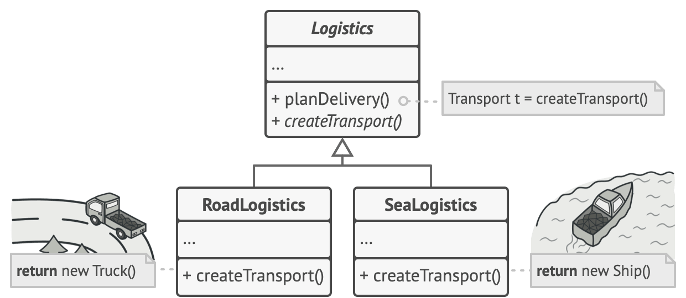


Subclasses can alter the class of objects being returned by the factory method.

At first glance, this change may look pointless: we just moved the constructor call from one part of the program to another. However, consider this: now you can override the factory method in a subclass and change the class of products being created by the method.

There’s a slight limitation though: subclasses may return different types of products only if these products have a common base class or interface. Also, the factory method in the base class should have its return type declared as this interface.

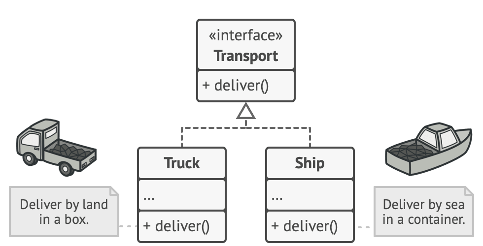

All products must follow the same interface.

For example, both `Truck` and `Ship` classes should implement the `Transport` interface, which declares a method called `deliver`. Each class implements this method differently: trucks deliver cargo by land, ships deliver cargo by sea. The factory method in the `RoadLogistics` class returns truck objects, whereas the factory method in the `SeaLogistics` class returns ships.

The code that uses the factory method (often called the client code) doesn’t see a difference between the actual products returned by various subclasses. The client treats all the products as abstract `Transport`.

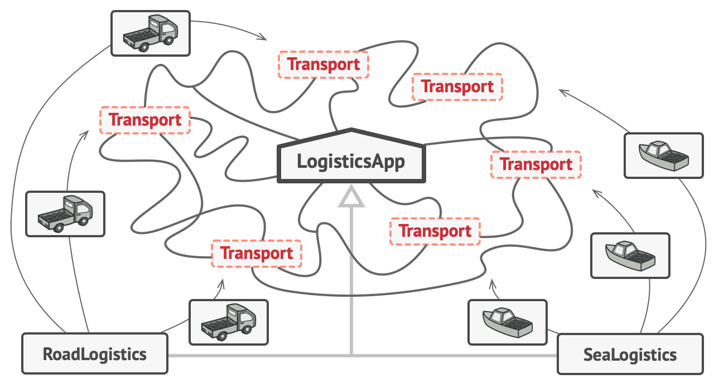

As long as all product classes implement a common interface, you can pass their objects to the client code without breaking it.

The client knows that all transport objects are supposed to have the `deliver` method, but exactly how it works isn’t important to the client.

### :construction: Structure

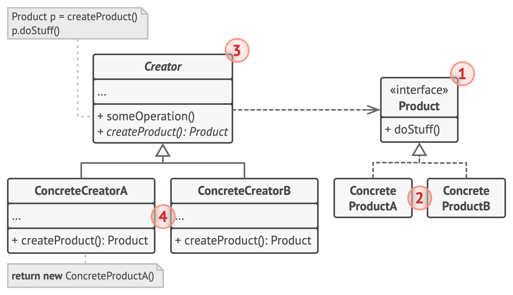

1. The **Product** declares the interface, which is common to all objects that can be produced by the creator and its subclasses

2. **Concrete Products** are different implementations of the product interface.

3. The **Creator** class declares the factory method that returns new product objects. It’s important that the return type of this method matches the product interface.

You can declare the factory method as abstract to force all subclasses to implement their own versions of the method. As an alternative, the base factory method can return some default product type.

Note, despite its name, product creation is **not** the primary responsibility of the creator. Usually, the creator class already has some core business logic related to products. The factory method helps to decouple this logic from the concrete product classes. Here is an analogy: a large software development company can have a training department for programmers. However, the primary function of the company as a whole is still writing code, not producing programmers.

4. **Concrete Creators** override the base factory method so it returns a different type of product.

Note that the factory method doesn’t have to **create** new instances all the time. It can also return existing objects from a cache, an object pool, or another source.

### :hash: Pseudocode

This example illustrates how the **Factory Method** can be used for creating cross-platform UI elements without coupling the client code to concrete UI classes.

The base dialog class uses different UI elements to render its window. Under various operating systems, these elements may look a little bit different, but they should still behave consistently. A button in Windows is still a button in Linux.

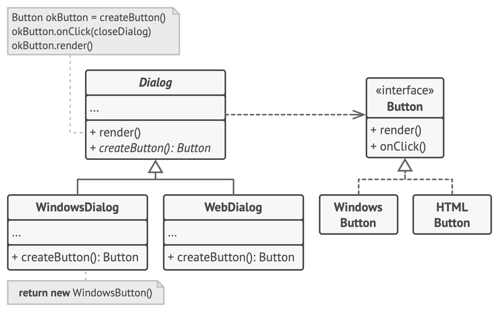

The cross-platform dialog example.


When the factory method comes into play, you don’t need to rewrite the logic of the dialog for each operating system. If we declare a factory method that produces buttons inside the base dialog class, we can later create a dialog subclass that returns Windows-styled buttons from the factory method. The subclass then inherits most of the dialog’s code from the base class, but, thanks to the factory method, can render Windows-looking buttons on the screen.

For this pattern to work, the base dialog class must work with abstract buttons: a base class or an interface that all concrete buttons follow. This way the dialog’s code remains functional, whichever type of buttons it works with.

Of course, you can apply this approach to other UI elements as well. However, with each new factory method you add to the dialog, you get closer to the **Abstract Factory** pattern. Fear not, we’ll talk about this pattern later.

```c++
// The creator class declares the factory method that must
// return an object of a product class. The creator's subclasses
// usually provide the implementation of this method.
    class Dialog is
    // The creator may also provide some default implementation
    // of the factory method.
    abstract method createButton():Button

    // Note that, despite its name, the creator's primary
    // responsibility isn't creating products. It usually
    // contains some core business logic that relies on product
    // objects returned by the factory method. Subclasses can
    // indirectly change that business logic by overriding the
    // factory method and returning a different type of product
    // from it.
    method render() is
        // Call the factory method to create a product object.
        Button okButton = createButton()
        // Now use the product.
        okButton.onClick(closeDialog)
        okButton.render()


// Concrete creators override the factory method to change the
// resulting product's type.
class WindowsDialog extends Dialog is
    method createButton():Button is
        return new WindowsButton()


class WebDialog extends Dialog is
    method createButton():Button is
        return new HTMLButton()


// The product interface declares the operations that all
// concrete products must implement.
interface Button is
    method render()
    method onClick(f)

// Concrete products provide various implementations of the
// product interface.
class WindowsButton implements Button is
    method render(a, b) is
        // Render a button in Windows style.
    method onClick(f) is
        // Bind a native OS click event.


class HTMLButton implements Button is
    method render(a, b) is
        // Return an HTML representation of a button.
    method onClick(f) is
        // Bind a web browser click event.


class Application is
    field dialog: Dialog

    // The application picks a creator's type depending on the
    // current configuration or environment settings.
    method initialize() is

    config = readApplicationConfigFile()

    if (config.OS == "Windows") then
        dialog = new WindowsDialog()
    else if (config.OS == "Web") then
        dialog = new WebDialog()
    else
        throw new Exception("Error! Unknown operating system.")


// The client code works with an instance of a concrete
// creator, albeit through its base interface. As long as
// the client keeps working with the creator via the base
// interface, you can pass it any creator's subclass.

method main() is
    this.initialize()
    dialog.render()

```

### :bulb: Applicability

:beetle: **Use the Factory Method when you don’t know beforehand the exact types and dependencies of the objects your code should work with.**

:sparkles: The Factory Method separates product construction code from the code that actually uses the product. Therefore it’s easier to extend the product construction code independently from the rest of the code.

For example, to add a new product type to the app, you’ll only need to create a new creator subclass and override the factory method in it.

**Use the Factory Method when you want to provide users of your library or framework with a way to extend its internal components.**

Inheritance is probably the easiest way to extend the default behavior of a library or framework. But how would the framework recognize that your subclass should be used instead of a standard component?

The solution is to reduce the code that constructs components across the framework into a single factory method and let anyone override this method in addition to extending the component itself.

Let’s see how that would work. Imagine that you write an app using an open source UI framework. Your app should have round `buttons`, but the framework only provides square ones. You extend the standard Button class with a glorious `RoundButton` subclass. But now you need to tell the main `UIFramework` class to use the new button subclass instead of a default one.

To achieve this, you create a subclass `UIWithRoundButtons` from a base framework class and override its `createButton` method. While this method returns `Button` objects in the base class, you make your subclass return `RoundButton` objects. Now use the `UIWithRoundButtons` class instead of `UIFramework`. And that’s about it!

**Use the Factory Method when you want to save system resources by reusing existing objects instead of rebuilding them each time.**

You often experience this need when dealing with large, resource-intensive objects such as database connections, file systems, and network resources.

Let’s think about what has to be done to reuse an existing object:

1. First, you need to create some storage to keep track of all of the created objects.

2. When someone requests an object, the program should look for a free object inside that pool.

3. … and then return it to the client code.

4. If there are no free objects, the program should create a new one (and add it to the pool).

That’s a lot of code! And it must all be put into a single place so that you don’t pollute the program with duplicate code.

Probably the most obvious and convenient place where this code could be placed is the constructor of the class whose objects we’re trying to reuse. However, a constructor must always return **new objects** by definition. It can’t return existing instances.

Therefore, you need to have a regular method capable of creating new objects as well as reusing existing ones. That sounds very much like a factory method.

### :clipboard: How to Implement

1. Make all products follow the same interface. This interface should declare methods that make sense in every product.

2. Add an empty factory method inside the creator class. The return type of the method should match the common product interface.

3. In the creator’s code find all references to product constructors. One by one, replace them with calls to the factory method, while extracting the product creation code into the factory method.

You might need to add a temporary parameter to the factory method to control the type of returned product.

At this point, the code of the factory method may look pretty ugly. It may have a large `switch` operator that picks which product class to instantiate. But don’t worry, we’ll fix it soon enough.

4. Now, create a set of creator subclasses for each type of product listed in the factory method. Override the factory method in the subclasses and extract the appropriate bits of construction code from the base method.

5. If there are too many product types and it doesn’t make sense to create subclasses for all of them, you can reuse the control parameter from the base class in subclasses.

For instance, imagine that you have the following hierarchy of classes: the base `Mail` class with a couple of subclasses: `AirMail` and `GroundMail`; the `Transport` classes are `Plane`, `Truck` and `Train`. While the `AirMail` class only uses Plane objects, `GroundMail` may work with both `Truck` and `Train` objects. You can create a new subclass (say `TrainMail`) to handle both cases, but there’s another option. The client code can pass an argument to the factory method of the `GroundMail` class to control which product it wants to receive.

6. If, after all of the extractions, the base factory method has become empty, you can make it abstract. If there’s something left, you can make it a default behavior of the method.


### ⚖️ Pros and Cons

:heavy_check_mark: You avoid tight coupling between the creator and the concrete products.

:heavy_check_mark: Single Responsibility Principle. You can move the product creation code into one place in the program, making the code easier to support.

:heavy_check_mark: Open/Closed Principle. You can introduce new types of products into the program without breaking existing client code.

:heavy_multiplication_x: The code may become more complicated since you need to introduce a lot of new subclasses to implement the pattern. The best case scenario is when you’re introducing the pattern into an existing hierarchy of creator classes.

### :arrows_counterclockwise: Relations with Other Patterns


- Many designs start by using **Factory Method** (less complicated and more customizable via subclasses) and evolve toward **Abstract Factory**, **Prototype**, or **Builder** (more flexible, but more complicated).

- **Abstract Factory** classes are often based on a set of **Factory Methods**, but you can also use **Prototype** to compose the methods on these classes.

- You can use **Factory Method** along with **Iterator** to let collection subclasses return different types of iterators that are compatible with the collections.

- **Prototype** isn’t based on inheritance, so it doesn’t have its drawbacks. On the other hand, Prototype requires a complicated initialization of the cloned object. **Factory Method** is based on inheritance but doesn’t require an initialization step.

- **Factory Method** is a specialization of **Template Method**. At the same time, a Factory Method may serve as a step in a large Template Method.

---


## Abstract Factory


**Abstract Factory** is a creational design pattern that lets you produce families of related objects without specifying their concrete classes.

### :worried: Problem

Imagine that you’re creating a furniture shop simulator. Your code consists of classes that represent:

1. A family of related products, say: `Chair` + `Sofa` + `CoffeeTable`.

2. Several variants of this family. For example, products `Chair` + `Sofa` + `CoffeeTable` are available in these variants: `Modern`, `Victorian`, `ArtDeco`.

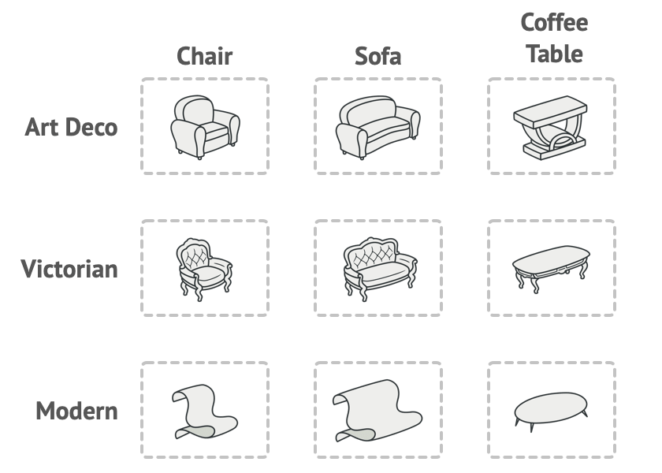

Product families and their variants.

You need a way to create individual furniture objects so that they match other objects of the same family. Customers get quite mad when they receive non-matching furniture.


A Modern-style sofa doesn’t match Victorian-style chairs.

Also, you don’t want to change existing code when adding new products or families of products to the program. Furniture vendors update their catalogs very often, and you wouldn’t want to change the core code each time it happens.

### :smiley: Solution

The first thing the Abstract Factory pattern suggests is to explicitly declare interfaces for each distinct product of the product family (e.g., chair, sofa or coffee table). Then you can make all variants of products follow those interfaces. For example, all chair variants can implement the Chair interface; all coffee table variants can implement the CoffeeTable interface, and so on.


All variants of the same object must be moved to a single class hierarchy.

The next move is to declare the Abstract Factory—an interface with a list of creation methods for all products that are part of the product family (for example, `createChair`, `createSofa` and `createCoffeeTable`). These methods must return **abstract** product types represented by the interfaces we extracted previously: `Chair`, `Sofa`, `CoffeeTable` and so on.

Now, how about the product variants? For each variant of a product family, we create a separate factory class based on the `AbstractFactory` interface. A factory is a class that returns products of a particular kind. For example, the `ModernFurnitureFactory` can only create `ModernChair`, `ModernSofa` and `ModernCoffeeTable` objects.

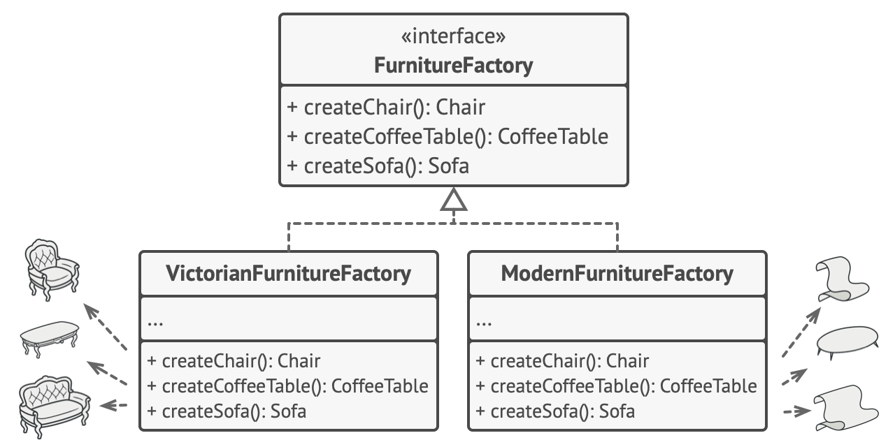

Each concrete factory corresponds to a specific product variant.

The client code has to work with both factories and products via their respective abstract interfaces. This lets you change the type of a factory that you pass to the client code, as well as the product variant that the client code receives, without breaking the actual client code.


The client shouldn’t care about the concrete class of the factory it works with.

Say the client wants a factory to produce a chair. The client doesn’t have to be aware of the factory’s class, nor does it matter what kind of chair it gets. Whether it’s a Modern model or a Victorian-style chair, the client must treat all chairs in the same manner, using the abstract `Chair` interface. With this approach, the only thing that the client knows about the chair is that it implements the `sitOn` method in some way. Also, whichever variant of the chair is returned, it’ll always match the type of sofa or coffee table produced by the same factory object.

There’s one more thing left to clarify: if the client is only exposed to the abstract interfaces, what creates the actual factory objects? Usually, the application creates a concrete factory object at the initialization stage. Just before that, the app must select the factory type depending on the configuration or the environment settings.

### :construction: Structure

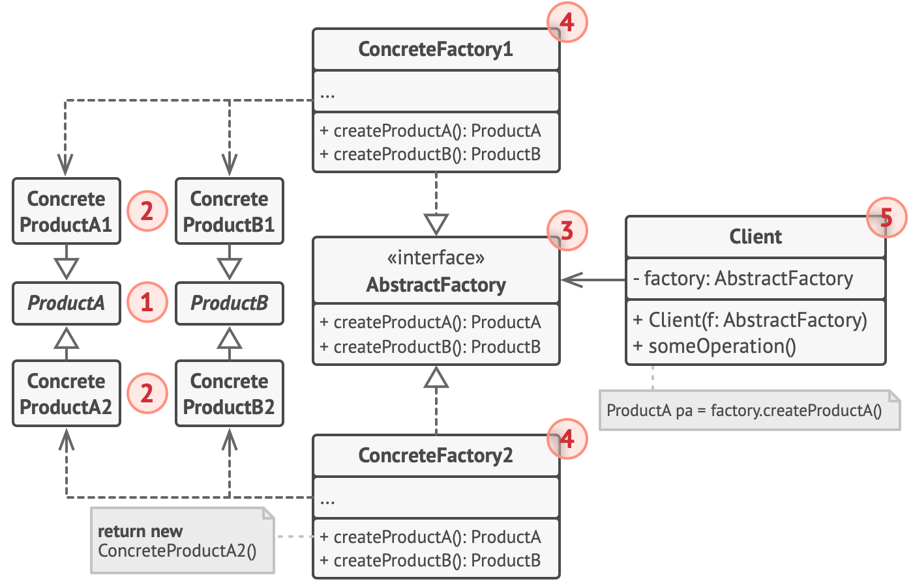

1. **Abstract Products** declare interfaces for a set of distinct but related products which make up a product family.

2. **Concrete Products** are various implementations of abstract products, grouped by variants. Each abstract product (chair/sofa) must be implemented in all given variants (Victorian/Modern).

3. The **Abstract Factory** interface declares a set of methods for creating each of the abstract products.

4. **Concrete Factories** implement creation methods of the abstract factory. Each concrete factory corresponds to a specific variant of products and creates only those product variants.

5. Although concrete factories instantiate concrete products, signatures of their creation methods must return corresponding abstract products. This way the client code that uses a factory doesn’t get coupled to the specific variant of the product it gets from a factory. The Client can work with any concrete factory/product variant, as long as it communicates with their objects via abstract interfaces.


### :hash: Pseudocode

This example illustrates how the **Abstract Factory** pattern can be used for creating cross-platform UI elements without coupling the client code to concrete UI classes, while keeping all created elements consistent with a selected operating system.

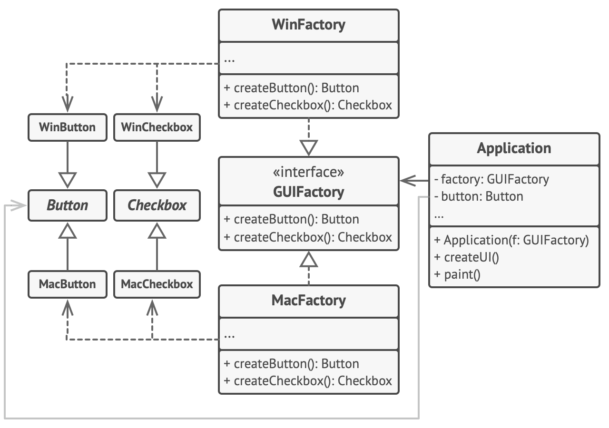


The cross-platform UI classes example.

The same UI elements in a cross-platform application are expected to behave similarly, but look a little bit different under different operating systems. Moreover, it’s your job to make sure that the UI elements match the style of the current operating system. You wouldn’t want your program to render macOS controls when it’s executed in Windows.


The Abstract Factory interface declares a set of creation methods that the client code can use to produce different types of UI elements. Concrete factories correspond to specific operating systems and create the UI elements that match that particular OS.

It works like this: when an application launches, it checks the type of the current operating system. The app uses this information to create a factory object from a class that matches the operating system. The rest of the code uses this factory to create UI elements. This prevents the wrong elements from being created.

With this approach, the client code doesn’t depend on concrete classes of factories and UI elements as long as it works with these objects via their abstract interfaces. This also lets the client code support other factories or UI elements that you might add in the future.

As a result, you don’t need to modify the client code each time you add a new variation of UI elements to your app. You just have to create a new factory class that produces these elements and slightly modify the app’s initialization code so it selects that class when appropriate.

```c++

// The abstract factory interface declares a set of methods that
// return different abstract products. These products are called
// a family and are related by a high-level theme or concept.
// Products of one family are usually able to collaborate among
// themselves. A family of products may have several variants,
// but the products of one variant are incompatible with the
// products of another variant.
interface GUIFactory is
    method createButton():Button
    method createCheckbox():Checkbox


// Concrete factories produce a family of products that belong
// to a single variant. The factory guarantees that the
// resulting products are compatible. Signatures of the concrete
// factory's methods return an abstract product, while inside
// the method a concrete product is instantiated.
class WinFactory implements GUIFactory is
    method createButton():Button is
        return new WinButton()
    method createCheckbox():Checkbox is
        return new WinCheckbox()


// Each concrete factory has a corresponding product variant.
class MacFactory implements GUIFactory is
    method createButton():Button is
        return new MacButton()
    method createCheckbox():Checkbox is
        return new MacCheckbox()


// Each distinct product of a product family should have a base
// interface. All variants of the product must implement this
// interface.

interface Button is
    method paint()


// Concrete products are created by corresponding concrete
// factories.
class WinButton implements Button is
    method paint() is
        // Render a button in Windows style.
class MacButton implements Button is
    method paint() is
        // Render a button in macOS style.


// Here's the base interface of another product. All products
// can interact with each other, but proper interaction is
// possible only between products of the same concrete variant.
interface Checkbox is
    method paint()


class WinCheckbox implements Checkbox is
    method paint() is
        // Render a checkbox in Windows style.

class MacCheckbox implements Checkbox is
    method paint() is
        // Render a checkbox in macOS style.


// The client code works with factories and products only
// through abstract types: GUIFactory, Button and Checkbox. This
// lets you pass any factory or product subclass to the client
// code without breaking it.
class Application is
    private field factory: GUIFactory
    private field button: Button
    constructor Application(factory: GUIFactory) is
        this.factory = factory
    method createUI() is
        this.button = factory.createButton()
    method paint() is
        button.paint()

// The application picks the factory type depending on the
// current configuration or environment settings and creates it
// at runtime (usually at the initialization stage).
class ApplicationConfigurator is
    method main() is
        config = readApplicationConfigFile()

    if (config.OS == "Windows") then
        factory = new WinFactory()
    else if (config.OS == "Mac") then
        factory = new MacFactory()
    else
        throw new Exception("Error! Unknown operating system.")

    Application app = new Application(factory)

```

### :bulb: Applicability

:beetle: **Use the Abstract Factory when your code needs to work with various families of related products, but you don’t want it to depend on the concrete classes of those products—they might be unknown beforehand or you simply want to allow for future extensibility.**

:sparkles: The Abstract Factory provides you with an interface for creating objects from each class of the product family. As long as your code creates objects via this interface, you don’t have to worry about creating the wrong variant of a product which doesn’t match the products already created by your app.

- Consider implementing the Abstract Factory when you have a class with a set of Factory Methods that blur its primary responsibility.

- In a well-designed program each class is responsible only for one thing. When a class deals with multiple product types, it may be worth extracting its factory methods into a stand-alone factory class or a full-blown Abstract Factory implementation.

### :clipboard: How to Implement

1. Map out a matrix of distinct product types versus variants of these products.

2. Declare abstract product interfaces for all product types. Then make all concrete product classes implement these interfaces.

3. Declare the abstract factory interface with a set of creation methods for all abstract products.

4. Implement a set of concrete factory classes, one for each product variant.

5. Create factory initialization code somewhere in the app. It should instantiate one of the concrete factory classes, depending on the application configuration or the current environment. Pass this factory object to all classes that construct products.

6. Scan through the code and find all direct calls to product constructors. Replace them with calls to the appropriate creation method on the factory object.

### ⚖️ Pros and Cons

:heavy_check_mark: You can be sure that the products you’re getting from a factory are compatible with each other.

:heavy_check_mark: You avoid tight coupling between concrete products and client code.

:heavy_check_mark: Single Responsibility Principle. You can extract the product creation code into one place, making the code easier to support.

:heavy_check_mark: Open/Closed Principle. You can introduce new variants of products without breaking existing client code.

:heavy_multiplication_x: The code may become more complicated than it should be, since a lot of new interfaces and classes are introduced along with the pattern.

### :arrows_counterclockwise: Relations with Other Patterns

- Many designs start by using **Factory Method** (less complicated and more customizable via subclasses) and evolve toward **Abstract Factory**, **Prototype**, or **Builder** (more flexible, but more complicated).

- **Builder** focuses on constructing complex objects step by step. **Abstract** Factory specializes in creating families of related objects. Abstract Factory returns the product immediately, whereas Builder lets you run some additional construction steps before fetching the product.

- **Abstract Factory** classes are often based on a set of **Factory Methods**, but you can also use **Prototype** to compose the methods on these classes.

- **Abstract Factory** can serve as an alternative to **Facade** when you only want to hide the way the subsystem objects are created from the client code.

- You can use **Abstract Factory** along with **Bridge**. This pairing is useful when some abstractions defined by Bridge can only work with specific implementations. In this case, Abstract Factory can encapsulate these relations and hide the complexity from the client code.

- **Abstract Factories**, **Builders** and **Prototypes** can all be implemented as **Singletons**.

---


## Builder

**Builder** is a creational design pattern that lets you construct complex objects step by step. The pattern allows you to produce different types and representations of an object using the same construction code.

### :worried: Problem

Imagine a complex object that requires laborious, step-by-step initialization of many fields and nested objects. Such initialization code is usually buried inside a monstrous constructor with lots of parameters. Or even worse: scattered all over the client code.


You might make the program too complex by creating a subclass for every possible configuration of an object.

For example, let’s think about how to create a `House` object. To build a simple house, you need to construct four walls and a floor, install a door, fit a pair of windows, and build a roof. But what if you want a bigger, brighter house, with a backyard and other goodies (like a heating system, plumbing, and electrical wiring)?

The simplest solution is to extend the base `House` class and create a set of subclasses to cover all combinations of the parameters. But eventually you’ll end up with a considerable number of subclasses. Any new parameter, such as the porch style, will require growing this hierarchy even more.

There’s another approach that doesn’t involve breeding subclasses. You can create a giant constructor right in the base `House` class with all possible parameters that control the house object. While this approach indeed eliminates the need for subclasses, it creates another problem.

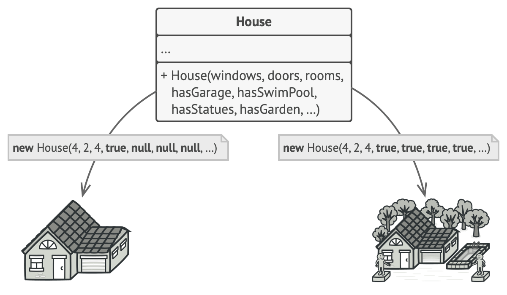

The constructor with lots of parameters has its downside: not all the parameters are needed at all times.

In most cases most of the parameters will be unused, making **the constructor calls pretty ugly**. For instance, only a fraction of houses have swimming pools, so the parameters related to swimming pools will be useless nine times out of ten.

### :smiley: Solution

The Builder pattern suggests that you extract the object construction code out of its own class and move it to separate objects called builders.

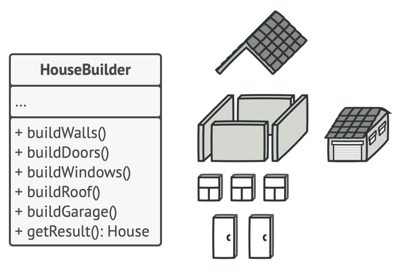


The Builder pattern lets you construct complex objects step by step. The Builder doesn’t allow other objects to access the product while it’s being built.

The pattern organizes object construction into a set of steps (`buildWalls`, `buildDoor`, etc.). To create an object, you execute a series of these steps on a builder object. The important part is that you don’t need to call all of the steps. You can call only those steps that are necessary for producing a particular configuration of an object.

Some of the construction steps might require different implementation when you need to build various representations of the product. For example, walls of a cabin may be built of wood, but the castle walls must be built with stone.

In this case, you can create several different builder classes that implement the same set of building steps, but in a different manner. Then you can use these builders in the construction process (i.e., an ordered set of calls to the building steps) to produce different kinds of objects.

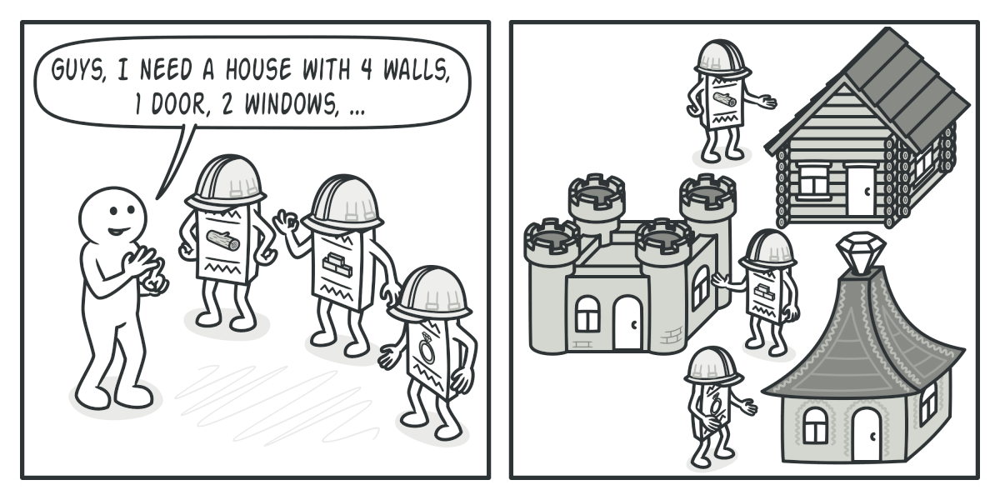

Different builders execute the same task in various ways.

For example, imagine a builder that builds everything from wood and glass, a second one that builds everything with stone and iron and a third one that uses gold and diamonds. By calling the same set of steps, you get a regular house from the first builder, a small castle from the second and a palace from the third. However, this would only work if the client code that calls the building steps is able to interact with builders using a common interface.

### Director

You can go further and extract a series of calls to the builder steps you use to construct a product into a separate class called director. The director class defines the order in which to execute the building steps, while the builder provides the implementation for those steps.

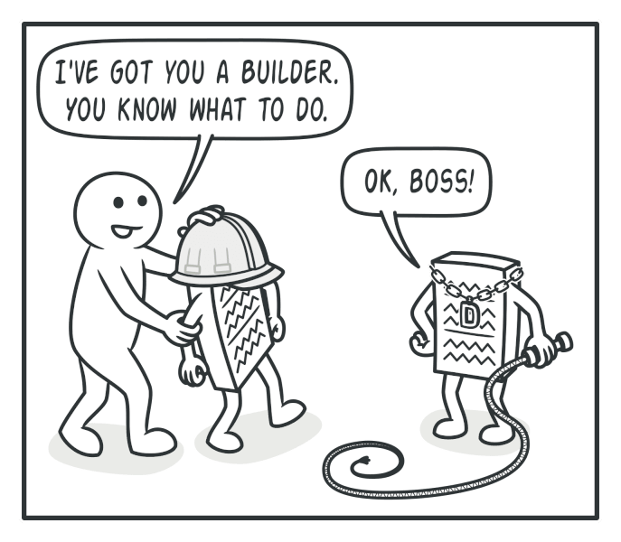

The director knows which building steps to execute to get a working product.

Having a director class in your program isn’t strictly necessary. You can always call the building steps in a specific order directly from the client code. However, the director class might be a good place to put various construction routines so you can reuse them across your program.

In addition, the director class completely hides the details of product construction from the client code. The client only needs to associate a builder with a director, launch the construction with the director, and get the result from the builder.

### :construction: Structure

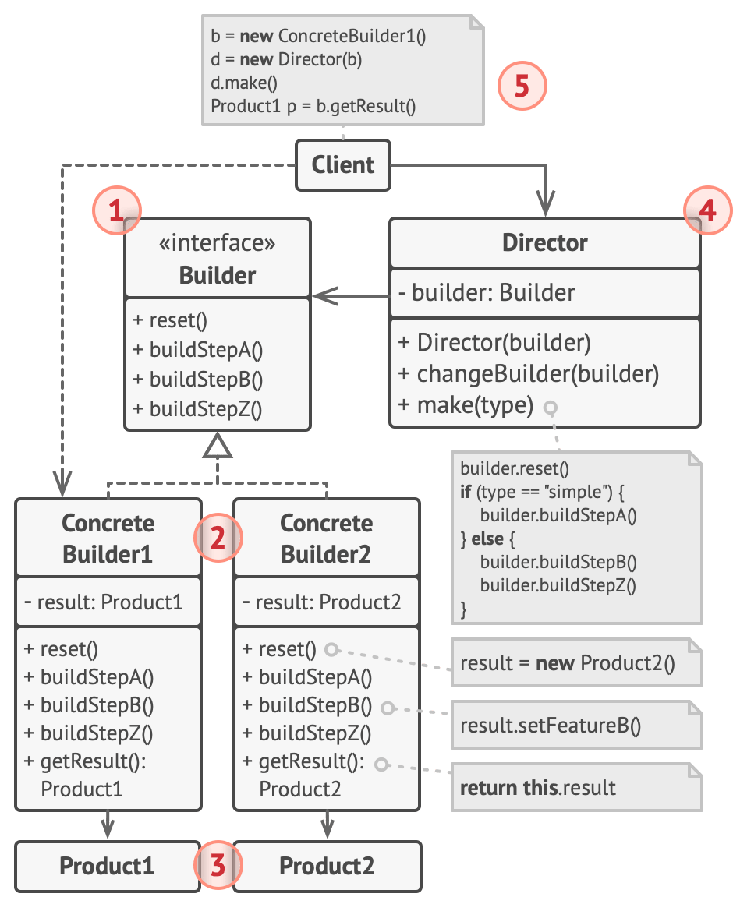

1. The **Builder** interface declares product construction steps that are common to all types of builders.

2. **Concrete Builders** provide different implementations of the construction steps. Concrete builders may produce products that don’t follow the common interface.

3. **Products** are resulting objects. Products constructed by different builders don’t have to belong to the same class hierarchy or interface.

4. The **Director** class defines the order in which to call construction steps, so you can create and reuse specific configurations of products.

5. The **Client** must associate one of the builder objects with the director. Usually, it’s done just once, via parameters of the director’s constructor. Then the director uses that builder object for all further construction. However, there’s an alternative approach for when the client passes the builder object to the production method of the director. In this case, you can use a different builder each time you produce something with the director.

### :hash: Pseudocode

This example of the Builder pattern illustrates how you can reuse the same object construction code when building different types of products, such as cars, and create the corresponding manuals for them.

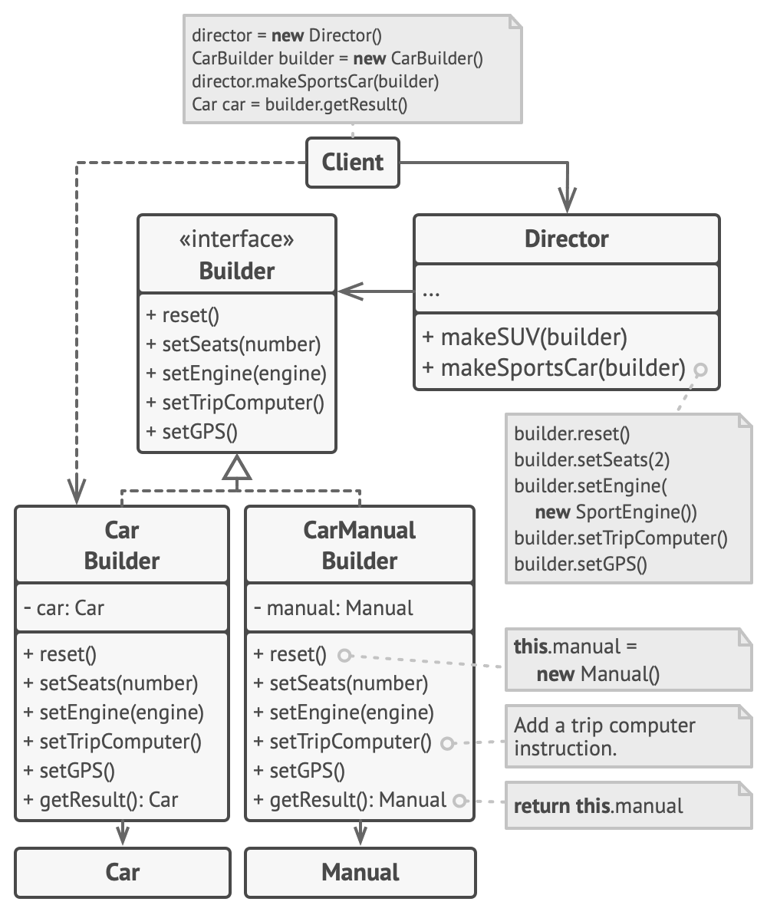

The example of step-by-step construction of cars and the user guides that fit those car models.

A car is a complex object that can be constructed in a hundred different ways. Instead of bloating the `Car` class with a huge constructor, we extracted the car assembly code into a separate car builder class. This class has a set of methods for configuring various parts of a car.

If the client code needs to assemble a special, fine-tuned model of a car, it can work with the builder directly. On the other hand, the client can delegate the assembly to the director class, which knows how to use a builder to construct several of the most popular models of cars.

You might be shocked, but every car needs a manual (seriously, who reads them?). The manual describes every feature of the car, so the details in the manuals vary across the different models. That’s why it makes sense to reuse an existing construction process for both real cars and their respective manuals. Of course, building a manual isn’t the same as building a car, and that’s why we must provide another builder class that specializes in composing manuals. This class implements the same building methods as its car-building sibling, but instead of crafting car parts, it describes them. By passing these builders to the same director object, we can construct either a car or a manual.

The final part is fetching the resulting object. A metal car and a paper manual, although related, are still very different things. We can’t place a method for fetching results in the director without coupling the director to concrete product classes. Hence, we obtain the result of the construction from the builder which performed the job.

```c
// Using the Builder pattern makes sense only when your products
// are quite complex and require extensive configuration. The
// following two products are related, although they don't have
// a common interface.
class Car is
    // A car can have a GPS, trip computer and some number of
    // seats. Different models of cars (sports car, SUV,
    // cabriolet) might have different features installed or
    // enabled.

class Manual is
    // Each car should have a user manual that corresponds to
    // the car's configuration and describes all its features.

// The builder interface specifies methods for creating the
// different parts of the product objects.
interface Builder is
    method reset()
    method setSeats(...)
    method setEngine(...)
    method setTripComputer(...)
    method setGPS(...)


// The concrete builder classes follow the builder interface and
// provide specific implementations of the building steps. Your
// program may have several variations of builders, each
// implemented differently.
class CarBuilder implements Builder is
    private field car:Car


// A fresh builder instance should contain a blank product
// object which it uses in further assembly.
constructor CarBuilder() is
    this.reset()

// The reset method clears the object being built.
method reset() is
    this.car = new Car()

// All production steps work with the same product instance.
method setSeats(...) is
    // Set the number of seats in the car.

method setEngine(...) is
    // Install a given engine.

method setTripComputer(...) is
    // Install a trip computer.

method setGPS(...) is
    // Install a global positioning system.

// Concrete builders are supposed to provide their own
// methods for retrieving results. That's because various
// types of builders may create entirely different products
// that don't all follow the same interface. Therefore such
// methods can't be declared in the builder interface (at
// least not in a statically-typed programming language).
//
// Usually, after returning the end result to the client, a
// builder instance is expected to be ready to start
// producing another product. That's why it's a usual
// practice to call the reset method at the end of the
// `getProduct` method body. However, this behavior isn't
// mandatory, and you can make your builder wait for an
// explicit reset call from the client code before disposing
// of the previous result.
method getProduct():Car is
    product = this.car
    this.reset()
    return product

// Unlike other creational patterns, builder lets you construct
// products that don't follow the common interface.
class CarManualBuilder implements Builder is
    private field manual:Manual
    constructor CarManualBuilder() is
        this.reset()

    method reset() is
        this.manual = new Manual()

    method setSeats(...) is
        // Document car seat features.

    method setEngine(...) is
        // Add engine instructions.

    method setTripComputer(...) is
        // Add trip computer instructions.

    method setGPS(...) is
        // Add GPS instructions.

    method getProduct():Manual is
        // Return the manual and reset the builder.


// The director is only responsible for executing the building
// steps in a particular sequence. It's helpful when producing
// products according to a specific order or configuration.
// Strictly speaking, the director class is optional, since the
// client can control builders directly.
class Director is
    private field builder:Builder

    // The director works with any builder instance that the
    // client code passes to it. This way, the client code may
    // alter the final type of the newly assembled product.
    method setBuilder(builder:Builder)
        this.builder = builder

    // The director can construct several product variations
    // using the same building steps.
    method constructSportsCar(builder: Builder) is
        builder.reset()
        builder.setSeats(2)
        builder.setEngine(new SportEngine())
        builder.setTripComputer(true)
        builder.setGPS(true)

method constructSUV(builder: Builder) is
    // ...


// The client code creates a builder object, passes it to the
// director and then initiates the construction process. The end
// result is retrieved from the builder object.
class Application is
    method makeCar() is
        director = new Director()
        CarBuilder builder = new CarBuilder()
        director.constructSportsCar(builder)
        Car car = builder.getProduct()
        CarManualBuilder builder = new CarManualBuilder()
        director.constructSportsCar(builder)

        
        // The final product is often retrieved from a builder
        // object since the director isn't aware of and not
        // dependent on concrete builders and products.
        Manual manual = builder.getProduct()
```

### :bulb: Applicability

:beetle: **Use the Builder pattern to get rid of a “telescopic constructor”.**

:sparkles: Say you have a constructor with ten optional parameters. Calling such a beast is very inconvenient; therefore, you overload the constructor and create several shorter versions with fewer parameters. These constructors still refer to the main one, passing some default values into any omitted parameters.

```c++
class Pizza {
    Pizza(int size) { ... }
    Pizza(int size, boolean cheese) { ... }
    Pizza(int size, boolean cheese, boolean pepperoni) { ... }
    // ...

```


Creating such a monster is only possible in languages that support method overloading, such as C# or Java.

The Builder pattern lets you build objects step by step, using only those steps that you really need. After implementing the pattern, you don’t have to cram dozens of parameters into your constructors anymore.

:beetle: **Use the Builder pattern when you want your code to be able to create different representations of some product (for example, stone and wooden houses).**

:sparkles: The Builder pattern can be applied when construction of various representations of the product involves similar steps that differ only in the details.

The base builder interface defines all possible construction steps, and concrete builders implement these steps to construct particular representations of the product. Meanwhile, the director class guides the order of construction.

:beetle: Use the Builder to construct Composite trees or other complex objects.

:sparkles: The Builder pattern lets you construct products step-by-step. You could defer execution of some steps without breaking the final product. You can even call steps recursively, which comes in handy when you need to build an object tree.

A builder doesn’t expose the unfinished product while running construction steps. This prevents the client code from fetching an incomplete result.

### :clipboard: How to Implement


1. Make sure that you can clearly define the common construction steps for building all available product representations. Otherwise, you won’t be able to proceed with implementing the pattern.

2. Declare these steps in the base builder interface.

3. Create a concrete builder class for each of the product representations and implement their construction steps.
 Don’t forget about implementing a method for fetching the result of the construction. The reason why this method can’t be declared inside the builder interface is that various builders may construct products that don’t have a common interface. Therefore, you don’t know what would be the return type for such a method. However, if you’re dealing with products from a single hierarchy, the fetching method can be safely added to the base interface.

4. Think about creating a director class. It may encapsulate various ways to construct a product using the same builder object.

5. The client code creates both the builder and the director objects. Before construction starts, the client must pass a builder object to the director. Usually, the client does this only once, via parameters of the director’s constructor. The director uses the builder object in all further construction. There’s an alternative approach, where the builder is passed directly to the construction method of the director.

6. The construction result can be obtained directly from the director only if all products follow the same interface. Otherwise, the client should fetch the result from the builder.

### ⚖️ Pros and Cons

:heavy_check_mark: You can construct objects step-by-step, defer construction steps or run steps recursively.

:heavy_check_mark: You can reuse the same construction code when building various representations of products.

:heavy_check_mark: Single Responsibility Principle. You can isolate complex construction code from the business logic of the product.

:heavy_multiplication_x: The overall complexity of the code increases since the pattern requires creating multiple new classes.

### :arrows_counterclockwise: Relations with Other Patterns

- Many designs start by using **Factory Method** (less complicated and more customizable via subclasses) and evolve toward **Abstract Factory**, **Prototype**, or **Builder** (more flexible, but more complicated).

- **Builder** focuses on constructing complex objects step by step. **Abstract Factory** specializes in creating families of related objects. Abstract Factory returns the product immediately, whereas Builder lets you run some additional construction steps before fetching the product.

- You can use **Builder** when creating complex **Composite** trees because you can program its construction steps to work recursively.

- You can combine **Builder** with **Bridge**: the director class plays the role of the abstraction, while different builders act as implementations.

- **Abstract Factories**, **Builders** and **Prototypes** can all be implemented as **Singletons**.

---


## Prototype

###### Also known as: Clone

**Prototype** is a creational design pattern that lets you copy existing objects without making your code dependent on their classes.

### :worried: Problem


Say you have an object, and you want to create an exact copy of it. How would you do it? First, you have to create a new object of the same class. Then you have to go through all the fields of the original object and copy their values over to the new object.

Nice! But there’s a catch. Not all objects can be copied that way because some of the object’s fields may be private and not visible from outside of the object itself.


Copying an object “from the outside” isn’t always possible.

There’s one more problem with the direct approach. Since you have to know the object’s class to create a duplicate, your code becomes dependent on that class. If the extra dependency doesn’t scare you, there’s another catch. Sometimes you only know the interface that the object follows, but not its concrete class, when, for example, a parameter in a method accepts any objects that follow some interface.

### :smiley: Solution


The Prototype pattern delegates the cloning process to the actual objects that are being cloned. The pattern declares a common interface for all objects that support cloning. This interface lets you clone an object without coupling your code to the class of that object. Usually, such an interface contains just a single `clone` method.

The implementation of the `clone` method is very similar in all classes. The method creates an object of the current class and carries over all of the field values of the old object into the new one. You can even copy private fields because most programming languages let objects access private fields of other objects that belong to the same class. 

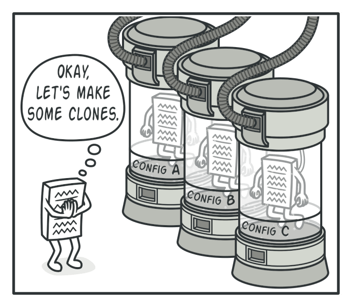

Pre-built prototypes can be an alternative to subclassing.

An object that supports cloning is called a prototype. When your objects have dozens of fields and hundreds of possible configurations, cloning them might serve as an alternative to subclassing.

Here’s how it works: you create a set of objects, configured in various ways. When you need an object like the one you’ve configured, you just clone a prototype instead of constructing a new object from scratch.

### :car: Real-World Analogy

In real life, prototypes are used for performing various tests before starting mass production of a product. However, in this case, prototypes don’t participate in any actual production, playing a passive role instead.


The division of a cell.

Since industrial prototypes don’t really copy themselves, a much closer analogy to the pattern is the process of mitotic cell division (biology, remember?). After mitotic division, a pair of identical cells is formed. The original cell acts as a prototype and takes an active role in creating the copy.

### :construction: Structure

**Basic implementation**

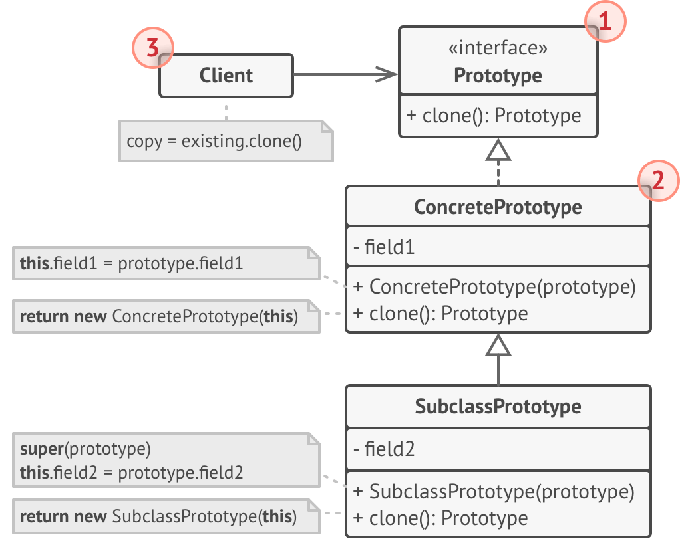

1. The **Prototype** interface declares the cloning methods. In most cases, it’s a single clone method.

2. The **Concrete Prototype** class implements the cloning method. In addition to copying the original object’s data to the clone, this method may also handle some edge cases of the cloning process related to cloning linked objects, untangling recursive dependencies, etc.

3. The **Client** can produce a copy of any object that follows the prototype interface.

**Prototype registry implementation**

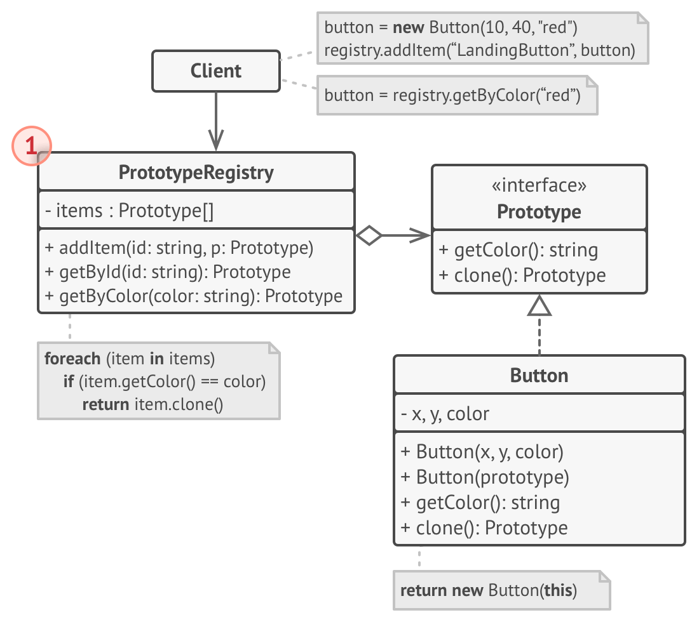

1. The **Prototype Registry** provides an easy way to access frequently-used prototypes. It stores a set of pre-built objects that are ready to be copied. The simplest prototype registry is a `name → prototype` hash map. However, if you need better search criteria than a simple name, you can build a much more robust version of the registry.

### :hash: Pseudocode

In this example, the **Prototype** pattern lets you produce exact copies of geometric objects, without coupling the code to their classes.

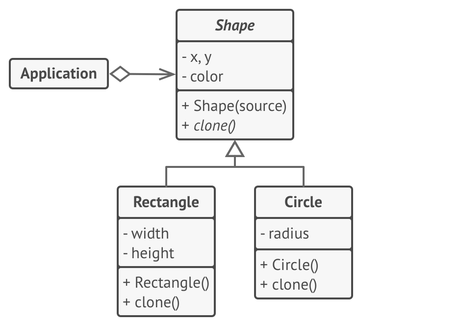

Cloning a set of objects that belong to a class hierarchy.

All shape classes follow the same interface, which provides a cloning method. A subclass may call the parent’s cloning method before copying its own field values to the resulting object.

```c++
// Base prototype.
abstract class Shape is
    field X: int
    field Y: int
    field color: string

    // A regular constructor.
    constructor Shape() is
        // ...  
    
    // The prototype constructor. A fresh object is initialized
    // with values from the existing object.
    constructor Shape(source: Shape) is
        this()
        this.X = source.X
        this.Y = source.Y
        this.color = source.color

    // The clone operation returns one of the Shape subclasses.
    abstract method clone():Shape
// Concrete prototype. The cloning method creates a new object
// and passes it to the constructor. Until the constructor is
// finished, it has a reference to a fresh clone. Therefore,
// nobody has access to a partly-built clone. This keeps the
// cloning result consistent.
class Rectangle extends Shape is
field width: int
field height: int

constructor Rectangle(source: Rectangle) is
    // A parent constructor call is needed to copy private
    // fields defined in the parent class.
    super(source)
    this.width = source.width
    this.height = source.height

method clone():Shape is
    return new Rectangle(this)


class Circle extends Shape is
    field radius: int

constructor Circle(source: Circle) is
    super(source)
    this.radius = source.radius

method clone():Shape is
    return new Circle(this)


// Somewhere in the client code.
class Application is
    field shapes: array of Shape

    constructor Application() is
        Circle circle = new Circle()
        circle.X = 10
        circle.Y = 10
        circle.radius = 20
        shapes.add(circle)

        Circle anotherCircle = circle.clone()
        shapes.add(anotherCircle)   
        // The `anotherCircle` variable contains an exact copy
        // of the `circle` object.

        Rectangle rectangle = new Rectangle()
        rectangle.width = 10
        rectangle.height = 20
        shapes.add(rectangle)

    method businessLogic() is
        // Prototype rocks because it lets you produce a copy of
        // an object without knowing anything about its type.
        Array shapesCopy = new Array of Shapes.
        // For instance, we don't know the exact elements in the
        // shapes array. All we know is that they are all
        // shapes. But thanks to polymorphism, when we call the
        // `clone` method on a shape the program checks its real
        // class and runs the appropriate clone method defined
        // in that class. That's why we get proper clones
        // instead of a set of simple Shape objects.
        foreach (s in shapes) do
            shapesCopy.add(s.clone())

        // The `shapesCopy` array contains exact copies of the
        // `shape` array's children.

```

### :bulb: Applicability

:beetle: **Use the Prototype pattern when your code shouldn’t depend on the concrete classes of objects that you need to copy.**

:sparkles: This happens a lot when your code works with objects passed to you from 3rd-party code via some interface. The concrete classes of these objects are unknown, and you couldn’t depend on them even if you wanted to.

The Prototype pattern provides the client code with a general interface for working with all objects that support cloning. This interface makes the client code independent from the concrete classes of objects that it clones.

:beetle: **Use the pattern when you want to reduce the number of subclasses that only differ in the way they initialize their respective objects. Somebody could have created these subclasses to be able to create objects with a specific configuration.**

:sparkles: The Prototype pattern lets you use a set of pre-built objects, configured in various ways, as prototypes.

Instead of instantiating a subclass that matches some configuration, the client can simply look for an appropriate prototype and clone it.

### :clipboard: How to Implement

1. Create the prototype interface and declare the `clone` method in it. Or just add the method to all classes of an existing class hierarchy, if you have one.

2. A prototype class must define the alternative constructor that accepts an object of that class as an argument. The constructor must copy the values of all fields defined in the class from the passed object into the newly created instance. If you’re changing a subclass, you must call the parent constructor to let the superclass handle the cloning of its private fields.
If your programming language doesn’t support method overloading, you may define a special method for copying the object data. The constructor is a more convenient place to do this because it delivers the resulting object right after you call the `new` operator.

3. The cloning method usually consists of just one line: running a `new` operator with the prototypical version of the constructor. Note, that every class must explicitly override the cloning method and use its own class name along with the new operator. Otherwise, the cloning method may produce an object of a parent class.

4. Optionally, create a centralized prototype registry to store a catalog of frequently used prototypes.
You can implement the registry as a new factory class or put it in the base prototype class with a static method for fetching the prototype. This method should search for a prototype based on search criteria that the client code passes to the method. The criteria might either be a simple string tag or a complex set of search parameters. After the appropriate prototype is found, the registry should clone it and return the copy to the client.
Finally, replace the direct calls to the subclasses’ constructors with calls to the factory method of the prototype registry.


### ⚖️ Pros and Cons
:heavy_check_mark: You can clone objects without coupling to their concrete classes.

:heavy_check_mark: You can get rid of repeated initialization code in favor of cloning pre-built prototypes.

:heavy_check_mark: You can produce complex objects more conveniently.

:heavy_check_mark: You get an alternative to inheritance when dealing with configuration presets for complex objects.

:heavy_multiplication_x: Cloning complex objects that have circular references might be very tricky.

### :arrows_counterclockwise: Relations with Other Patterns

- Many designs start by using **Factory Method** (less complicated and more customizable via subclasses) and evolve toward **Abstract Factory**, **Prototype**, or **Builder** (more flexible, but more complicated).

- **Abstract Factory** classes are often based on a set of **Factory Methods**, but you can also use **Prototype** to compose the methods on these classes.

- **Prototype** can help when you need to save copies of **Commands** into history.

- Designs that make heavy use of **Composite** and **Decorator** can often benefit from using **Prototype**. Applying the pattern lets you clone complex structures instead of re-constructing them from scratch.

- **Prototype** isn’t based on inheritance, so it doesn’t have its drawbacks. On the other hand, Prototype requires a complicated initialization of the cloned object. **Factory Method** is based on inheritance but doesn’t require an initialization step.

- Sometimes **Prototype** can be a simpler alternative to **Memento**. This works if the object, the state of which you want to store in the history, is fairly straightforward and doesn’t have links to external resources, or the links are easy to re-establish.

- **Abstract Factories**, **Builders** and **Prototypes** can all be implemented as **Singletons**.

---


## Singleton

**Singleton** is a creational design pattern that lets you ensure that a class has only one instance, while providing a global access point to this instance.

### :worried: Problem

The Singleton pattern solves two problems at the same time, violating the Single Responsibility Principle:

1. **Ensure that a class has just a single instance**. Why would anyone want to control how many instances a class has? The most common reason for this is to control access to some shared resource—for example, a database or a file.

Here’s how it works: imagine that you created an object, but after a while decided to create a new one. Instead of receiving a fresh object, you’ll get the one you already created.

Note that this behavior is impossible to implement with a regular constructor since a constructor call **must** always return a new object by design.


Clients may not even realize that they’re working with the same object all the time.

2. Provide a global access point to that instance. Remember those global variables that you (all right, me) used to store some essential objects? While they’re very handy, they’re also very unsafe since any code can potentially overwrite the contents of those variables and crash the app.

Just like a global variable, the Singleton pattern lets you access some object from anywhere in the program. However, it also protects that instance from being overwritten by other code.

There’s another side to this problem: you don’t want the code that solves problem #1 to be scattered all over your program. It’s much better to have it within one class, especially if the rest of your code already depends on it.
Nowadays, the Singleton pattern has become so popular that people may call something a singleton even if it solves just one of the listed problems.

### :smiley: Solution

All implementations of the Singleton have these two steps in common:

- Make the default constructor private, to prevent other objects from using the `new` operator with the Singleton class.

- Create a static creation method that acts as a constructor. Under the hood, this method calls the private constructor to create an object and saves it in a static field. All following calls to this method return the cached object.

If your code has access to the Singleton class, then it’s able to call the Singleton’s static method. So whenever that method is called, the same object is always returned.

### :car: Real-World Analogy

The government is an excellent example of the Singleton pattern. A country can have only one official government. Regardless of the personal identities of the individuals who form governments, the title, “The Government of X”, is a global point of access that identifies the group of people in charge.

### :construction: Structure

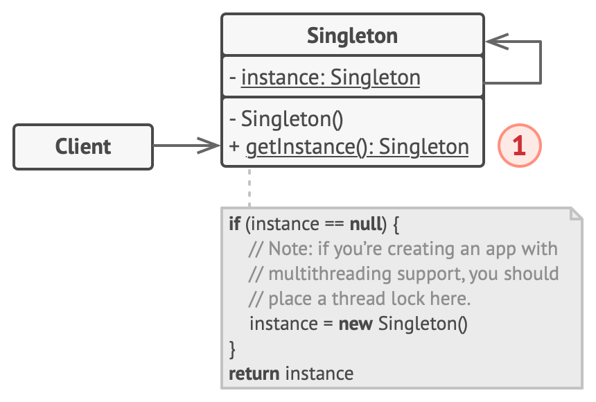

1. The **Singleton** class declares the static method `getInstance` that returns the same instance of its own class.

The Singleton’s constructor should be hidden from the client code. Calling the `getInstance` method should be the only way of getting the Singleton object.

### :hash: Pseudocode

In this example, the database connection class acts as a Singleton. This class doesn’t have a public constructor, so the only way to get its object is to call the getInstance method. This method caches the first created object and returns it in all subsequent calls.

```c++
// The Database class defines the `getInstance` method that lets
// clients access the same instance of a database connection
// throughout the program.
    class Database is
    // The field for storing the singleton instance should be
    // declared static.
    private static field instance: Database

    // The singleton's constructor should always be private to
    // prevent direct construction calls with the `new`
    // operator.
    private constructor Database() is
        // Some initialization code, such as the actual
        // connection to a database server.
        // ...
    // The static method that controls access to the singleton
    // instance.
    public static method getInstance() is
        if (Database.instance == null) then
            acquireThreadLock() and then
            // Ensure that the instance hasn't yet been
            // initialized by another thread while this one
            // has been waiting for the lock's release.
            if (Database.instance == null) then
                Database.instance = new Database()
        return Database.instance

    // Finally, any singleton should define some business logic
    // which can be executed on its instance.
    public method query(sql) is
        // For instance, all database queries of an app go
        // through this method. Therefore, you can place
        // throttling or caching logic here.
        // ...

class Application is
    method main() is
        Database foo = Database.getInstance()
        foo.query("SELECT ...")
        // ...
        Database bar = Database.getInstance()
        bar.query("SELECT ...")
        // The variable `bar` will contain the same object as
        // the variable `foo`.

```

### :bulb: Applicability

:beetle: **Use the Singleton pattern when a class in your program should have just a single instance available to all clients; for example, a single database object shared by different parts of the program.**

:sparkles: The Singleton pattern disables all other means of creating objects of a class except for the special creation method. This method either creates a new object or returns an existing one if it has already been created.

:beetle: **Use the Singleton pattern when you need stricter control over global variables.**

:sparkles: Unlike global variables, the Singleton pattern guarantees that there’s just one instance of a class. Nothing, except for the Singleton class itself, can replace the cached instance.

Note that you can always adjust this limitation and allow creating any number of Singleton instances. The only piece of code that needs changing is the body of the getInstance method.

### :clipboard: How to Implement


1. Add a private static field to the class for storing the singleton instance.

2. Declare a public static creation method for getting the singleton instance.

3. Implement “lazy initialization” inside the static method. It should create a new object on its first call and put it into the static field. The method should always return that instance on all subsequent calls.

4. Make the constructor of the class private. The static method of the class will still be able to call the constructor, but not the other objects.

5. Go over the client code and replace all direct calls to the singleton’s constructor with calls to its static creation method.


### ⚖️ Pros and Cons

:heavy_check_mark: You can be sure that a class has only a single instance.

:heavy_check_mark: You gain a global access point to that instance.

:heavy_check_mark: The singleton object is initialized only when it’s requested for the first time.

:heavy_multiplication_x: Violates the Single Responsibility Principle. The pattern solves two problems at the time.

:heavy_multiplication_x: The Singleton pattern can mask bad design, for instance, when the components of the program know too much about each other.

:heavy_multiplication_x: The pattern requires special treatment in a multithreaded environment so that multiple threads won’t create a singleton object several times.

:heavy_multiplication_x: It may be difficult to unit test the client code of the Singleton because many test frameworks rely on inheritance when producing mock objects. Since the constructor of the singleton class is private and overriding static methods is impossible in most languages, you will need to think of a creative way to mock the singleton. Or just don’t write the tests. Or don’t use the Singleton pattern.

### :arrows_counterclockwise: Relations with Other Patterns

- A **Facade** class can often be transformed into a **Singleton** since a single facade object is sufficient in most cases.

- **Flyweight** would resemble **Singleton** if you somehow managed to reduce all shared states of the objects to just one flyweight object. But there are two fundamental differences between these patterns:

    1. There should be only one Singleton instance, whereas a Flyweight class can have multiple instances with different intrinsic states.

    2. The Singleton object can be mutable. Flyweight objects are immutable.

- **Abstract Factories**, **Builders** and **Prototypes** can all be implemented as **Singletons**.

---

## Structural Design Patterns

Structural patterns explain how to assemble objects and classes into larger structures, while keeping this structures flexible and efficient.

> ### [Adapter](#Adapter-1)
> [](#Adapter-1) </br>
>[Allows objects with incompatible interfaces to collaborate.](#Adapter-1)

> ### [Bridge](#Bridge-1)
> [](#Bridge-1) </br>
> [Lets you split a large class or a set of closely related classes into two separate hierarchies—abstraction and implementation—which can be developed independently of each other.](#Bridge-1)

> ### [Composite](#Composite-1)
> [](#Composite-1) </br>
> [Lets you compose objects into tree structures and then work with these structures as if they were individual objects.](#Composite-1)

> ### [Decorator](#Decorator-1)
> [](#Decorator-1) </br>
> [Lets you attach new behaviors to objects by placing these objects inside special wrapper objects that contain the behaviors.](#Decorator-1)

> ### [Facade](#Facade-1)
> [](#Facade-1) </br>
> [Provides a simplified interface to a library, a framework, or any other complex set of classes.](#Facade-1)

> ### [Flyweight](#Flyweight-1)
> [](#Flyweight-1) </br>
> [Lets you fit more objects into the available amount of RAM by sharing common parts of state between multiple objects instead of keeping all of the data in each object.](#Flyweight-1)

> ### [Proxy](#Proxy-1)
> [](#Proxy-1) </br>
> [Lets you provide a substitute or placeholder for another object. A proxy controls access to the original object, allowing you to perform something either before or after the request gets through to the original object.](#Proxy-1)

---

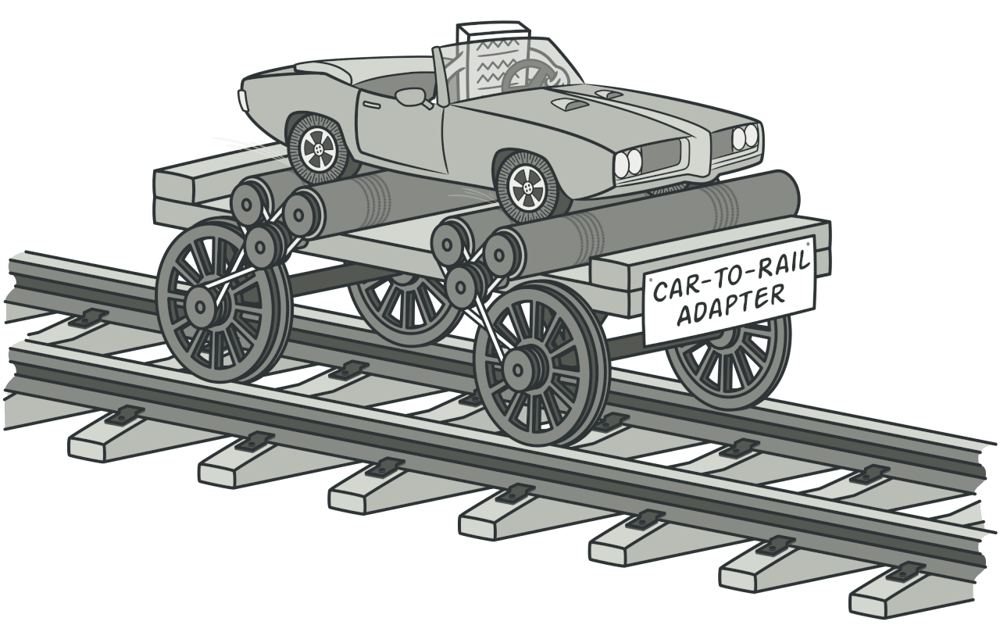

## Adapter

###### Also known as: Wrapper

**Adapter** is a structural design pattern that allows objects with incompatible interfaces to collaborate.

### :worried: Problem

Imagine that you’re creating a stock market monitoring app. The app downloads the stock data from multiple sources in XML format and then displays nice-looking charts and diagrams for the user.

At some point, you decide to improve the app by integrating a smart 3rd-party analytics library. But there’s a catch: the analytics library only works with data in JSON format.

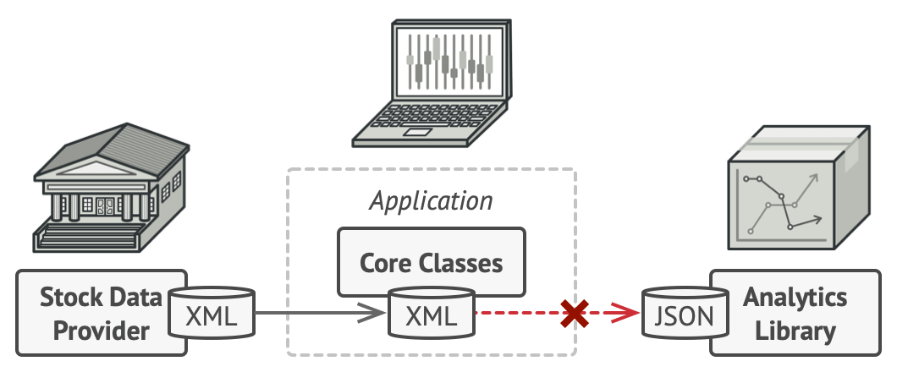

You can’t use the analytics library “as is” because it expects the data in a format that’s incompatible with your app.

You could change the library to work with XML. However, this might break some existing code that relies on the library. And worse, you might not have access to the library’s source code in the first place, making this approach impossible.

### :smiley: Solution

You can create an adapter. This is a special object that converts the interface of one object so that another object can understand it.

An adapter wraps one of the objects to hide the complexity of conversion happening behind the scenes. The wrapped object isn’t even aware of the adapter. For example, you can wrap an object that operates in meters and kilometers with an adapter that converts all of the data to imperial units such as feet and miles.

Adapters can not only convert data into various formats but can also help objects with different interfaces collaborate. Here’s how it works:

1. The adapter gets an interface, compatible with one of the existing objects.

2. Using this interface, the existing object can safely call the adapter’s methods.

3. Upon receiving a call, the adapter passes the request to the second object, but in a format and order that the second object expects.


Sometimes it’s even possible to create a two-way adapter that can convert the calls in both directions.

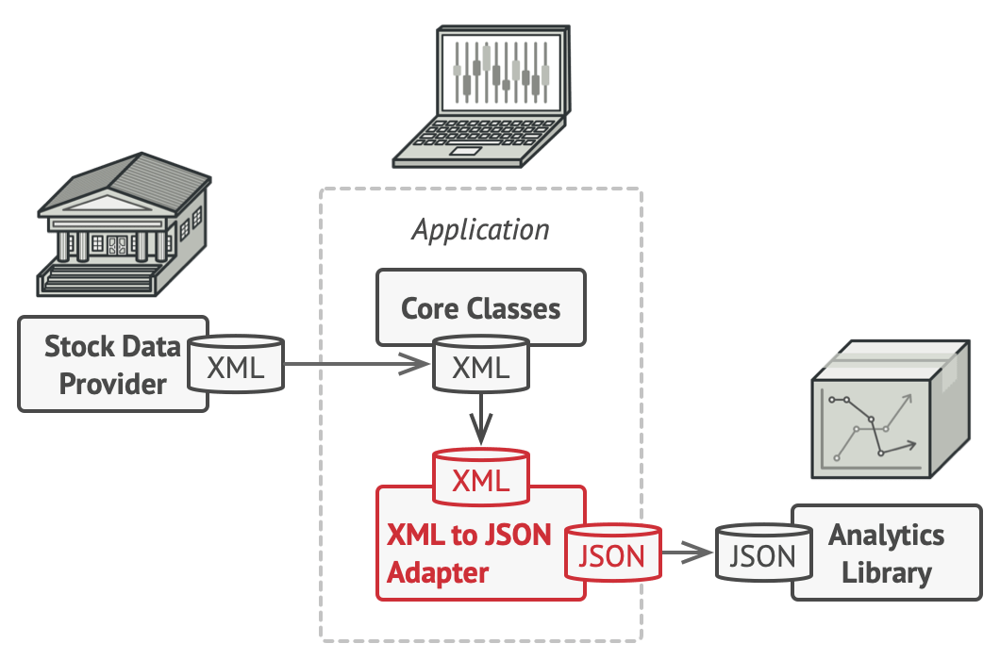

Let’s get back to our stock market app. To solve the dilemma of incompatible formats, you can create XML-to-JSON adapters for every class of the analytics library that your code works with directly. Then you adjust your code to communicate with the library only via these adapters. When an adapter receives a call, it translates the incoming XML data into a JSON structure and passes the call to the appropriate methods of a wrapped analytics object.

### :car: Real-World Analogy

When you travel from the US to Europe for the first time, you may get a surprise when trying to charge your laptop. The power plug and sockets standards are different in different countries. 


A suitcase before and after a trip abroad.

That’s why your US plug won’t fit a German socket. The problem can be solved by using a power plug adapter that has the American-style socket and the European-style plug.

### :construction: Structure


**Object adapter**

This implementation uses the object composition principle: the adapter implements the interface of one object and wraps the other one. It can be implemented in all popular programming languages.

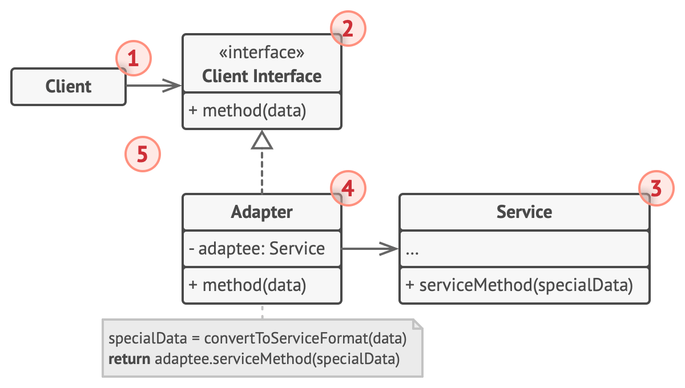

1. The **Client** is a class that contains the existing business logic of the program.

2. The **Client Interface** describes a protocol that other classes must follow to be able to collaborate with the client code.

3. The **Service** is some useful class (usually 3rd-party or legacy). The client can’t use this class directly because it has an incompatible interface.

4. The **Adapter** is a class that’s able to work with both the client and the service: it implements the client interface, while wrapping the service object. The adapter receives calls from the client via the adapter interface and translates them into calls to the wrapped service object in a format it can understand.

5. The client code doesn’t get coupled to the concrete adapter class as long as it works with the adapter via the client interface. Thanks to this, you can introduce new types of adapters into the program without breaking the existing client code. This can be useful when the interface of the service class gets changed or replaced: you can just create a new adapter class without changing the client code.


**Class adapter**

This implementation uses inheritance: the adapter inherits interfaces from both objects at the same time. Note that this approach can only be implemented in programming languages that support multiple inheritance, such as C++.

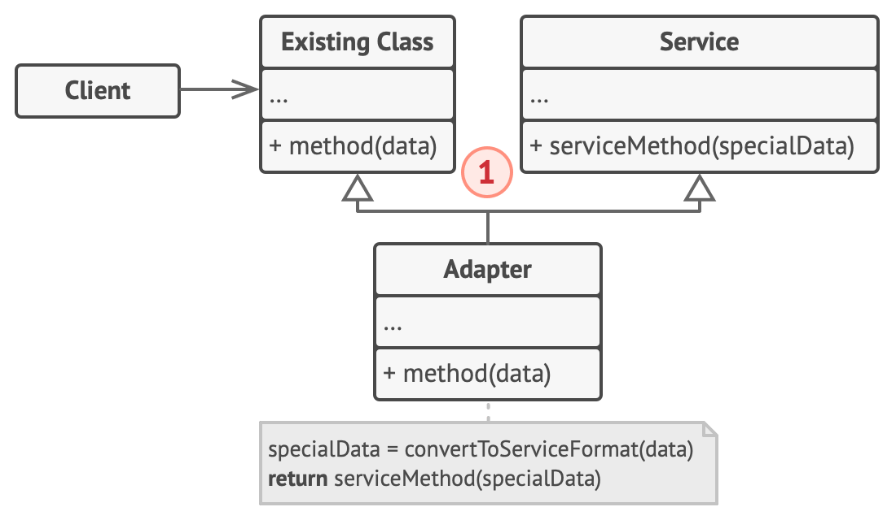

1. The Class Adapter doesn’t need to wrap any objects because it inherits behaviors from both the client and the service. The adaptation happens within the overridden methods. The resulting adapter can be used in place of an existing client class.


### :hash: Pseudocode


This example of the **Adapter** pattern is based on the classic conflict between square pegs and round holes.

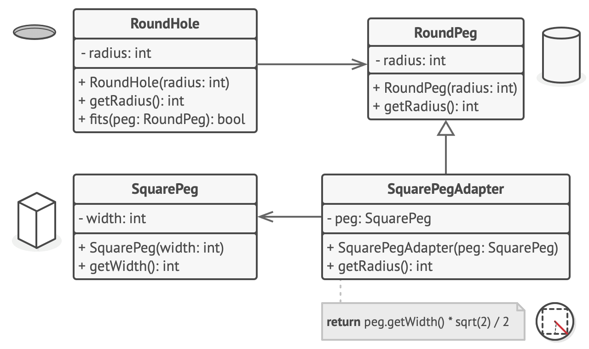

Adapting square pegs to round holes.

The Adapter pretends to be a round peg, with a radius equal to a half of the square’s diameter (in other words, the radius of the smallest circle that can accommodate the square peg).

```c++
// Say you have two classes with compatible interfaces:
// RoundHole and RoundPeg.
class RoundHole is
    constructor RoundHole(radius) { ... }

    method getRadius() is
        // Return the radius of the hole.

    method fits(peg: RoundPeg) is  
        return this.getRadius() >= peg.getRadius()

class RoundPeg is
    constructor RoundPeg(radius) { ... }

    method getRadius() is
        // Return the radius of the peg.


// But there's an incompatible class: SquarePeg.
class SquarePeg is
    constructor SquarePeg(width) { ... }

    method getWidth() is
        // Return the square peg width.


// An adapter class lets you fit square pegs into round holes.
// It extends the RoundPeg class to let the adapter objects act
// as round pegs.
class SquarePegAdapter extends RoundPeg is
    // In reality, the adapter contains an instance of the
    // SquarePeg class.
    private field peg: SquarePeg

    constructor SquarePegAdapter(peg: SquarePeg) is
        this.peg = peg
        
    method getRadius() is
        // radius that could fit the square peg that the adapter
        // The adapter pretends that it's a round peg with a
        // actually wraps.
        return peg.getWidth() * Math.sqrt(2) / 2
// Somewhere in client code.
hole = new RoundHole(5)
rpeg = new RoundPeg(5)
hole.fits(rpeg) // true

small_sqpeg = new SquarePeg(5)
large_sqpeg = new SquarePeg(10)
hole.fits(small_sqpeg) // this won't compile (incompatible types)

small_sqpeg_adapter = new SquarePegAdapter(small_sqpeg)
large_sqpeg_adapter = new SquarePegAdapter(large_sqpeg)
hole.fits(small_sqpeg_adapter) // true
hole.fits(large_sqpeg_adapter) // false
```

### :bulb: Applicability

:beetle: **Use the Adapter class when you want to use some existing class, but its interface isn’t compatible with the rest of your code.**

:sparkles:The Adapter pattern lets you create a middle-layer class that serves as a translator between your code and a legacy class, a 3rd-party class or any other class with a weird interface.

:beetle: **Use the pattern when you want to reuse several existing subclasses that lack some common functionality that can’t be added to the superclass.**

:sparkles:You could extend each subclass and put the missing functionality into new child classes. However, you’ll need to duplicate the code across all of these new classes, which **smells really bad**.

The much more elegant solution would be to put the missing functionality into an adapter class. Then you would wrap objects with missing features inside the adapter, gaining needed features dynamically. For this to work, the target classes must have a common interface, and the adapter’s field should follow that interface. This approach looks very similar to the **Decorator** pattern.

### :clipboard: How to Implement


1. Make sure that you have at least two classes with incompatible interfaces:

    - A useful service class, which you can’t change (often 3rd-party, legacy or with lots of existing dependencies).

    - One or several client classes that would benefit from using the service class.

2. Declare the client interface and describe how clients communicate with the service.

3. Create the adapter class and make it follow the client interface. Leave all the methods empty for now.

4. Add a field to the adapter class to store a reference to the service object. The common practice is to initialize this field via the constructor, but sometimes it’s more convenient to pass it to the adapter when calling its methods.

5. One by one, implement all methods of the client interface in the adapter class. The adapter should delegate most of the real work to the service object, handling only the interface or data format conversion.

6. Clients should use the adapter via the client interface. This will let you change or extend the adapters without affecting the client code.

### ⚖️ Pros and Cons

:heavy_check_mark: Single Responsibility Principle. You can separate the interface or data conversion code from the primary business logic of the program.

:heavy_check_mark: Open/Closed Principle. You can introduce new types of adapters into the program without breaking the existing client code, as long as they work with the adapters through the client interface.

:heavy_multiplication_x: The overall complexity of the code increases because you need to introduce a set of new interfaces and classes. Sometimes it’s simpler just to change the service class so that it matches the rest of your code.

### :arrows_counterclockwise: Relations with Other Patterns

- **Bridge** is usually designed up-front, letting you develop parts of an application independently of each other. On the other hand, **Adapter** is commonly used with an existing app to make some otherwise-incompatible classes work together nicely.

- **Adapter** changes the interface of an existing object, while **Decorator** enhances an object without changing its interface. In addition, Decorator supports recursive composition, which isn’t possible when you use Adapter.

- **Adapter** provides a different interface to the wrapped object, **Proxy** provides it with the same interface, and **Decorator** provides it with an enhanced interface.

- Facade defines a new interface for existing objects, whereas **Adapter** tries to make the existing interface usable. Adapter usually wraps just one object, while Facade works with an entire subsystem of objects.

- **Bridge**, **State**, **Strategy** (and to some degree **Adapter**) have very similar structures. Indeed, all of these patterns are based on composition, which is delegating work to other objects. However, they all solve different problems. A pattern isn’t just a recipe for structuring your code in a specific way. It can also communicate to other developers the problem the pattern solves.

---


## Bridge

**Bridge** is a structural design pattern that lets you split a large class or a set of closely related classes into two separate hierarchies—abstraction and implementation—which can be developed independently of each other.

### :worried: Problem

Abstraction? Implementation? Sound scary? Stay calm and let’s consider a simple example.

Say you have a geometric `Shape` class with a pair of subclasses: `Circle` and `Square`. You want to extend this class hierarchy to incorporate colors, so you plan to create `Red` and `Blue` shape subclasses. However, since you already have two subclasses, you’ll need to create four class combinations such as `BlueCircle` and `RedSquare`.

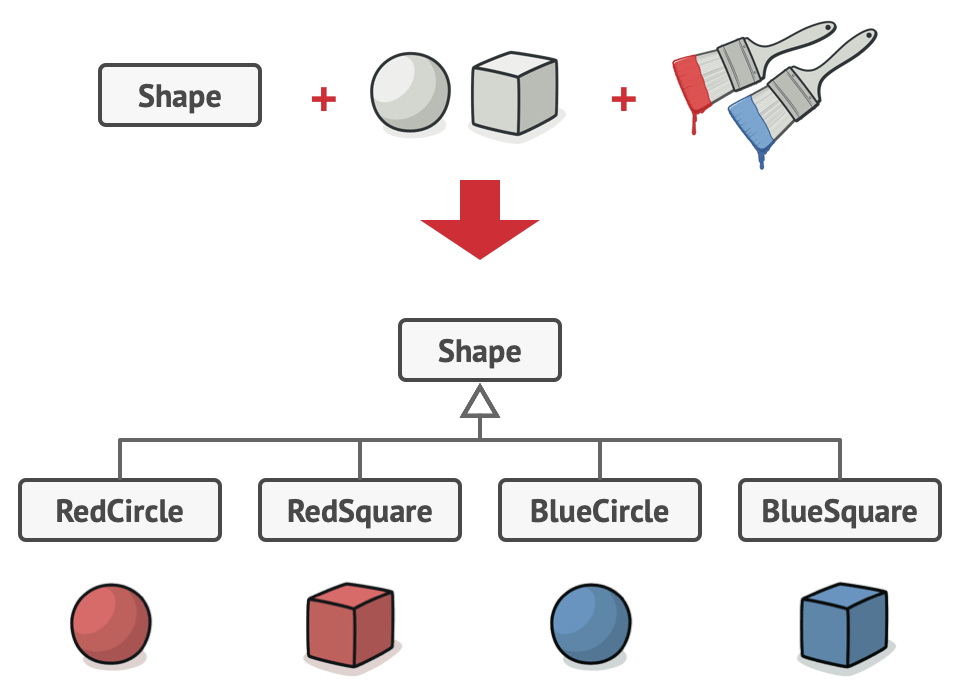

Number of class combinations grows in geometric progression.

Adding new shape types and colors to the hierarchy will grow it exponentially. For example, to add a triangle shape you’d need to introduce two subclasses, one for each color. And after that, adding a new color would require creating three subclasses, one for each shape type. The further we go, the worse it becomes.

### :smiley: Solution


This problem occurs because we’re trying to extend the shape classes in two independent dimensions: by form and by color. That’s a very common issue with class inheritance.

The Bridge pattern attempts to solve this problem by switching from inheritance to the object composition. What this means is that you extract one of the dimensions into a separate class hierarchy, so that the original classes will reference an object of the new hierarchy, instead of having all of its state and behaviors within one class.

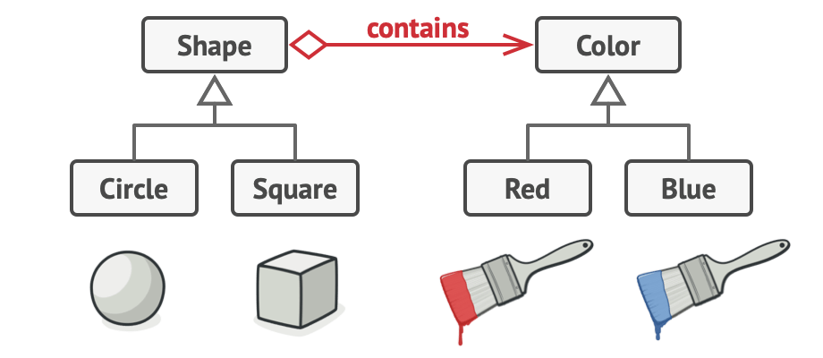

You can prevent the explosion of a class hierarchy by transforming it into several related hierarchies.

Following this approach, we can extract the color-related code into its own class with two subclasses: `Red` and `Blue`. The `Shape` class then gets a reference field pointing to one of the color objects. Now the shape can delegate any color-related work to the linked color object. That reference will act as a bridge between the `Shape` and `Color` classes. From now on, adding new colors won’t require changing the shape hierarchy, and vice versa.


**Abstraction and Implementation**


The GoF book[^1] introduces the terms Abstraction and Implementation as part of the Bridge definition. In my opinion, the terms sound too academic and make the pattern seem more complicated than it really is. Having read the simple example with shapes and colors, let’s decipher the meaning behind the GoF book’s scary words.

Abstraction (also called interface) is a high-level control layer for some entity. This layer isn’t supposed to do any real work on its own. It should delegate the work to the implementation layer (also called platform).

Note that we’re not talking about interfaces or abstract classes from your programming language. These aren’t the same things.

When talking about real applications, the abstraction can be represented by a graphical user interface (GUI), and the implementation could be the underlying operating system code (API) which the GUI layer calls in response to user interactions.

Generally speaking, you can extend such an app in two independent directions:

- Have several different GUIs (for instance, tailored for regular customers or admins).

- Support several different APIs (for example, to be able to launch the app under Windows, Linux, and macOS).

In a worst-case scenario, this app might look like a giant spaghetti bowl, where hundreds of conditionals connect different types of GUI with various APIs all over the code.


Making even a simple change to a monolithic codebase is pretty hard because you must understand the entire thing very well. Making changes to smaller, well-defined modules is much easier.

You can bring order to this chaos by extracting the code related to specific interface-platform combinations into separate classes. However, soon you’ll discover that there are lots of these classes. The class hierarchy will grow exponentially because adding a new GUI or supporting a different API would require creating more and more classes.

Let’s try to solve this issue with the Bridge pattern. It suggests that we divide the classes into two hierarchies:

- Abstraction: the GUI layer of the app.

- Implementation: the operating systems’ APIs.


One of the ways to structure a cross-platform application.

The abstraction object controls the appearance of the app, delegating the actual work to the linked implementation object. Different implementations are interchangeable as long as they follow a common interface, enabling the same GUI to work under Windows and Linux.

As a result, you can change the GUI classes without touching the API-related classes. Moreover, adding support for another operating system only requires creating a subclass in the implementation hierarchy.

### :construction: Structure

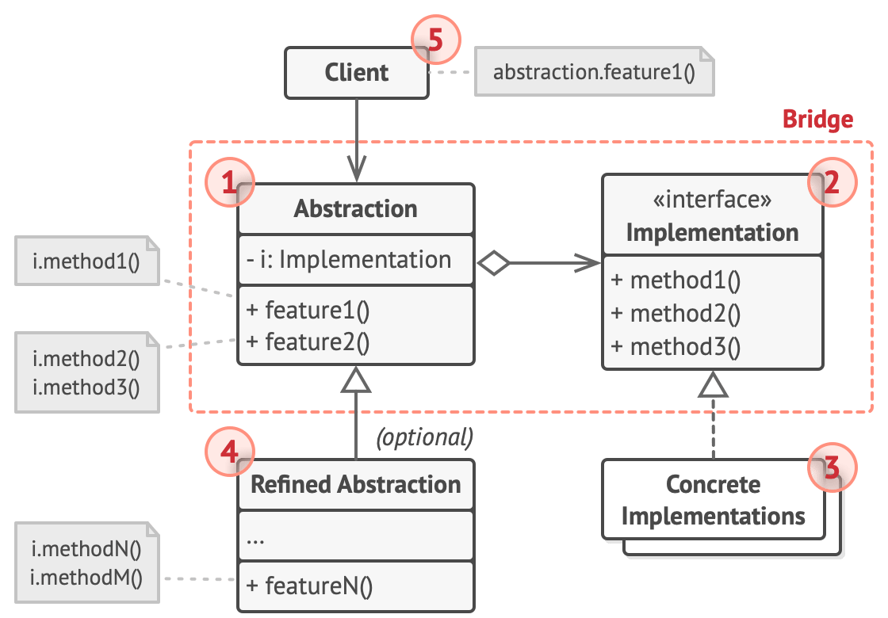

1. The **Abstraction** provides high-level control logic. It relies on the implementation object to do the actual low-level work.

2. The **Implementation** declares the interface that’s common for all concrete implementations. An abstraction can only communicate with an implementation object via methods that are declared here.
The abstraction may list the same methods as the implementation, but usually the abstraction declares some complex behaviors that rely on a wide variety of primitive operations declared by the implementation.

3. Concrete Implementations contain platform-specific code.

4. **Refined Abstractions** provide variants of control logic. Like their parent, they work with different implementations via the general implementation interface.

5. Usually, the **Client** is only interested in working with the abstraction. However, it’s the client’s job to link the abstraction object with one of the implementation objects.

### :hash: Pseudocode

This example illustrates how the **Bridge** pattern can help divide the monolithic code of an app that manages devices and their remote controls. The `Device` classes act as the implementation, whereas the `Remotes` act as the abstraction.

The base remote control class declares a reference field that links it with a device object. All remotes work with the devices via the general device interface, which lets the same remote support multiple device types.

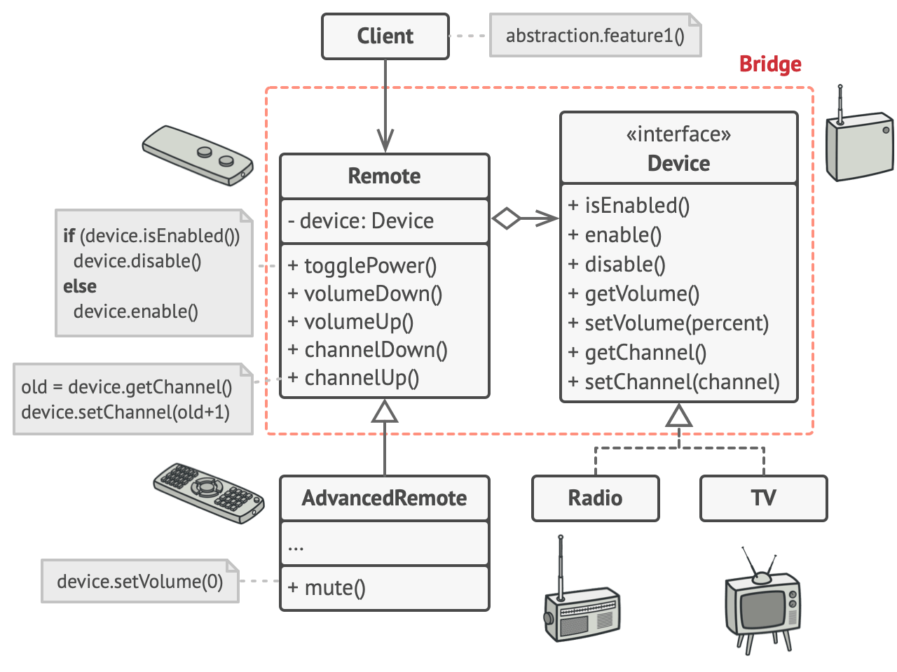

The original class hierarchy is divided into two parts: devices and remote controls.

You can develop the remote control classes independently from the device classes. All that’s needed is to create a new remote subclass. For example, a basic remote control might only have two buttons, but you could extend it with additional features, such as an extra battery or a touchscreen.

The client code links the desired type of remote control with a specific device object via the remote’s constructor.

```c++
// The "abstraction" defines the interface for the "control"
// part of the two class hierarchies. It maintains a reference
// to an object of the "implementation" hierarchy and delegates
// all of the real work to this object.
class RemoteControl is
    protected field device: Device
    constructor RemoteControl(device: Device) is
        this.device = device
    method togglePower() is
        if (device.isEnabled()) then
            device.disable()
    else
            device.enable()
    method volumeDown() is
        device.setVolume(device.getVolume() - 10)
    method volumeUp() is
        device.setVolume(device.getVolume() + 10)
    method channelDown() is
        device.setChannel(device.getChannel() - 1)
    method channelUp() is
        device.setChannel(device.getChannel() + 1)


// You can extend classes from the abstraction hierarchy
// independently from device classes.
class AdvancedRemoteControl extends RemoteControl is
    method mute() is
        device.setVolume(0)


// The "implementation" interface declares methods common to all
// concrete implementation classes. It doesn't have to match the
// abstraction's interface. In fact, the two interfaces can be
// entirely different. Typically the implementation interface
// provides only primitive operations, while the abstraction
// defines higher-level operations based on those primitives.
interface Device is
    method isEnabled()
    method enable()
    method disable()
    method getVolume()
    method setVolume(percent)
    method getChannel()
    method setChannel(channel)


// All devices follow the same interface.
class Tv implements Device is
    // ...

class Radio implements Device is
    // ...


// Somewhere in client code.
tv = new Tv()
remote = new RemoteControl(tv)
remote.togglePower()

radio = new Radio()
remote = new AdvancedRemoteControl(radio)

```

### :bulb: Applicability

:beetle: **Use the Bridge pattern when you want to divide and organize a monolithic class that has several variants of some functionality (for example, if the class can work with various database servers).**

:sparkles: The bigger a class becomes, the harder it is to figure out how it works, and the longer it takes to make a change. The changes made to one of the variations of functionality may require making changes across the whole class, which often results in making errors or not addressing some critical side effects.

The Bridge pattern lets you split the monolithic class into several class hierarchies. After this, you can change the classes in each hierarchy independently of the classes in the others. This approach simplifies code maintenance and minimizes the risk of breaking existing code.

:beetle: **Use the pattern when you need to extend a class in several orthogonal (independent) dimensions.**

:sparkles: The Bridge suggests that you extract a separate class hierarchy for each of the dimensions. The original class delegates the related work to the objects belonging to those hierarchies instead of doing everything on its own.

:beetle: **Use the Bridge if you need to be able to switch implementations at runtime.**

:sparkles: Although it’s optional, the Bridge pattern lets you replace the implementation object inside the abstraction. It’s as easy as assigning a new value to a field.

By the way, this last item is the main reason why so many people confuse the Bridge with the **Strategy** pattern. Remember that a pattern is more than just a certain way to structure your classes. It may also communicate intent and a problem being addressed.


### :clipboard: How to Implement

1. Identify the orthogonal dimensions in your classes. These independent concepts could be: abstraction/platform, domain/infrastructure, front-end/back-end, or interface/implementation.

2. See what operations the client needs and define them in the base abstraction class.

3. Determine the operations available on all platforms. Declare the ones that the abstraction needs in the general implementation interface.

4. For all platforms in your domain create concrete implementation classes, but make sure they all follow the implementation interface.

5. Inside the abstraction class, add a reference field for the implementation type. The abstraction delegates most of the work to the implementation object that’s referenced in that field.

6. If you have several variants of high-level logic, create refined abstractions for each variant by extending the base abstraction class.

7. The client code should pass an implementation object to the abstraction’s constructor to associate one with the other. After that, the client can forget about the implementation and work only with the abstraction object.

### ⚖️ Pros and Cons

:heavy_check_mark: You can create platform-independent classes and apps.

:heavy_check_mark: The client code works with high-level abstractions. It isn’t exposed to the platform details.

:heavy_check_mark: Open/Closed Principle. You can introduce new abstractions and implementations independently from each other.

:heavy_check_mark: Single Responsibility Principle. You can focus on high-level logic in the abstraction and on platform details in the implementation.

:heavy_multiplication_x: You might make the code more complicated by applying the pattern to a highly cohesive class.


### :arrows_counterclockwise: Relations with Other Patterns

- **Bridge** is usually designed up-front, letting you develop parts of an application independently of each other. On the other hand, **Adapter** is commonly used with an existing app to make some otherwise-incompatible classes work together nicely.

- **Bridge**, **State**, **Strategy** (and to some degree **Adapter**) have very similar structures. Indeed, all of these patterns are based on composition, which is delegating work to other objects. However, they all solve different problems. A pattern isn’t just a recipe for structuring your code in a specific way. It can also communicate to other developers the problem the pattern solves.

- You can use **Abstract Factory** along with **Bridge**. This pairing is useful when some abstractions defined by Bridge can only work with specific implementations. In this case, Abstract Factory can encapsulate these relations and hide the complexity from the client code.

- You can combine **Builder** with **Bridge**: the director class plays the role of the abstraction, while different builders act as implementations.

---


## Composite

###### Also known as: Object Tree

**Composite** is a structural design pattern that lets you compose objects into tree structures and then work with these structures as if they were individual objects.

### :worried: Problem

Using the Composite pattern makes sense only when the core model of your app can be represented as a tree.

For example, imagine that you have two types of objects: `Products` and `Boxes`. A `Box` can contain several `Products` as well as a number of smaller `Boxes`. These little `Boxes` can also hold some `Products` or even smaller `Boxes`, and so on.

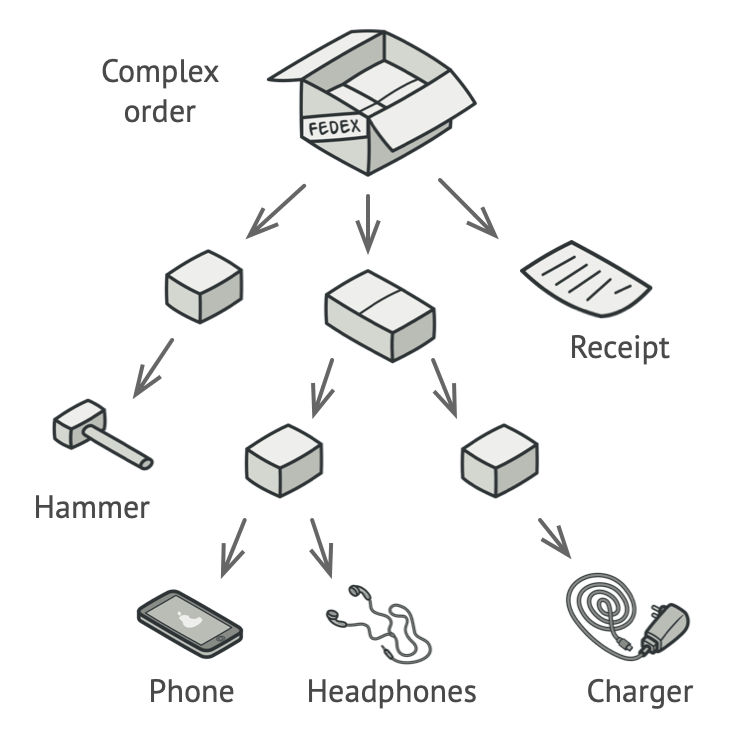

Say you decide to create an ordering system that uses these classes. Orders could contain simple products without any wrapping, as well as boxes stuffed with products...and other boxes. How would you determine the total price of such an order?

An order might comprise various products, packaged in boxes, which are packaged in bigger boxes and so on. The whole structure looks like an upside down tree.

You could try the direct approach: unwrap all the boxes, go over all the products and then calculate the total. That would be doable in the real world; but in a program, it’s not as simple as running a loop. You have to know the classes of `Products` and `Boxes` you’re going through, the nesting level of the boxes and other nasty details beforehand. All of this makes the direct approach either too awkward or even impossible.

### :smiley: Solution

The Composite pattern suggests that you work with `Products` and `Boxes` through a common interface which declares a method for calculating the total price.

How would this method work? For a product, it’d simply return the product’s price. For a box, it’d go over each item the box contains, ask its price and then return a total for this box. If one of these items were a smaller box, that box would also start going over its contents and so on, until the prices of all inner components were calculated. A box could even add some extra cost to the final price, such as packaging cost.


The Composite pattern lets you run a behavior recursively over all components of an object tree.

The greatest benefit of this approach is that you don’t need to care about the concrete classes of objects that compose the tree. You don’t need to know whether an object is a simple product or a sophisticated box. You can treat them all the same via the common interface. When you call a method, the objects themselves pass the request down the tree.

### :car: Real-World Analogy

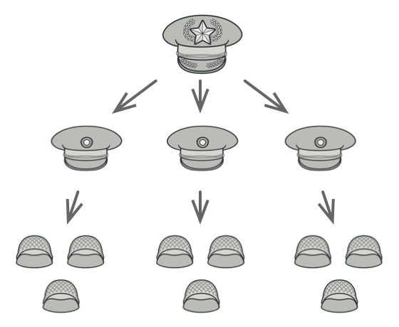

An example of a military structure.

Armies of most countries are structured as hierarchies. An army consists of several divisions; a division is a set of brigades, and a brigade consists of platoons, which can be broken down into squads. Finally, a squad is a small group of real soldiers. Orders are given at the top of the hierarchy and passed down onto each level until every soldier knows what needs to be done.

### :construction: Structure

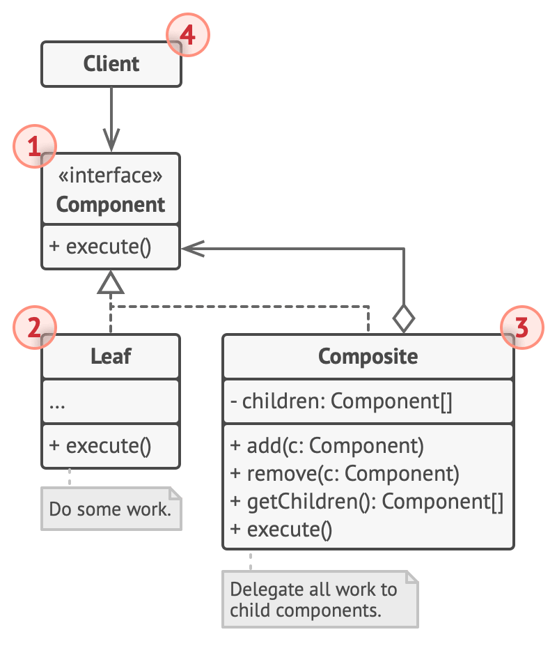

1. The Component interface describes operations that are common to both simple and complex elements of the tree.

2. The Leaf is a basic element of a tree that doesn’t have sub-elements.

Usua    lly, leaf components end up doing most of the real work, since they don’t have anyone to delegate the work to.

3. The Container (aka composite) is an element that has sub-elements: leaves or other containers. A container doesn’t know the concrete classes of its children. It works with all sub-elements only via the component interface.

Upon receiving a request, a container delegates the work to its sub-elements, processes intermediate results and then returns the final result to the client.

4. The Client works with all elements through the component interface. As a result, the client can work in the same way with both simple or complex elements of the tree.

### :hash: Pseudocode


In this example, the Composite pattern lets you implement stacking of geometric shapes in a graphical editor.

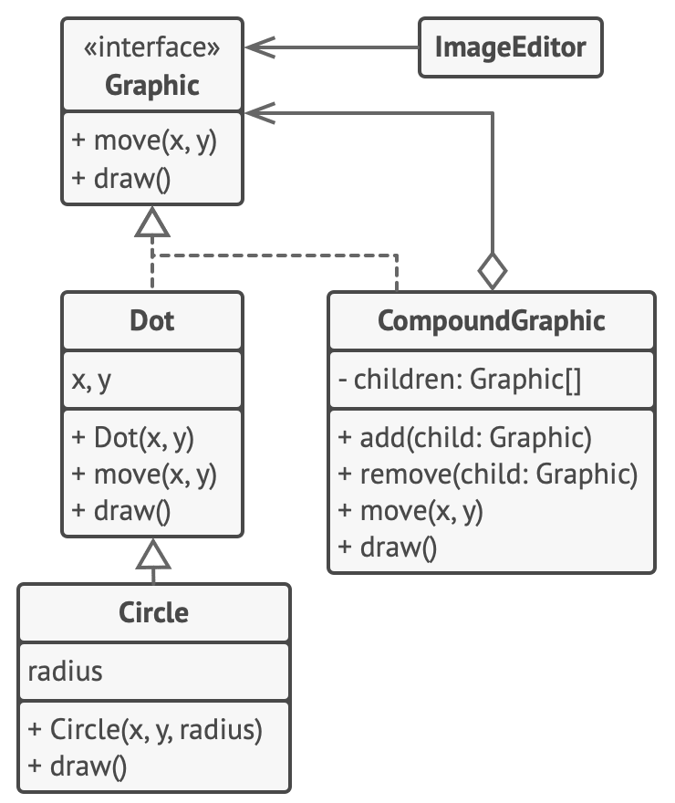

The geometric shapes editor example.

The `CompoundGraphic` class is a container that can comprise any number of sub-shapes, including other compound shapes. A compound shape has the same methods as a simple shape. However, instead of doing something on its own, a compound shape passes the request recursively to all its children and “sums up” the result.

The client code works with all shapes through the single interface common to all shape classes. Thus, the client doesn’t know whether it’s working with a simple shape or a compound one. The client can work with very complex object structures without being coupled to concrete classes that form that structure.


```c++
// The component interface declares common operations for both
// simple and complex objects of a composition.
interface Graphic is
    method move(x, y)
    method draw()

// The leaf class represents end objects of a composition. A
// leaf object can't have any sub-objects. Usually, it's leaf
// objects that do the actual work, while composite objects only
// delegate to their sub-components.
class Dot implements Graphic is
    field x, y

    constructor Dot(x, y) { ... }
    
    method move(x, y) is
        this.x += x, this.y += y

    method draw() is
        // Draw a dot at X and Y.
        
// All component classes can extend other components.
class Circle extends Dot is
    field radius


    constructor Circle(x, y, radius) { ... }

    method draw() is
        // Draw a circle at X and Y with radius R.

// The composite class represents complex components that may
// have children. Composite objects usually delegate the actual
// work to their children and then "sum up" the result.
class CompoundGraphic implements Graphic is
    field children: array of Graphic

    // A composite object can add or remove other components
    // (both simple or complex) to or from its child list.
    method add(child: Graphic) is
        // Add a child to the array of children.

    method remove(child: Graphic) is
        // Remove a child from the array of children.

    method move(x, y) is
        foreach (child in children) do
            child.move(x, y)

// A composite executes its primary logic in a particular
// way. It traverses recursively through all its children,
// collecting and summing up their results. Since the
// composite's children pass these calls to their own
// children and so forth, the whole object tree is traversed
// as a result.
method draw() is
    // 1. For each child component:
    // - Draw the component.
    // - Update the bounding rectangle.
    // 2. Draw a dashed rectangle using the bounding
    // coordinates.


// The client code works with all the components via their base
// interface. This way the client code can support simple leaf
// components as well as complex composites.
class ImageEditor is
    field all: CompoundGraphic
    method load() is
        all = new CompoundGraphic()
        all.add(new Dot(1, 2))
        all.add(new Circle(5, 3, 10))
        // ...

    // Combine selected components into one complex composite
    // component.
    method groupSelected(components: array of Graphic) is
        group = new CompoundGraphic()
        foreach (component in components) do
            group.add(component)
            all.remove(component)
        all.add(group)
        // All components will be drawn.
        all.draw()

```

### :bulb: Applicability

:beetle: **Use the Composite pattern when you have to implement a tree-like object structure.**

:sparkles: The Composite pattern provides you with two basic element types that share a common interface: simple leaves and complex containers. A container can be composed of both leaves and other containers. This lets you construct a nested recursive object structure that resembles a tree.

:beetle: **Use the pattern when you want the client code to treat both simple and complex elements uniformly.**

:sparkles: All elements defined by the Composite pattern share a common interface. Using this interface, the client doesn’t have to worry about the concrete class of the objects it works with.


### :clipboard: How to Implement

1. Make sure that the core model of your app can be represented as a tree structure. Try to break it down into simple elements and containers. Remember that containers must be able to contain both simple elements and other containers.

2. Declare the component interface with a list of methods that make sense for both simple and complex components.

3. Create a leaf class to represent simple elements. A program may have multiple different leaf classes.

4. Create a container class to represent complex elements. In this class, provide an array field for storing references to sub-elements. The array must be able to store both leaves and containers, so make sure it’s declared with the component interface type.

While implementing the methods of the component interface, remember that a container is supposed to be delegating most of the work to sub-elements.

5. Finally, define the methods for adding and removal of child elements in the container.

Keep in mind that these operations can be declared in the component interface. This would violate the Interface Segregation Principle because the methods will be empty in the leaf class. However, the client will be able to treat all the elements equally, even when composing the tree.


### ⚖️ Pros and Cons

:heavy_check_mark: You can work with complex tree structures more conveniently: use polymorphism and recursion to your advantage.

:heavy_check_mark: Open/Closed Principle. You can introduce new element types into the app without breaking the existing code, which now works with the object tree.

:heavy_multiplication_x: It might be difficult to provide a common interface for classes whose functionality differs too much. In certain scenarios, you’d need to overgeneralize the component interface, making it harder to comprehend.

### :arrows_counterclockwise: Relations with Other Patterns

- You can use **Builder** when creating complex **Composite** trees because you can program its construction steps to work recursively.

- **Chain of Responsibility** is often used in conjunction with **Composite**. In this case, when a leaf component gets a request, it may pass it through the chain of all of the parent components down to the root of the object tree.

- You can use **Iterators** to traverse **Composite** trees.

- You can use **Visitor** to execute an operation over an entire **Composite** tree.

- You can implement shared leaf nodes of the **Composite** tree as **Flyweights** to save some RAM.

- **Composite** and **Decorator** have similar structure diagrams since both rely on recursive composition to organize an open-ended number of objects.

A Decorator is like a Composite but only has one child component. There’s another significant difference: Decorator adds additional responsibilities to the wrapped object, while Composite just “sums up” its children’s results.

However, the patterns can also cooperate: you can use Decorator to extend the behavior of a specific object in the Composite tree.

- Designs that make heavy use of **Composite** and **Decorator** can often benefit from using **Prototype**. Applying the pattern lets you clone complex structures instead of re-constructing them from scratch.

---


## Decorator

###### Also known as: Wrapper

**Decorator** is a structural design pattern that lets you attach new behaviors to objects by placing these objects inside special wrapper objects that contain the behaviors.

### :worried: Problem

Imagine that you’re working on a notification library which lets other programs notify their users about important events.

The initial version of the library was based on the `Notifier` class that had only a few fields, a constructor and a single send method. The method could accept a message argument from a client and `send` the message to a list of emails that were passed to the notifier via its constructor. A third-party app which acted as a client was supposed to create and configure the notifier object once, and then use it each time something important happened.

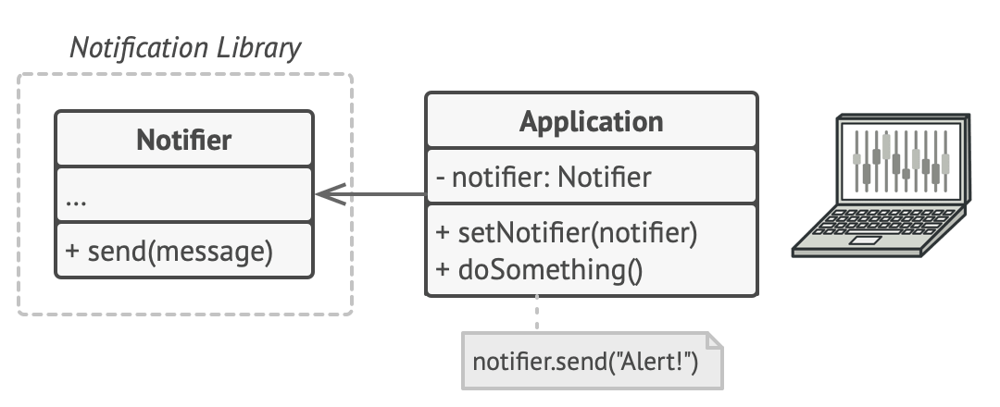

A program could use the notifier class to send notifications about important events to a predefined set of emails.

At some point, you realize that users of the library expect more than just email notifications. Many of them would like to receive an SMS about critical issues. Others would like to be notified on Facebook and, of course, the corporate users would love to get Slack notifications.

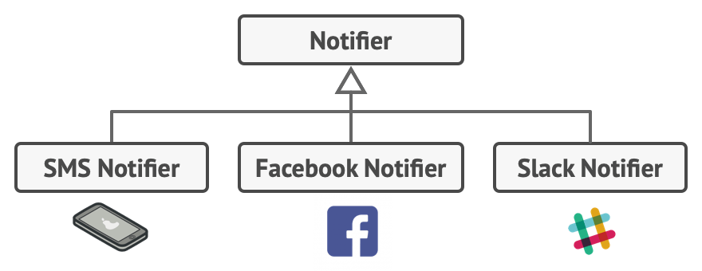

Each notification type is implemented as a notifier’s subclass.

How hard can that be? You extended the `Notifier` class and put the additional notification methods into new subclasses. Now the client was supposed to instantiate the desired notification class and use it for all further notifications.

But then someone reasonably asked you, “Why can’t you use several notification types at once? If your house is on fire, you’d probably want to be informed through every channel.”

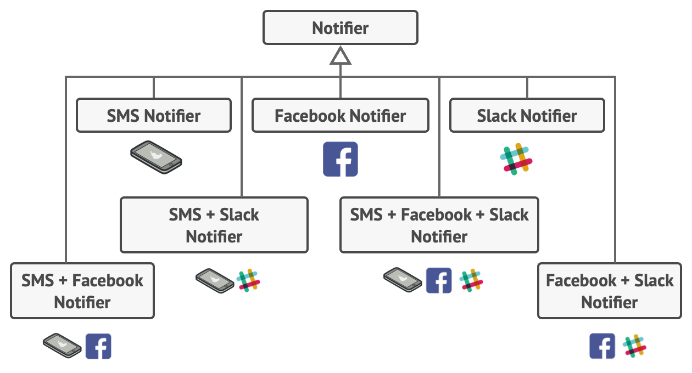

Combinatorial explosion of subclasses.

You tried to address that problem by creating special subclasses which combined several notification methods within one class. However, it quickly became apparent that this approach would bloat the code immensely, not only the library code but the client code as well.You have to find some other way to structure notifications classes so that their number won’t accidentally break some Guinness record.

### :smiley: Solution

Extending a class is the first thing that comes to mind when you need to alter an object’s behavior. However, inheritance has several serious caveats that you need to be aware of.

- Inheritance is static. You can’t alter the behavior of an existing object at runtime. You can only replace the whole object with another one that’s created from a different subclass.

- Subclasses can have just one parent class. In most languages, inheritance doesn’t let a class inherit behaviors of multiple classes at the same time.

One of the ways to overcome these caveats is by using Aggregation or Composition[^2] instead of Inheritance. Both of the alternatives work almost the same way: one object has a reference to another and delegates it some work, whereas with inheritance, the object itself is able to do that work, inheriting the behavior from its superclass.

With this new approach you can easily substitute the linked “helper” object with another, changing the behavior of the container at runtime. An object can use the behavior of various classes, having references to multiple objects and delegating them all kinds of work. Aggregation/composition is the key principle behind many design patterns, including Decorator. On that note, let’s return to the pattern discussion.

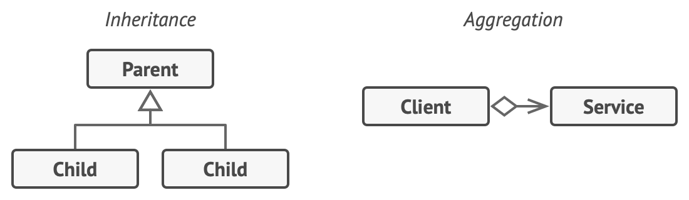

Inheritance vs. Aggregation

“Wrapper” is the alternative nickname for the Decorator pattern that clearly expresses the main idea of the pattern. A wrapper is an object that can be linked with some target object. The wrapper contains the same set of methods as the target and delegates to it all requests it receives. However, the wrapper may alter the result by doing something either before or after it passes the request to the target.

When does a simple wrapper become the real decorator? As I mentioned, the wrapper implements the same interface as the wrapped object. That’s why from the client’s perspective these objects are identical. Make the wrapper’s reference field accept any object that follows that interface. This will let you cover an object in multiple wrappers, adding the combined behavior of all the wrappers to it.

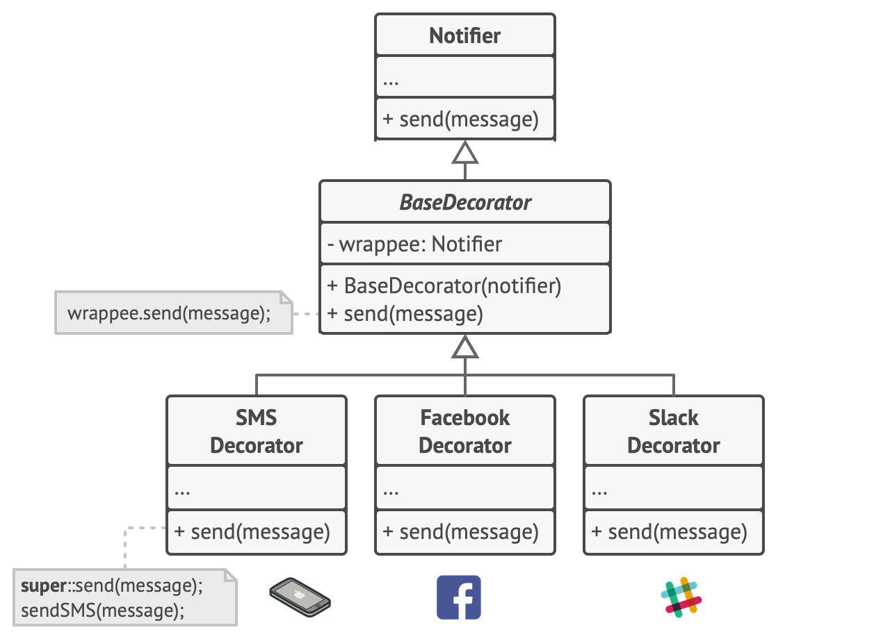

Various notification methods become decorators.

In our notifications example, let’s leave the simple email notification behavior inside the base Notifier class, but turn all other notification methods into decorators. The client code would need to wrap a basic notifier object into a set of decorators that match the client’s preferences. The resulting objects will be structured as a stack.

The last decorator in the stack would be the object that the client actually works with. Since all decorators implement the same interface as the base notifier, the rest of the client code won’t care whether it works with the “pure” notifier object or the decorated one.

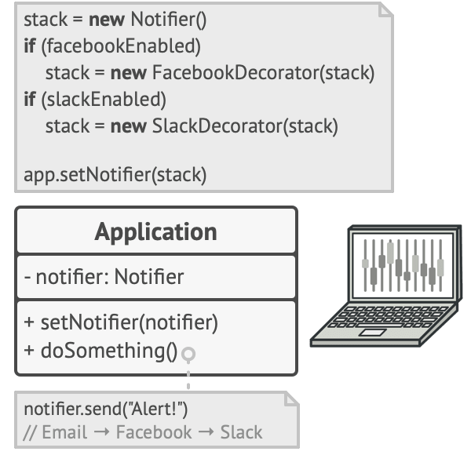

Apps might configure complex stacks of notification decorators.

We could apply the same approach to other behaviors such as formatting messages or composing the recipient list. The client can decorate the object with any custom decorators, as long as they follow the same interface as the others.

### :car: Real-World Analogy


You get a combined effect from wearing multiple pieces of clothing.

Wearing clothes is an example of using decorators. When you’re cold, you wrap yourself in a sweater. If you’re still cold with a sweater, you can wear a jacket on top. If it’s raining, you can put on a raincoat. All of these garments “extend” your basic behavior but aren’t part of you, and you can easily take off any piece of clothing whenever you don’t need it.

### :construction: Structure

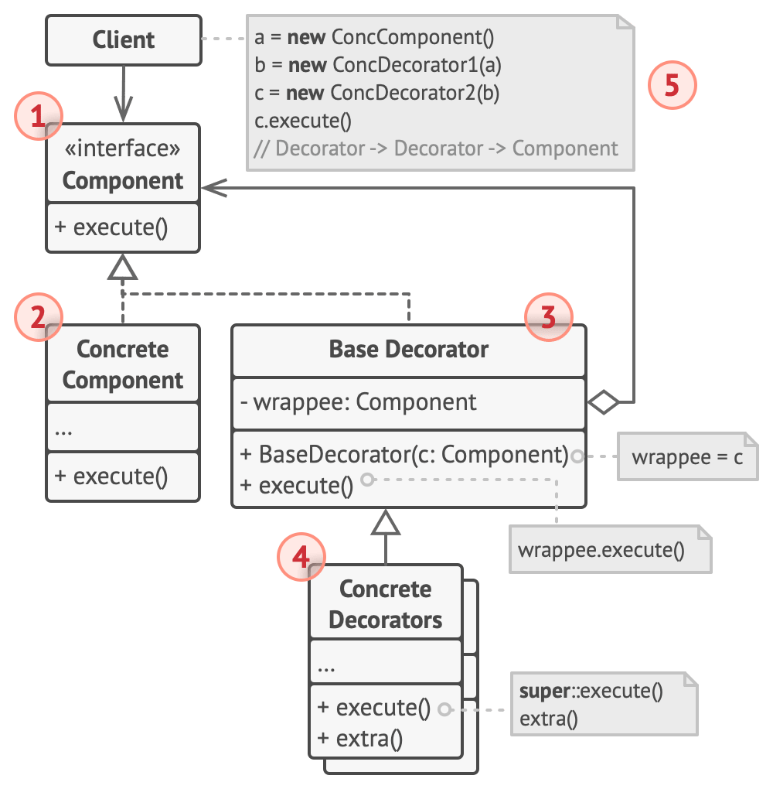

1. The Component declares the common interface for both wrappers and wrapped objects.

2. Concrete Component is a class of objects being wrapped. It defines the basic behavior, which can be altered by decorators.

3. The Base Decorator class has a field for referencing a wrapped object. The field’s type should be declared as the component interface so it can contain both concrete components and decorators. The base decorator delegates all operations to the wrapped object.

4. Concrete Decorators define extra behaviors that can be added to components dynamically. Concrete decorators override methods of the base decorator and execute their behavior either before or after calling the parent method.

5. The Client can wrap components in multiple layers of decorators, as long as it works with all objects via the component interface.

### :hash: Pseudocode


In this example, the **Decorator** pattern lets you compress and encrypt sensitive data independently from the code that actually uses this data.

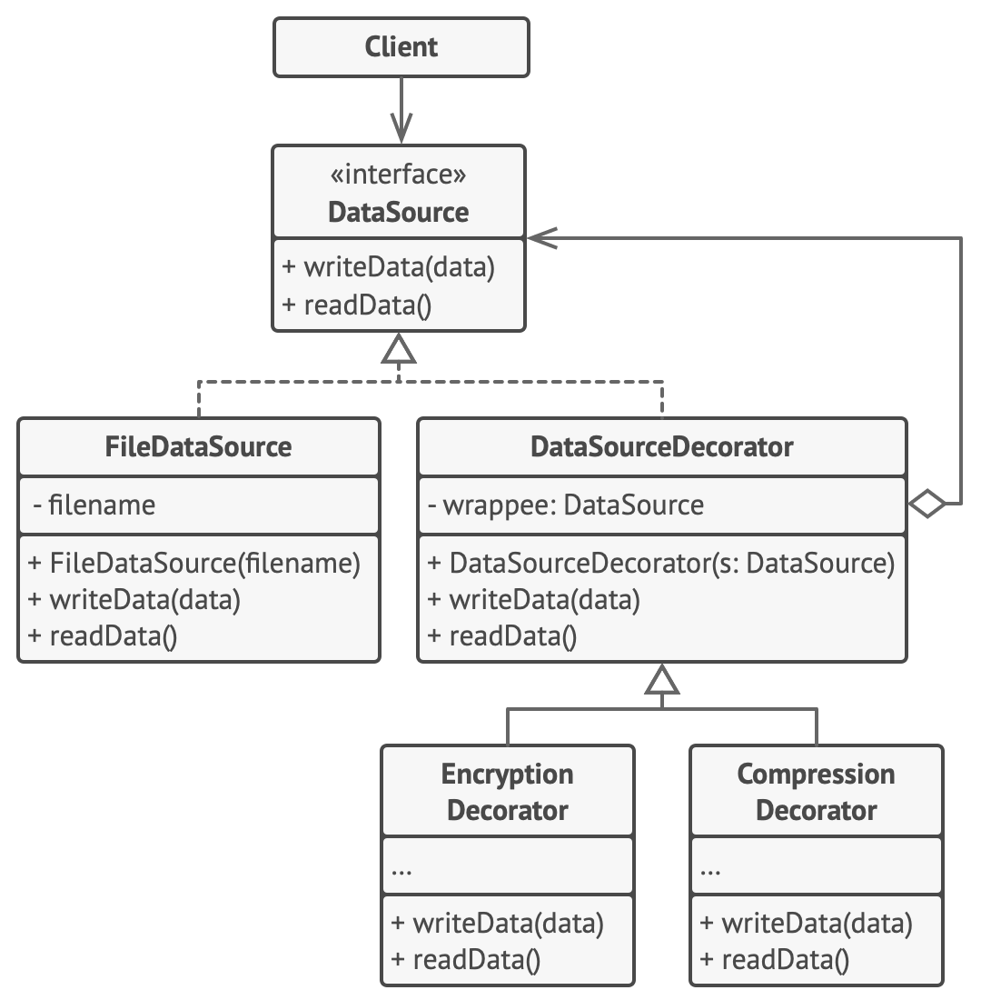

The encryption and compression decorators example.

The application wraps the data source object with a pair of decorators. Both wrappers change the way the data is written to and read from the disk:

- Just before the data is **written to disk**, the decorators encrypt and compress it. The original class writes the encrypted and protected data to the file without knowing about the change.

- Right after the data is **read from disk**, it goes through the same decorators, which decompress and decode it.

The decorators and the data source class implement the same interface, which makes them all interchangeable in the client code.

```c++
// The component interface defines operations that can be
// altered by decorators.
interface DataSource is
    method writeData(data)
    method readData():data

// Concrete components provide default implementations for the
// operations. There might be several variations of these
// classes in a program.
class FileDataSource implements DataSource is
    constructor FileDataSource(filename) { ... }

    method writeData(data) is
        // Write data to file.

    method readData():data is
        // Read data from file.

// The base decorator class follows the same interface as the
// other components. The primary purpose of this class is to
// define the wrapping interface for all concrete decorators.
// The default implementation of the wrapping code might include
// a field for storing a wrapped component and the means to
// initialize it.
class DataSourceDecorator implements DataSource is
    protected field wrappee: DataSource
    
    constructor DataSourceDecorator(source: DataSource) is
        wrappee = source

    // The base decorator simply delegates all work to the
    // wrapped component. Extra behaviors can be added in
    // concrete decorators.
    method writeData(data) is
    wrappee.writeData(data)
    // Concrete decorators may call the parent implementation of
    // the operation instead of calling the wrapped object
    // directly. This approach simplifies extension of decorator
    // classes.
    method readData():data is
        return wrappee.readData()
        
// Concrete decorators must call methods on the wrapped object,
// but may add something of their own to the result. Decorators
// can execute the added behavior either before or after the
// call to a wrapped object.
class EncryptionDecorator extends DataSourceDecorator is
    method writeData(data) is
        // 1. Encrypt passed data.
        // 2. Pass encrypted data to the wrappee's writeData
        // method.
    method readData():data is
        // 1. Get data from the wrappee's readData method.
        // 2. Try to decrypt it if it's encrypted.
        // 3. Return the result.

// You can wrap objects in several layers of decorators.
class CompressionDecorator extends DataSourceDecorator is
    method writeData(data) is
        // 1. Compress passed data.
        // 2. Pass compressed data to the wrappee's writeData
        // method.
    method readData():data is
        // 1. Get data from the wrappee's readData method.
        // 2. Try to decompress it if it's compressed.
        // 3. Return the result.

        
// Option 1. A simple example of a decorator assembly.
class Application is
    method dumbUsageExample() is
        source = new FileDataSource("somefile.dat")
        source.writeData(salaryRecords)
        // The target file has been written with plain data.

        source = new CompressionDecorator(source)
        source.writeData(salaryRecords)
        // The target file has been written with compressed
        // data.

        source = new EncryptionDecorator(source)
        // The source variable now contains this:
        // Encryption > Compression > FileDataSource
        source.writeData(salaryRecords)
        // The file has been written with compressed and
        // encrypted data.

// Option 2. Client code that uses an external data source.
// SalaryManager objects neither know nor care about data
// storage specifics. They work with a pre-configured data
// source received from the app configurator.
class SalaryManager is
    field source: DataSource

    constructor SalaryManager(source: DataSource) { ... }

    method load() is
        return source.readData()
    method save() is
        source.writeData(salaryRecords)
    // ...Other useful methods...
// The app can assemble different stacks of decorators at
// runtime, depending on the configuration or environment.
class ApplicationConfigurator is
    method configurationExample() is
        source = new FileDataSource("salary.dat")
        if (enabledEncryption)
            source = new EncryptionDecorator(source)
        if (enabledCompression)
            source = new CompressionDecorator(source)
        
        
        logger = new SalaryManager(source)
        salary = logger.load()
    // ...
```

### :bulb: Applicability

:beetle: **Use the Decorator pattern when you need to be able to assign extra behaviors to objects at runtime without breaking the code that uses these objects.**

:sparkles: The Decorator lets you structure your business logic into layers, create a decorator for each layer and compose objects with various combinations of this logic at runtime. The client code can treat all these objects in the same way, since they all follow a common interface.

:beetle: **Use the pattern when it’s awkward or not possible to extend an object’s behavior using inheritance.**

:sparkles: Many programming languages have the final keyword that can be used to prevent further extension of a class. For a final class, the only way to reuse the existing behavior would be to wrap the class with your own wrapper, using the Decorator pattern.

### :clipboard: How to Implement

1. Make sure your business domain can be represented as a primary component with multiple optional layers over it.

2. Figure out what methods are common to both the primary component and the optional layers. Create a component interface and declare those methods there.

3. Create a concrete component class and define the base behavior in it.

4. Create a base decorator class. It should have a field for storing a reference to a wrapped object. The field should be declared with the component interface type to allow linking to concrete components as well as decorators. The base decorator must delegate all work to the wrapped object.

5. Make sure all classes implement the component interface.

6. Create concrete decorators by extending them from the base decorator. A concrete decorator must execute its behavior before or after the call to the parent method (which always delegates to the wrapped object).

7. The client code must be responsible for creating decorators and composing them in the way the client needs.

### ⚖️ Pros and Cons

:heavy_check_mark: You can extend an object’s behavior without making a new subclass.

:heavy_check_mark: You can add or remove responsibilities from an object at runtime.

:heavy_check_mark: You can combine several behaviors by wrapping an object into multiple decorators.

:heavy_check_mark: Single Responsibility Principle. You can divide a monolithic class that implements many possible variants of behavior into several smaller classes.

:heavy_multiplication_x: It’s hard to remove a specific wrapper from the wrappers stack.

:heavy_multiplication_x: It’s hard to implement a decorator in such a way that its behavior doesn’t depend on the order in the decorators stack.

:heavy_multiplication_x: The initial configuration code of layers might look pretty ugly.

### :arrows_counterclockwise: Relations with Other Patterns

- **Adapter** changes the interface of an existing object, while **Decorator** enhances an object without changing its interface. In addition, Decorator supports recursive composition, which isn’t possible when you use Adapter.

- **Adapter** provides a different interface to the wrapped object, **Proxy** provides it with the same interface, and **Decorator** provides it with an enhanced interface.

- **Chain of Responsibility** and **Decorator** have very similar class structures. Both patterns rely on recursive composition to pass the execution through a series of objects. However, there are several crucial differences.

The CoR handlers can execute arbitrary operations independently of each other. They can also stop passing the request further at any point. On the other hand, various Decorators can extend the object’s behavior while keeping it consistent with the base interface. In addition, decorators aren’t allowed to break the flow of the request.

- **Composite** and **Decorator** have similar structure diagrams since both rely on recursive composition to organize an open-ended number of objects.

A Decorator is like a Composite but only has one child component. There’s another significant difference: Decorator adds additional responsibilities to the wrapped object, while Composite just “sums up” its children’s results.

However, the patterns can also cooperate: you can use Decorator to extend the behavior of a specific object in the Composite tree.

- Designs that make heavy use of **Composite** and **Decorator** can often benefit from using **Prototype**. Applying the pattern lets you clone complex structures instead of re-constructing them from scratch.

- **Decorator** lets you change the skin of an object, while **Strategy** lets you change the guts.

- **Decorator** and **Proxy** have similar structures, but very different intents. Both patterns are built on the composition principle, where one object is supposed to delegate some of the work to another. The difference is that a Proxy usually manages the life cycle of its service object on its own, whereas the composition of Decorators is always controlled by the client.

---


## Facade

**Facade** is a structural design pattern that provides a simplified interface to a library, a framework, or any other complex set of classes.

### :worried: Problem

Imagine that you must make your code work with a broad set of objects that belong to a sophisticated library or framework. Ordinarily, you’d need to initialize all of those objects, keep track of dependencies, execute methods in the correct order, and so on.

As a result, the business logic of your classes would become tightly coupled to the implementation details of 3rd-party classes, making it hard to comprehend and maintain.

### :smiley: Solution

A facade is a class that provides a simple interface to a complex subsystem which contains lots of moving parts. A facade might provide limited functionality in comparison to working with the subsystem directly. However, it includes only those features that clients really care about.

Having a facade is handy when you need to integrate your app with a sophisticated library that has dozens of features, but you just need a tiny bit of its functionality.

For instance, an app that uploads short funny videos with cats to social media could potentially use a professional video conversion library. However, all that it really needs is a class with the single method `encode(filename, format)`. After creating such a class and connecting it with the video conversion library, you’ll have your first facade.

### :car: Real-World Analogy

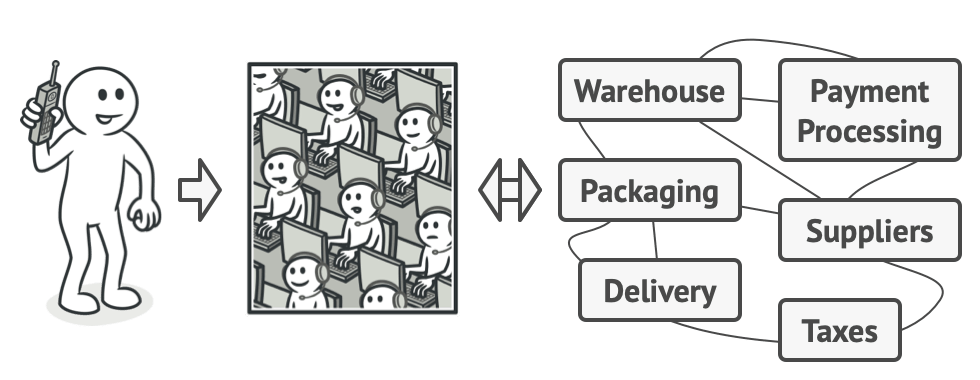

Placing orders by phone.

When you call a shop to place a phone order, an operator is your facade to all services and departments of the shop. The operator provides you with a simple voice interface to the ordering system, payment gateways, and various delivery services.

### :construction: Structure

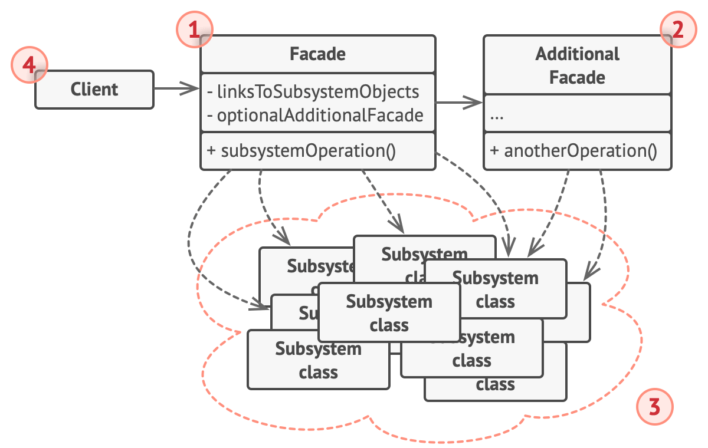

1. The Facade provides convenient access to a particular part of the subsystem’s functionality. It knows where to direct the client’s request and how to operate all the moving parts.

2. An Additional Facade class can be created to prevent polluting a single facade with unrelated features that might make it yet another complex structure. Additional facades can be used by both clients and other facades.

3. The Complex Subsystem consists of dozens of various objects. To make them all do something meaningful, you have to dive deep into the subsystem’s implementation details, such as initializing objects in the correct order and supplying them with data in the proper format.

Subsystem classes aren’t aware of the facade’s existence. They operate within the system and work with each other directly.

4. The Client uses the facade instead of calling the subsystem objects directly.

### :hash: Pseudocode


In this example, the **Facade** pattern simplifies interaction with a complex video conversion framework.

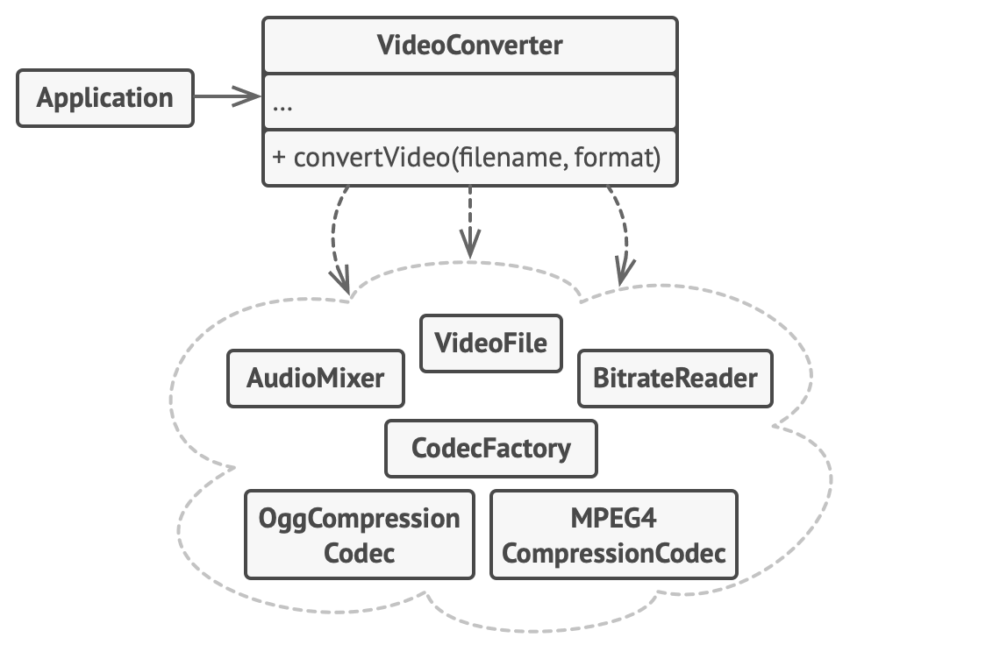

An example of isolating multiple dependencies within a single facade class.

Instead of making your code work with dozens of the framework classes directly, you create a facade class which encapsulates that functionality and hides it from the rest of the code. This structure also helps you to minimize the effort of upgrading to future versions of the framework or replacing it with another one. The only thing you’d need to change in your app would be the implementation of the facade’s methods.

```c++
// These are some of the classes of a complex 3rd-party video
// conversion framework. We don't control that code, therefore
// can't simplify it.

class VideoFile
// ...

class OggCompressionCodec
// ...

class MPEG4CompressionCodec
// ...

class CodecFactory
// ...

class BitrateReader
// ...

class AudioMixer
// ...


// We create a facade class to hide the framework's complexity
// behind a simple interface. It's a trade-off between
// functionality and simplicity.
class VideoConverter is
    method convert(filename, format):File is
        file = new VideoFile(filename)
        sourceCodec = new CodecFactory.extract(file)
        if (format == "mp4")
            destinationCodec = new MPEG4CompressionCodec()
        else
            destinationCodec = new OggCompressionCodec()
        buffer = BitrateReader.read(filename, sourceCodec)
        result = BitrateReader.convert(buffer, destinationCodec)
        result = (new AudioMixer()).fix(result)
        return new File(result)

// Application classes don't depend on a billion classes
// provided by the complex framework. Also, if you decide to
// switch frameworks, you only need to rewrite the facade class.
class Application is
    method main() is
        convertor = new VideoConverter()
        mp4 = convertor.convert("funny-cats-video.ogg", "mp4")
        mp4.save()

```

### :bulb: Applicability

:beetle: **Use the Facade pattern when you need to have a limited but straightforward interface to a complex subsystem.**

:sparkles: Often, subsystems get more complex over time. Even applying design patterns typically leads to creating more classes. A subsystem may become more flexible and easier to reuse in various contexts, but the amount of configuration and boilerplate code it demands from a client grows ever larger. The Facade attempts to fix this problem by providing a shortcut to the most-used features of the subsystem which fit most client requirements.

:beetle: **Use the Facade when you want to structure a subsystem into layers.**

:sparkles: Create facades to define entry points to each level of a subsystem. You can reduce coupling between multiple subsystems by requiring them to communicate only through facades.

For example, let’s return to our video conversion framework. It can be broken down into two layers: video- and audio-related. For each layer, you can create a facade and then make the classes of each layer communicate with each another via those facades. This approach looks very similar to the `Mediator` pattern.

### :clipboard: How to Implement

1. Check whether it’s possible to provide a simpler interface than what an existing subsystem already provides. You’re on the right track if this interface makes the client code independent from many of the subsystem’s classes.

2. Declare and implement this interface in a new facade class. The facade should redirect the calls from the client code to appropriate objects of the subsystem. The facade should be responsible for initializing the subsystem and managing its further life cycle unless the client code already does this.

3. To get the full benefit from the pattern, make all the client code communicate with the subsystem only via the facade. Now the client code is protected from any changes in the subsystem code. For example, when a subsystem gets upgraded to a new version, you will only need to modify the code in the facade.

4. If the facade becomes too big, consider extracting part of its behavior to a new, refined facade class.

### ⚖️ Pros and Cons

:heavy_check_mark: You can isolate your code from the complexity of a subsystem.

:heavy_multiplication_x: A facade can become **a god object** coupled to all classes of an app.

### :arrows_counterclockwise: Relations with Other Patterns

- **Facade** defines a new interface for existing objects, whereas **Adapter** tries to make the existing interface usable. Adapter usually wraps just one object, while Facade works with an entire subsystem of objects.

- **Abstract Factory** can serve as an alternative to **Facade** when you only want to hide the way the subsystem objects are created from the client code.

- **Flyweight** shows how to make lots of little objects, whereas **Facade** shows how to make a single object that represents an entire subsystem.

- **Facade** and **Mediator** have similar jobs: they try to organize collaboration between lots of tightly coupled classes.

    * Facade defines a simplified interface to a subsystem of objects, but it doesn’t introduce any new functionality. The subsystem itself is unaware of the facade. Objects within the subsystem can communicate directly.

    * Mediator centralizes communication between components of the system. The components only know about the mediator object and don’t communicate directly.

- A **Facade** class can often be transformed into a **Singleton** since a single facade object is sufficient in most cases.

- **Facade** is similar to **Proxy** in that both buffer a complex entity and initialize it on its own. Unlike Facade, Proxy has the same interface as its service object, which makes them interchangeable.

---


## Flyweight

###### Also known as: Cache

**Flyweight** is a structural design pattern that lets you fit more objects into the available amount of RAM by sharing common parts of state between multiple objects instead of keeping all of the data in each object.

### :worried: Problem

To have some fun after long working hours, you decided to create a simple video game: players would be moving around a map and shooting each other. You chose to implement a realistic particle system and make it a distinctive feature of the game. Vast quantities of bullets, missiles, and shrapnel from explosions should fly all over the map and deliver a thrilling experience to the player.

Upon its completion, you pushed the last commit, built the game and sent it to your friend for a test drive. Although the game was running flawlessly on your machine, your friend wasn’t able to play for long. On his computer, the game kept crashing after a few minutes of gameplay. 

After spending several hours digging through debug logs, you discovered that the game crashed because of an insufficient amount of RAM. It turned out that your friend’s rig was much less powerful than your own computer, and that’s why the problem emerged so quickly on his machine.

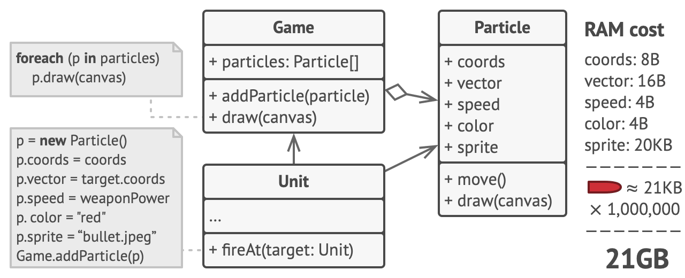

The actual problem was related to your particle system. Each particle, such as a bullet, a missile or a piece of shrapnel was represented by a separate object containing plenty of data. At some point, when the carnage on a player’s screen reached its climax, newly created particles no longer fit into the remaining RAM, so the program crashed.

### :smiley: Solution

On closer inspection of the `Particle` class, you may notice that the color and sprite fields consume a lot more memory than other fields. What’s worse is that these two fields store almost identical data across all particles. For example, all bullets have the same color and sprite.


Other parts of a particle’s state, such as coordinates, movement vector and speed, are unique to each particle. After all, the values of these fields change over time. This data represents the always changing context in which the particle exists, while the color and sprite remain constant for each particle.

This constant data of an object is usually called the intrinsic state. It lives within the object; other objects can only read it, not change it. The rest of the object’s state, often altered “from the outside” by other objects, is called the extrinsic state.

The Flyweight pattern suggests that you stop storing the extrinsic state inside the object. Instead, you should pass this state to specific methods which rely on it. Only the intrinsic state stays within the object, letting you reuse it in different contexts. As a result, you’d need fewer of these objects since they only differ in the intrinsic state, which has much fewer variations than the extrinsic.

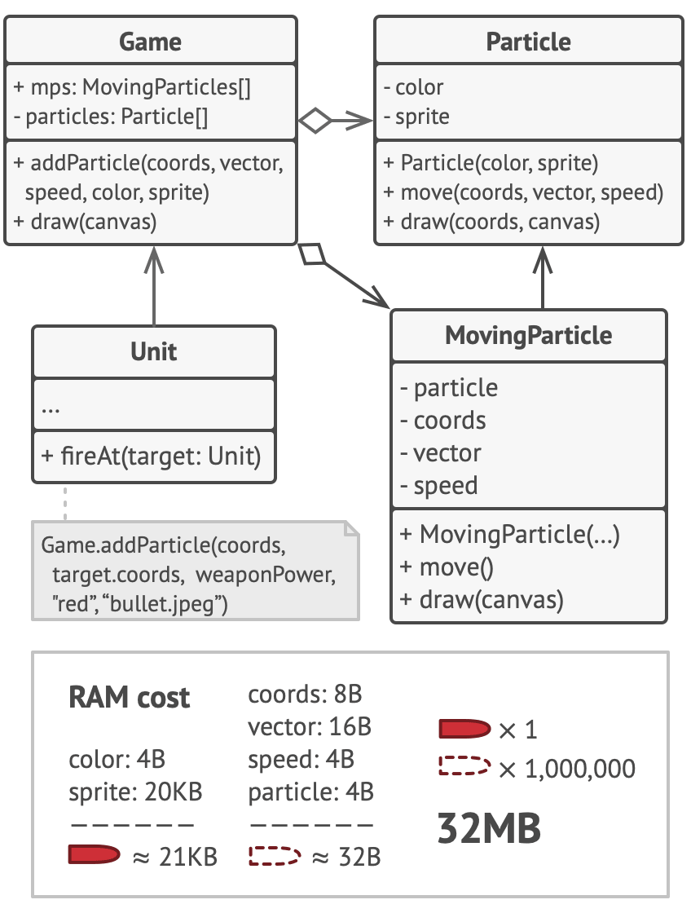

Let’s return to our game. Assuming that we had extracted the extrinsic state from our particle class, only three different objects would suffice to represent all particles in the game: a bullet, a missile, and a piece of shrapnel. As you’ve probably guessed by now, an object that only stores the intrinsic state is called a flyweight.

**Extrinsic state storage**

Where does the extrinsic state move to? Some class should still store it, right? In most cases, it gets moved to the container object, which aggregates objects before we apply the pattern.

In our case, that’s the main `Game` object that stores all `particles` in the particles field. To move the extrinsic state into this class, you need to create several array fields for storing coordinates, vectors, and speed of each individual particle. But that’s not all. You need another array for storing references to a specific flyweight that represents a particle. These arrays must be in sync so that you can access all data of a particle using the same index.

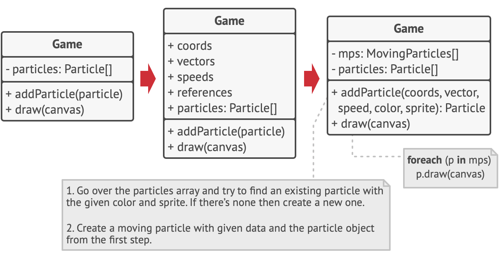

A more elegant solution is to create a separate context class that would store the extrinsic state along with reference to the flyweight object. This approach would require having just a single array in the container class.

Wait a second! Won’t we need to have as many of these contextual objects as we had at the very beginning? Technically, yes. But the thing is, these objects are much smaller than before. The most memory-consuming fields have been moved to just a few flyweight objects. Now, a thousand small contextual objects can reuse a single heavy flyweight object instead of storing a thousand copies of its data.

**Flyweight and immutability**

Since the same flyweight object can be used in different contexts, you have to make sure that its state can’t be modified. A flyweight should initialize its state just once, via constructor parameters. It shouldn’t expose any setters or public fields to other objects.

**Flyweight factory**

For more convenient access to various flyweights, you can create a factory method that manages a pool of existing flyweight objects. The method accepts the intrinsic state of the desired flyweight from a client, looks for an existing flyweight object matching this state, and returns it if it was found. If not, it creates a new flyweight and adds it to the pool.

There are several options where this method could be placed. The most obvious place is a flyweight container. Alternatively, you could create a new factory class. Or you could make the factory method static and put it inside an actual flyweight class.

### :construction: Structure


1. The Flyweight pattern is merely an optimization. Before applying it, make sure your program does have the RAM consumption problem related to having a massive number of similar objects in memory at the same time. Make sure that this problem can’t be solved in any other meaningful way.

2. The **Flyweight** class contains the portion of the original object’s state that can be shared between multiple objects. The same flyweight object can be used in many different contexts. The state stored inside a flyweight is called intrinsic. The state passed to the flyweight’s methods is called extrinsic.

3. The **Context** class contains the extrinsic state, unique across all original objects. When a context is paired with one of the flyweight objects, it represents the full state of the original object.

4. Usually, the behavior of the original object remains in the flyweight class. In this case, whoever calls a flyweight’s method must also pass appropriate bits of the extrinsic state into the method’s parameters. On the other hand, the behavior can be moved to the context class, which would use the linked flyweight merely as a data object.

5. The **Client** calculates or stores the extrinsic state of flyweights. From the client’s perspective, a flyweight is a template object which can be configured at runtime by passing some contextual data into parameters of its methods.

6. The **Flyweight Factory** manages a pool of existing flyweights. With the factory, clients don’t create flyweights directly. Instead, they call the factory, passing it bits of the intrinsic state of the desired flyweight. The factory looks over previously created flyweights and either returns an existing one that matches search criteria or creates a new one if nothing is found.

### :hash: Pseudocode


In this example, the Flyweight pattern helps to reduce memory usage when rendering millions of tree objects on a canvas.

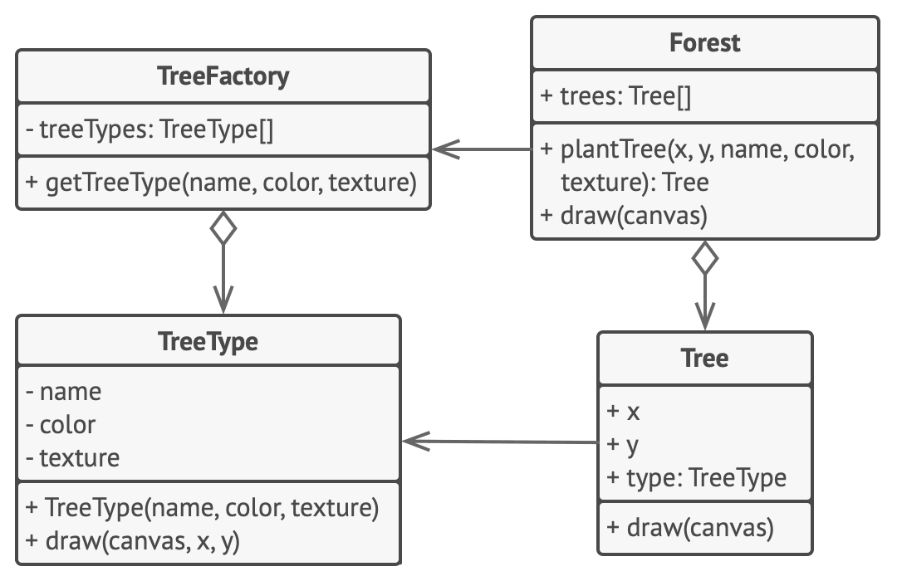

The pattern extracts the repeating intrinsic state from a main `Tree` class and moves it into the flyweight class `TreeType`.

Now instead of storing the same data in multiple objects, it’s kept in just a few flyweight objects and linked to appropriate `Tree` objects which act as contexts. The client code creates new tree objects using the flyweight factory, which encapsulates the complexity of searching for the right object and reusing it if needed.

```c++
// The flyweight class contains a portion of the state of a
// tree. These fields store values that are unique for each
// particular tree. For instance, you won't find here the tree
// coordinates. But the texture and colors shared between many
// trees are here. Since this data is usually BIG, you'd waste a
// lot of memory by keeping it in each tree object. Instead, we
// can extract texture, color and other repeating data into a
// separate object which lots of individual tree objects can
// reference.
class TreeType is
    field name
    field color
    field texture
    constructor TreeType(name, color, texture) { ... }
    method draw(canvas, x, y) is
        // 1. Create a bitmap of a given type, color & texture.
        // 2. Draw the bitmap on the canvas at X and Y coords.

// Flyweight factory decides whether to re-use existing
// flyweight or to create a new object.
class TreeFactory is
    static field treeTypes: collection of tree types
    static method getTreeType(name, color, texture) is
        type = treeTypes.find(name, color, texture)

        if (type == null)
            type = new TreeType(name, color, texture)
            treeTypes.add(type)
        return type

// The contextual object contains the extrinsic part of the tree
// state. An application can create billions of these since they
// are pretty small: just two integer coordinates and one
// reference field.
class Tree is
    field x,y
    field type: TreeType
    constructor Tree(x, y, type) { ... }
    method draw(canvas) is
        type.draw(canvas, this.x, this.y)

// The Tree and the Forest classes are the flyweight's clients.
// You can merge them if you don't plan to develop the Tree
// class any further.
class Forest is
    field trees: collection of Trees
    
    method plantTree(x, y, name, color, texture) is
        type = TreeFactory.getTreeType(name, color, texture)
        tree = new Tree(x, y, type)
        trees.add(tree)

    method draw(canvas) is
        foreach (tree in trees) do
            tree.draw(canvas)

```

### :bulb: Applicability

:beetle: **Use the Flyweight pattern only when your program must support a huge number of objects which barely fit into available RAM.**

:sparkles: The benefit of applying the pattern depends heavily on how and where it’s used. It’s most useful when:

- an application needs to spawn a huge number of similar objects

- this drains all available RAM on a target device

- the objects contain duplicate states which can be extracted and shared between multiple objects

### :clipboard: How to Implement

1. Divide fields of a class that will become a flyweight into two parts:

    - the intrinsic state: the fields that contain unchanging data duplicated across many objects

    - the extrinsic state: the fields that contain contextual data unique to each object

2. Leave the fields that represent the intrinsic state in the class, but make sure they’re immutable. They should take their initial values only inside the constructor.

3. Go over methods that use fiels of the extrinsic state. For each field used in the method, introduce a new parameter and use it instead of the field.

4. Optionally, create a factory class to manage the pool of flyweights. It should check for an existing flyweight before creating a new one. Once the factory is in place, clients must only request flyweights through it. They should describe the desired flyweight by passing its intrinsic state to the factory.

5. The client must store or calculate values of the extrinsic state (context) to be able to call methods of flyweight objects. For the sake of convenience, the extrinsic state along with the flyweight-referencing field may be moved to a separate context class.

### ⚖️ Pros and Cons

:heavy_check_mark: You can save lots of RAM, assuming your program has tons of similar objects.

:heavy_multiplication_x: You might be trading RAM over CPU cycles when some of the context data needs to be recalculated each time somebody calls a flyweight method.

:heavy_multiplication_x: The code becomes much more complicated. New team members will always be wondering why the state of an entity was separated in such a way.


### :arrows_counterclockwise: Relations with Other Patterns

- You can implement shared leaf nodes of the **Composite** tree as **Flyweights** to save some RAM.

- **Flyweight** shows how to make lots of little objects, whereas **Facade** shows how to make a single object that represents an entire subsystem.

- **Flyweight** would resemble **Singleton** if you somehow managed to reduce all shared states of the objects to just one flyweight object. But there are two fundamental differences between these patterns:

    1. There should be only one Singleton instance, whereas a Flyweight class can have multiple instances with different intrinsic states.

    2. The Singleton object can be mutable. Flyweight objects are immutable.

---


## Proxy

**Proxy** is a structural design pattern that lets you provide a substitute or placeholder for another object. A proxy controls access to the original object, allowing you to perform something either before or after the request gets through to the original object.

### :worried: Problem

Why would you want to control access to an object? Here is an example: you have a massive object that consumes a vast amount of system resources. You need it from time to time, but not always.

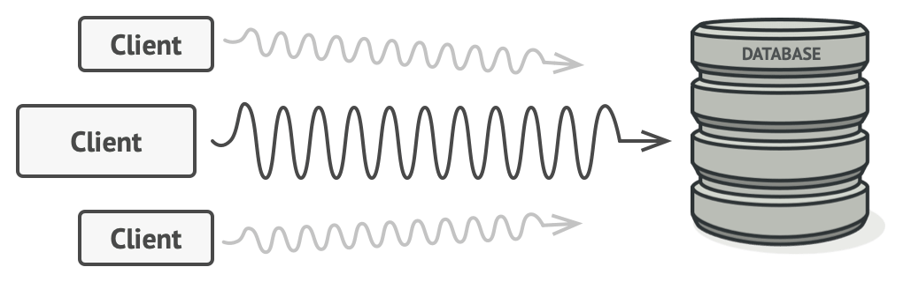

Database queries can be really slow.

You could implement lazy initialization: create this object only when it’s actually needed. All of the object’s clients would need to execute some deferred initialization code. Unfortunately, this would probably cause a lot of code duplication.

In an ideal world, we’d want to put this code directly into our object’s class, but that isn’t always possible. For instance, the class may be part of a closed 3rd-party library.

### :smiley: Solution

The Proxy pattern suggests that you create a new proxy class with the same interface as an original service object. Then you update your app so that it passes the proxy object to all of the original object’s clients. Upon receiving a request from a client, the proxy creates a real service object and delegates all the work to it.


The proxy disguises itself as a database object. It can handle lazy initialization and result caching without the client or the real database object even knowing.

But what’s the benefit? If you need to execute something either before or after the primary logic of the class, the proxy lets you do this without changing that class. Since the proxy implements the same interface as the original class, it can be passed to any client that expects a real service object.

### :car: Real-World Analogy

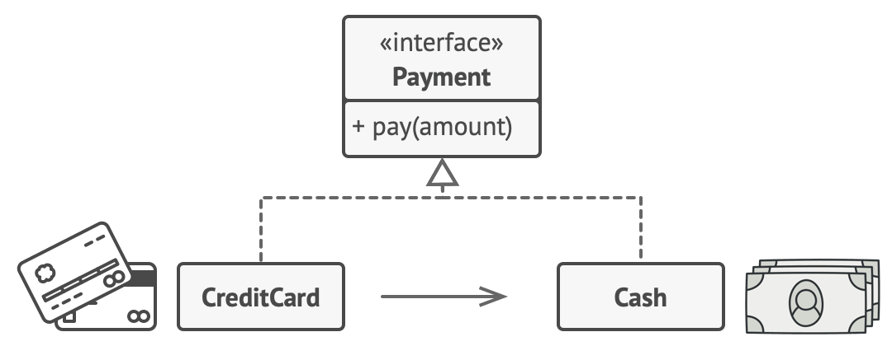

Credit cards can be used for payments just the same as cash.

A credit card is a proxy for a bank account, which is a proxy for a bundle of cash. Both implement the same interface: they can be used for making a payment. A consumer feels great because there’s no need to carry loads of cash around. A shop owner is also happy since the income from a transaction gets added electronically to the shop’s bank account without the risk of losing the deposit or getting robbed on the way to the bank.

### :construction: Structure

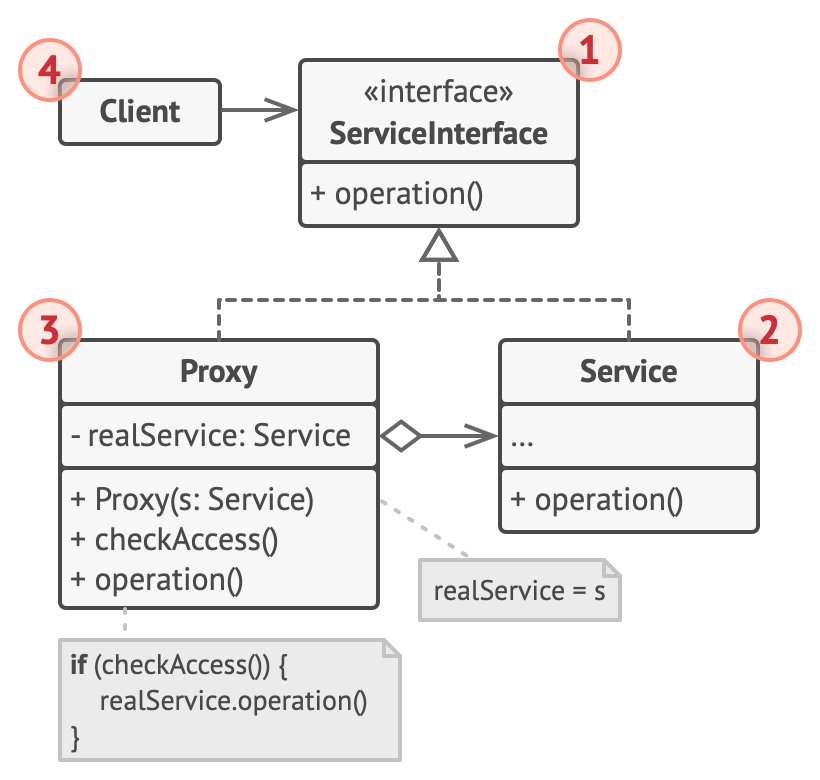

1. The **Service Interface** declares the interface of the Service. The proxy must follow this interface to be able to disguise itself as a service object.

2. The **Service** is a class that provides some useful business logic.

3. The **Proxy** class has a reference field that points to a service object. After the proxy finishes its processing (e.g., lazy initialization, logging, access control, caching, etc.), it passes the request to the service object.Usually, proxies manage the full lifecycle of their service objects.

4. The **Client** should work with both services and proxies via the same interface. This way you can pass a proxy into any code that expects a service object.

### :hash: Pseudocode

This example illustrates how the Proxy pattern can help to introduce lazy initialization and caching to a 3rd-party YouTube integration library.

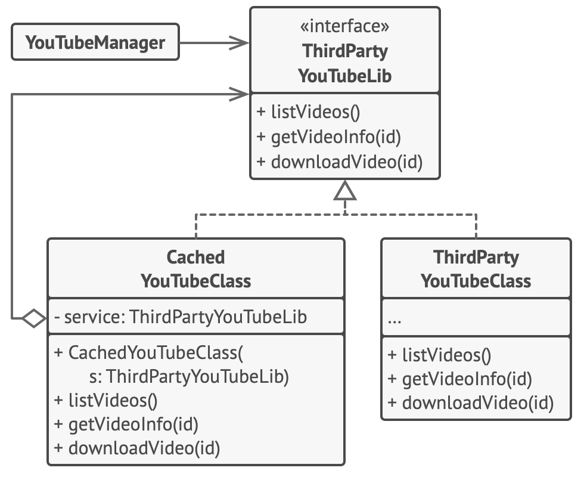

Caching results of a service with a proxy.

The library provides us with the video downloading class. However, it’s very inefficient. If the client application requests the same video multiple times, the library just downloads it over and over, instead of caching and reusing the first downloaded file.

The proxy class implements the same interface as the original downloader and delegates it all the work. However, it keeps track of the downloaded files and returns the cached result when the app requests the same video multiple times.

```c++
// The interface of a remote service.
interface ThirdPartyYouTubeLib is
    method listVideos()
    method getVideoInfo(id)
    method downloadVideo(id)

// The concrete implementation of a service connector. Methods
// of this class can request information from YouTube. The speed
// of the request depends on a user's internet connection as
// well as YouTube's. The application will slow down if a lot of
// requests are fired at the same time, even if they all request
// the same information.
class ThirdPartyYouTubeClass implements ThirdPartyYouTubeLib is
    method listVideos() is
        // Send an API request to YouTube.

    method getVideoInfo(id) is
        // Get metadata about some video.
    method downloadVideo(id) is
        // Download a video file from YouTube.

// To save some bandwidth, we can cache request results and keep
// them for some time. But it may be impossible to put such code
// directly into the service class. For example, it could have
// been provided as part of a third party library and/or defined
// as `final`. That's why we put the caching code into a new
// proxy class which implements the same interface as the
// service class. It delegates to the service object only when
// the real requests have to be sent.
class CachedYouTubeClass implements ThirdPartyYouTubeLib is
    private field service: ThirdPartyYouTubeLib
    private field listCache, videoCache
    field needReset
    
    constructor CachedYouTubeClass(service: ThirdPartyYouTubeLib) is
        this.service = service

    method listVideos() is
        if (listCache == null || needReset)
            listCache = service.listVideos()
        return listCache

    method getVideoInfo(id) is
        if (videoCache == null || needReset)
            videoCache = service.getVideoInfo(id)
        return videoCache

    method downloadVideo(id) is
        if (!downloadExists(id) || needReset)
            service.downloadVideo(id)


// The GUI class, which used to work directly with a service
// object, stays unchanged as long as it works with the service
// object through an interface. We can safely pass a proxy
// object instead of a real service object since they both
// implement the same interface.
class YouTubeManager is
    protected field service: ThirdPartyYouTubeLib

    constructor YouTubeManager(service: ThirdPartyYouTubeLib) is
        this.service = service
    
    method renderVideoPage(id) is
        info = service.getVideoInfo(id)
        // Render the video page.
    
    method renderListPanel() is
        list = service.listVideos()
        // Render the list of video thumbnails.
    
    method reactOnUserInput() is
        renderVideoPage()
        renderListPanel()

// The application can configure proxies on the fly.
class Application is
    method init() is
        aYouTubeService = new ThirdPartyYouTubeClass()
        aYouTubeProxy = new CachedYouTubeClass(aYouTubeService)
        manager = new YouTubeManager(aYouTubeProxy)
        manager.reactOnUserInput()

```


### :bulb: Applicability
:beetle:
:sparkles:


There are dozens of ways to utilize the Proxy pattern. Let’s go over the most popular uses.

:beetle: Lazy initialization (virtual proxy). This is when you have a heavyweight service object that wastes system resources by being always up, even though you only need it from time to time.

:sparkles: Instead of creating the object when the app launches, you can delay the object’s initialization to a time when it’s really needed.

:beetle: Access control (protection proxy). This is when you want only specific clients to be able to use the service object; for instance, when your objects are crucial parts of an operating system and clients are various launched applications (including malicious ones).

:sparkles: The proxy can pass the request to the service object only if the client’s credentials match some criteria.

:beetle: Local execution of a remote service (remote proxy). This is when the service object is located on a remote server.

:sparkles: In this case, the proxy passes the client request over the network, handling all of the nasty details of working with the network.

:beetle: Logging requests (logging proxy). This is when you want to keep a history of requests to the service object.

:sparkles: The proxy can log each request before passing it to the service.

:beetle: Caching request results (caching proxy). This is when you need to cache results of client requests and manage the life cycle of this cache, especially if results are quite large.

:sparkles: The proxy can implement caching for recurring requests that always yield the same results. The proxy may use the parameters of requests as the cache keys.

:beetle: Smart reference. This is when you need to be able to dismiss a heavyweight object once there are no clients that use it.

:sparkles: The proxy can keep track of clients that obtained a reference to the service object or its results. From time to time, the proxy may go over the clients and check whether they are still active. If the client list gets empty, the proxy might dismiss the service object and free the underlying system resources.

The proxy can also track whether the client had modified the service object. Then the unchanged objects may be reused by other clients.

### :clipboard: How to Implement

1. If there’s no pre-existing service interface, create one to make proxy and service objects interchangeable. Extracting the interface from the service class isn’t always possible, because you’d need to change all of the service’s clients to use that interface. Plan B is to make the proxy a subclass of the service class, and this way it’ll inherit the interface of the service.

2. Create the proxy class. It should have a field for storing a reference to the service. Usually, proxies create and manage the whole life cycle of their services. On rare occasions, a service is passed to the proxy via a constructor by the client.

3. Implement the proxy methods according to their purposes. In most cases, after doing some work, the proxy should delegate the work to the service object.

4. Consider introducing a creation method that decides whether the client gets a proxy or a real service. This can be a simple static method in the proxy class or a full-blown factory method.

5. Consider implementing lazy initialization for the service object.

### ⚖️ Pros and Cons

:heavy_check_mark: You can control the service object without clients knowing about it.

:heavy_check_mark: You can manage the lifecycle of the service object when clients don’t care about it.

:heavy_check_mark: The proxy works even if the service object isn’t ready or is not available.

:heavy_check_mark: Open/Closed Principle. You can introduce new proxies without changing the service or clients.

:heavy_multiplication_x: The code may become more complicated since you need to introduce a lot of new classes.

:heavy_multiplication_x: The response from the service might get delayed.

### :arrows_counterclockwise: Relations with Other Patterns

- **Adapter** provides a different interface to the wrapped object, **Proxy** provides it with the same interface, and **Decorator** provides it with an enhanced interface.

- **Facade** is similar to **Proxy** in that both buffer a complex entity and initialize it on its own. Unlike Facade, Proxy has the same interface as its service object, which makes them interchangeable.

- **Decorator** and **Proxy** have similar structures, but very different intents. Both patterns are built on the composition principle, where one object is supposed to delegate some of the work to another. The difference is that a Proxy usually manages the life cycle of its service object on its own, whereas the composition of Decorators is always controlled by the client.

---

## Behavioral Design Patterns

Behavioral patterns are concerned with algorithms and the assignment of responsibilities between objects.

> ### [Chain of Responsibility](#chain-of-responsibility-1)
> [](#chain-of-responsibility-1) </br>
> [Lets you pass requests along a chain of handlers. Upon receiving a request, each handler decides either to process the request or to pass it to the next handler in the chain.](#chain-of-responsibility-1)

> ### [Command](#command-1)
> [](#command-1) </br>
> [Turns a request into a stand-alone object that contains all information about the request. This transformation lets you pass requests as a method arguments, delay or queue a request's execution, and support undoable operations.](#command-1)

> ### [Iterator](#iterator-1)
> [](#iterator-1) </br>
> [Lets you traverse elements of a collection without exposing its underlying representation (list, stack, tree, etc.).](#iterator-1)

> ### [Mediator](#mediator-1)
> [](#mediator-1) </br>
> [Lets you reduce chaotic dependencies between objects. The pattern restricts direct communications between the objects and forces them to collaborate only via a mediator object.](#mediator-1)

> ### [Memento](#memento-1)
> [](#memento-1) </br>
> [Lets you save and restore the previous state of an object without revealing the details of its implementation.](#memento-1)

> ### [Observer](#observer-1)
> [](#observer-1) </br>
> [Lets you define a subscription mechanism to notify multiple objects about any events that happen to the object they're observing.](#observer-1)

> ### [State](#state-1)
> [](#state-1) </br>
> [Lets an object alter its behavior when its internal state changes. It appears as if the object changed its class.](#state-1)

> ### [Strategy](#strategy-1)
> [](#strategy-1) </br>
> [Lets you define a family of algorithms, put each of them into a separate class, and make their objects interchangeable.](#strategy-1)

> ### [Template Method](#template-method-1)
> [](#template-method-1) </br>
> [Defines the skeleton of an algorithm in the superclass but lets subclasses override specific steps of the algorithm without changing its structure.](#template-method-1)

> ### [Visitor](#visitor-1)
> [](#visitor-1) </br>
> [Lets you separate algorithms from the objects on which they operate.](#visitor-1)

---


## Chain of Responsibility

###### Also known as: CoR, Chain of Command

**Chain of Responsibility** is a behavioral design pattern that lets you pass requests along a chain of handlers. Upon receiving a request, each handler decides either to process the request or to pass it to the next handler in the chain.

### :worried: Problem

Imagine that you’re working on an online ordering system. You want to restrict access to the system so only authenticated users can create orders. Also, users who have administrative permissions must have full access to all orders.

After a bit of planning, you realized that these checks must be performed sequentially. The application can attempt to authenticate a user to the system whenever it receives a request that contains the user’s credentials. However, if those credentials aren’t correct and authentication fails, there’s no reason to proceed with any other checks.

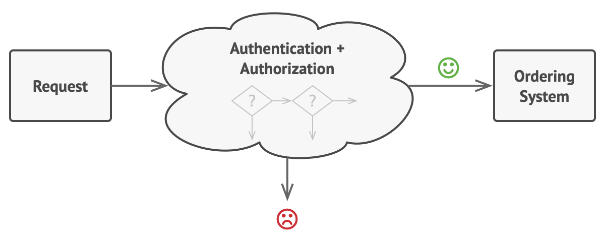

The request must pass a series of checks before the ordering system itself can handle it.

During the next few months, you implemented several more of those sequential checks.

- One of your colleagues suggested that it’s unsafe to pass raw data straight to the ordering system. So you added an extra validation step to sanitize the data in a request.

- Later, somebody noticed that the system is vulnerable to brute force password cracking. To negate this, you promptly added a check that filters repeated failed requests coming from the same IP address.

- Someone else suggested that you could speed up the system by returning cached results on repeated requests containing the same data. Hence, you added another check which lets the request pass through to the system only if there’s no suitable cached response.


The bigger the code grew, the messier it became.

The code of the checks, which had already looked like a mess, became more and more bloated as you added each new feature. Changing one check sometimes affected the others. Worst of all, when you tried to reuse the checks to protect other components of the system, you had to duplicate some of the code since those components required some of the checks, but not all of them.

The system became very hard to comprehend and expensive to maintain. You struggled with the code for a while, until one day you decided to refactor the whole thing.

### :smiley: Solution

Like many other behavioral design patterns, the **Chain of Responsibility** relies on transforming particular behaviors into stand-alone objects called handlers. In our case, each check should be extracted to its own class with a single method that performs the check. The request, along with its data, is passed to this method as an argument.

The pattern suggests that you link these handlers into a chain. Each linked handler has a field for storing a reference to the next handler in the chain. In addition to processing a request, handlers pass the request further along the chain. The request travels along the chain until all handlers have had a chance to process it.

Here’s the best part: a handler can decide not to pass the request further down the chain and effectively stop any further processing.

In our example with ordering systems, a handler performs the processing and then decides whether to pass the request further down the chain. Assuming the request contains the right data, all the handlers can execute their primary behavior, whether it’s authentication checks or caching.

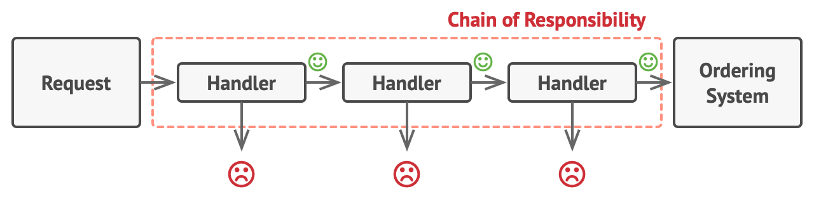

Handlers are lined up one by one, forming a chain.

However, there’s a slightly different approach (and it’s a bit more canonical) in which, upon receiving a request, a handler decides whether it can process it. If it can, it doesn’t pass the request any further. So it’s either only one handler that processes the request or none at all. This approach is very common when dealing with events in stacks of elements within a graphical user interface.

For instance, when a user clicks a button, the event propagates through the chain of GUI elements that starts with the button, goes along its containers (like forms or panels), and ends up with the main application window. The event is processed by the first element in the chain that’s capable of handling it. This example is also noteworthy because it shows that a chain can always be extracted from an object tree.

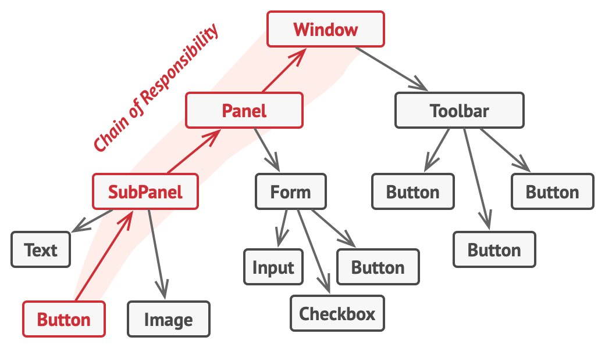

A chain can be formed from a branch of an object tree.

It’s crucial that all handler classes implement the same interface. Each concrete handler should only care about the following one having the execute method. This way you can compose chains at runtime, using various handlers without coupling your code to their concrete classes.


### :car: Real-World Analogy

You’ve just bought and installed a new piece of hardware on your computer. Since you’re a geek, the computer has several operating systems installed. You try to boot all of them to see whether the hardware is supported. Windows detects and enables the hardware automatically. However, your beloved Linux refuses to work with the new hardware. With a small flicker of hope, you decide to call the tech-support phone number written on the box.

The first thing you hear is the robotic voice of the autoresponder. It suggests nine popular solutions to various problems, none of which are relevant to your case. After a while, the robot connects you to a live operator.

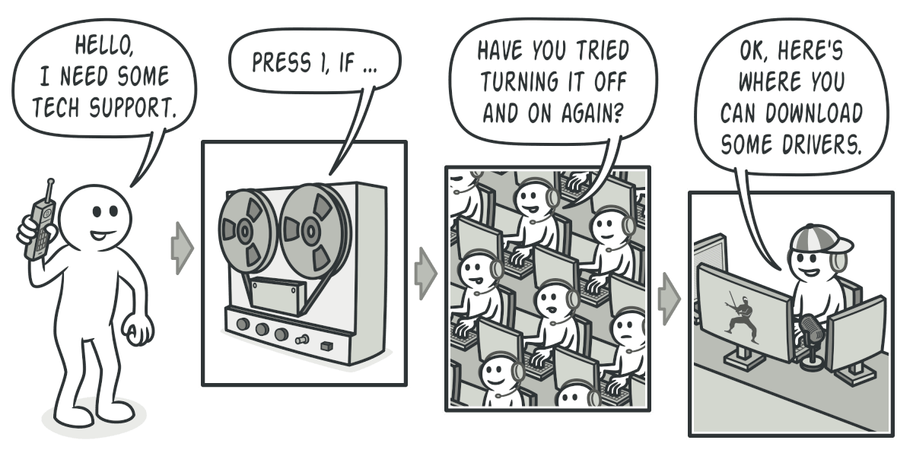

A call to tech support can go through multiple operators.

Alas, the operator isn’t able to suggest anything specific either. He keeps quoting lengthy excerpts from the manual, refusing to listen to your comments. After hearing the phrase “have you tried turning the computer off and on again?” for the 10th time, you demand to be connected to a proper engineer.

Eventually, the operator passes your call to one of the engineers, who had probably longed for a live human chat for hours as he sat in his lonely server room in the dark basement of some office building. The engineer tells you where to download proper drivers for your new hardware and how to install them on Linux. Finally, the solution! You end the call, bursting with joy.

### :construction: Structure

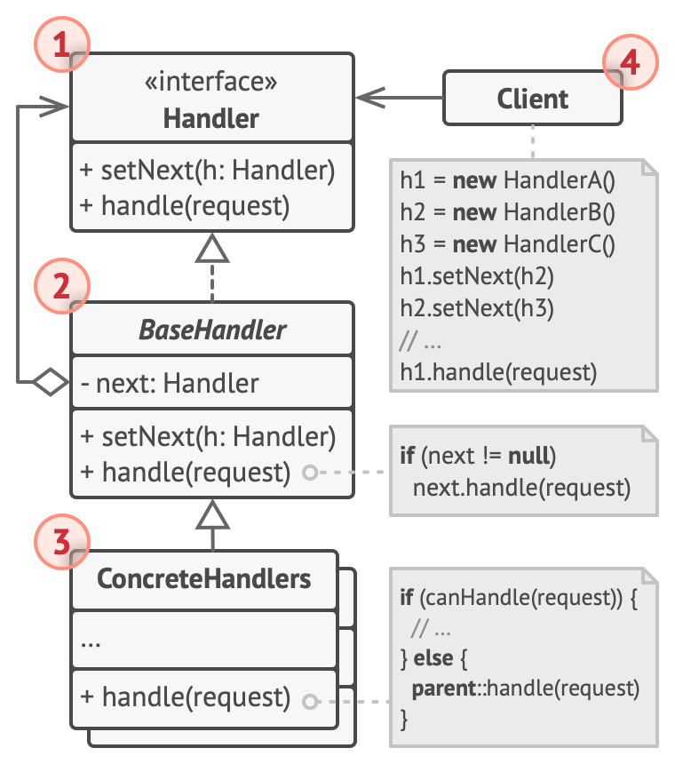

1. The Handler declares the interface, common for all concrete handlers. It usually contains just a single method for handling requests, but sometimes it may also have another method for setting the next handler on the chain.

2. The Base Handler is an optional class where you can put the boilerplate code that’s common to all handler classes.

Usually, this class defines a field for storing a reference to the next handler. The clients can build a chain by passing a handler to the constructor or setter of the previous handler. The class may also implement the default handling behavior: it can pass execution to the next handler after checking for its existence.

3. Concrete Handlers contain the actual code for processing requests. Upon receiving a request, each handler must decide whether to process it and, additionally, whether to pass it along the chain.

Handlers are usually self-contained and immutable, accepting all necessary data just once via the constructor.

4. The Client may compose chains just once or compose them dynamically, depending on the application’s logic. Note that a request can be sent to any handler in the chain—it doesn’t have to be the first one.

### :hash: Pseudocode

In this example, the Chain of Responsibility pattern is responsible for displaying contextual help information for active GUI elements.

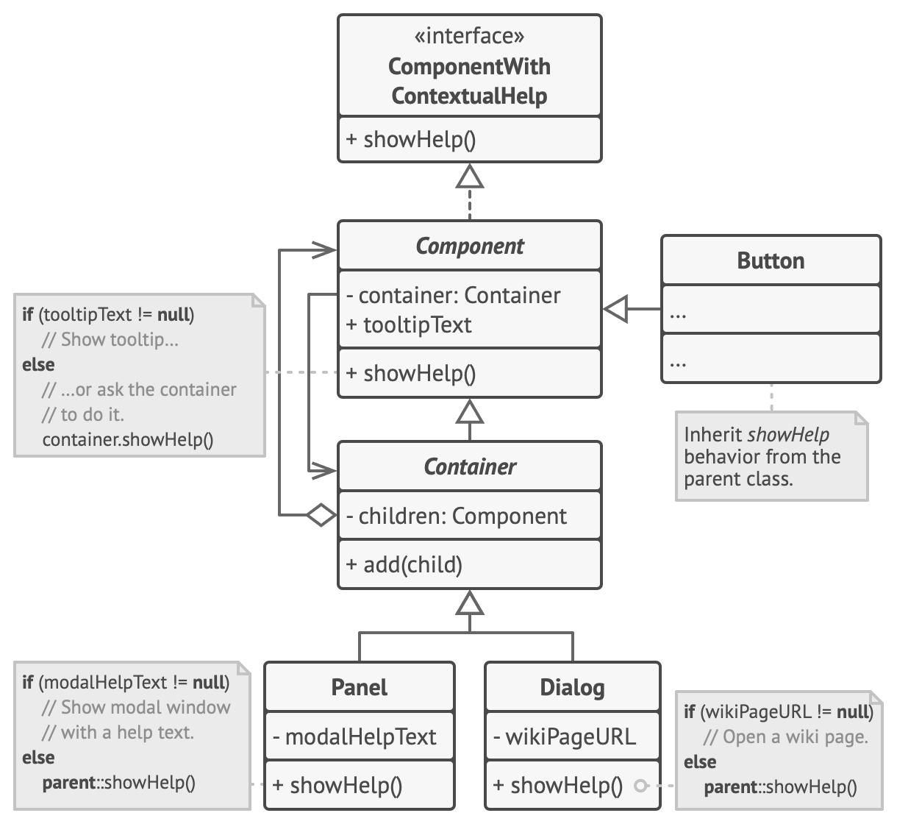

The GUI classes are built with the Composite pattern. Each element is linked to its container element. At any point, you can build a chain of elements that starts with the element itself and goes through all of its container elements.

The application’s GUI is usually structured as an object tree. For example, the `Dialog` class, which renders the main window of the app, would be the root of the object tree. The dialog contains `Panels`, which might contain other panels or simple low-level elements like `Buttons` and `TextFields`.

A simple component can show brief contextual tooltips, as long as the component has some help text assigned. But more complex components define their own way of showing contextual help, such as showing an excerpt from the manual or opening a page in a browser.

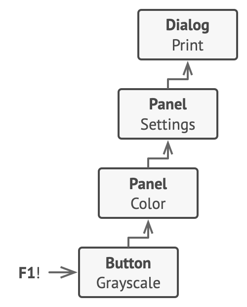

That’s how a help request traverses GUI objects.

When a user points the mouse cursor at an element and presses the `F1` key, the application detects the component under the pointer and sends it a help request. The request bubbles up through all the element’s containers until it reaches the element that’s capable of displaying the help information.

```c++
// The handler interface declares a method for building a chain
// of handlers. It also declares a method for executing a
// request.
interface ComponentWithContextualHelp is
    method showHelp()


// The base class for simple components.
abstract class Component implements ComponentWithContextualHelp is
    field tooltipText: string

    // The component's container acts as the next link in the
    // chain of handlers.
    protected field container: Container

    // The component shows a tooltip if there's help text
    // assigned to it. Otherwise it forwards the call to the
    // container, if it exists.
    method showHelp() is
        if (tooltipText != null)
            // Show tooltip.
        else
            container.showHelp()
// Containers can contain both simple components and other
// containers as children. The chain relationships are
// established here. The class inherits showHelp behavior from
// its parent.
abstract class Container extends Component is
    protected field children: array of Component

    method add(child) is
        children.add(child)
        child.container = this


// Primitive components may be fine with default help
// implementation...
class Button extends Component is
    // ...

// But complex components may override the default
// implementation. If the help text can't be provided in a new
// way, the component can always call the base implementation
// (see Component class).
class Panel extends Container is
    field modalHelpText: string

    method showHelp() is
        if (modalHelpText != null)
            // Show a modal window with the help text.
        else
            super.showHelp()
        
    // ...same as above...
    class Dialog extends Container is
        field wikiPageURL: string

        method showHelp() is
            if (wikiPageURL != null)
                // Open the wiki help page.
            else
                super.showHelp()

// Client code.
class Application is
    // Every application configures the chain differently.
    method createUI() is
        dialog = new Dialog("Budget Reports")
        dialog.wikiPageURL = "http://..."
        panel = new Panel(0, 0, 400, 800)
        panel.modalHelpText = "This panel does..."
        ok = new Button(250, 760, 50, 20, "OK")
        ok.tooltipText = "This is an OK button that..."
        cancel = new Button(320, 760, 50, 20, "Cancel")
        // ...
        panel.add(ok)
        panel.add(cancel)
        dialog.add(panel)

// Imagine what happens here.
method onF1KeyPress() is
    component = this.getComponentAtMouseCoords()
    component.showHelp()

```

### :bulb: Applicability

:beetle: Use the Chain of Responsibility pattern when your program is expected to process different kinds of requests in various ways, but the exact types of requests and their sequences are unknown beforehand.

:sparkles: The pattern lets you link several handlers into one chain and, upon receiving a request, “ask” each handler whether it can process it. This way all handlers get a chance to process the request.

:beetle: Use the pattern when it’s essential to execute several handlers in a particular order.

:sparkles: Since you can link the handlers in the chain in any order, all requests will get through the chain exactly as you planned.

:beetle: Use the CoR pattern when the set of handlers and their order are supposed to change at runtime.

:sparkles: If you provide setters for a reference field inside the handler classes, you’ll be able to insert, remove or reorder handlers dynamically.

### :clipboard: How to Implement

1. Declare the handler interface and describe the signature of a method for handling requests.

Decide how the client will pass the request data into the method. The most flexible way is to convert the request into an object and pass it to the handling method as an argument.

2. To eliminate duplicate boilerplate code in concrete handlers, it might be worth creating an abstract base handler class, derived from the handler interface.

This class should have a field for storing a reference to the next handler in the chain. Consider making the class immutable. However, if you plan to modify chains at runtime, you need to define a setter for altering the value of the reference field.

You can also implement the convenient default behavior for the handling method, which is to forward the request to the next object unless there’s none left. Concrete handlers will be able to use this behavior by calling the parent method.

3. One by one create concrete handler subclasses and implement their handling methods. Each handler should make two decisions when receiving a request:

    - Whether it’ll process the request.

    - Whether it’ll pass the request along the chain.

4. The client may either assemble chains on its own or receive pre-built chains from other objects. In the latter case, you must implement some factory classes to build chains according to the configuration or environment settings.

5. The client may trigger any handler in the chain, not just the first one. The request will be passed along the chain until some handler refuses to pass it further or until it reaches the end of the chain.

6. Due to the dynamic nature of the chain, the client should be ready to handle the following scenarios:

    - The chain may consist of a single link.

    - Some requests may not reach the end of the chain.

    - Others may reach the end of the chain unhandled.

### ⚖️ Pros and Cons

:heavy_check_mark: You can control the order of request handling.

:heavy_check_mark: Single Responsibility Principle. You can decouple classes that invoke operations from classes that perform operations.

:heavy_check_mark: Open/Closed Principle. You can introduce new handlers into the app without breaking the existing client code.

:heavy_multiplication_x: Some requests may end up unhandled.

### :arrows_counterclockwise: Relations with Other Patterns

- **Chain of Responsibility**, **Command**, **Mediator** and **Observer** address various ways of connecting senders and receivers of requests:

    * Chain of Responsibility passes a request sequentially along a dynamic chain of potential receivers until one of them handles it.

    * Command establishes unidirectional connections between senders and receivers.

    * Mediator eliminates direct connections between senders and receivers, forcing them to communicate indirectly via a mediator object.

    * Observer lets receivers dynamically subscribe to and unsubscribe from receiving requests.

- **Chain of Responsibility** is often used in conjunction with **Composite**. In this case, when a leaf component gets a request, it may pass it through the chain of all of the parent components down to the root of the object tree.

- Handlers in **Chain of Responsibility** can be implemented as **Commands**. In this case, you can execute a lot of different operations over the same context object, represented by a request.

However, there’s another approach, where the request itself is a Command object. In this case, you can execute the same operation in a series of different contexts linked into a chain.

- **Chain of Responsibility** and **Decorator** have very similar class structures. Both patterns rely on recursive composition to pass the execution through a series of objects. However, there are several crucial differences.

The CoR handlers can execute arbitrary operations independently of each other. They can also stop passing the request further at any point. On the other hand, various Decorators can extend the object’s behavior while keeping it consistent with the base interface. In addition, decorators aren’t allowed to break the flow of the request.

---


## Command

###### Also known as: Action, Transaction

**Command** is a behavioral design pattern that turns a request into a stand-alone object that contains all information about the request. This transformation lets you pass requests as a method arguments, delay or queue a request’s execution, and support undoable operations.

### :worried: Problem

Imagine that you’re working on a new text-editor app. Your current task is to create a toolbar with a bunch of buttons for various operations of the editor. You created a very neat `Button` class that can be used for buttons on the toolbar, as well as for generic buttons in various dialogs.

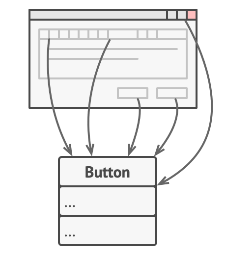

All buttons of the app are derived from the same class.

While all of these buttons look similar, they’re all supposed to do different things. Where would you put the code for the various click handlers of these buttons? The simplest solution is to create tons of subclasses for each place where the button is used. These subclasses would contain the code that would have to be executed on a button click.

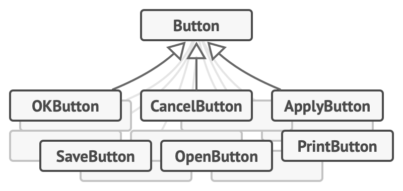

Lots of button subclasses. What can go wrong?

Before long, you realize that this approach is deeply flawed. First, you have an enormous number of subclasses, and that would be okay if you weren’t risking breaking the code in these subclasses each time you modify the base `Button` class. Put simply, your GUI code has become awkwardly dependent on the volatile code of the business logic.


Several classes implement the same functionality.

And here’s the ugliest part. Some operations, such as copying/pasting text, would need to be invoked from multiple places. For example, a user could click a small “Copy” button on the toolbar, or copy something via the context menu, or just hit Ctrl+C on the keyboard.

Initially, when our app only had the toolbar, it was okay to place the implementation of various operations into the button subclasses. In other words, having the code for copying text inside the `CopyButton` subclass was fine. But then, when you implement context menus, shortcuts, and other stuff, you have to either duplicate the operation’s code in many classes or make menus dependent on buttons, which is an even worse option.

### :smiley: Solution

Good software design is often based on the principle of separation of concerns, which usually results in breaking an app into layers. The most common example: a layer for the graphical user interface and another layer for the business logic. The GUI layer is responsible for rendering a beautiful picture on the screen, capturing any input and showing results of what the user and the app are doing. However, when it comes to doing something important, like calculating the trajectory of the moon or composing an annual report, the GUI layer delegates the work to the underlying layer of business logic.

In the code it might look like this: a GUI object calls a method of a business logic object, passing it some arguments. This process is usually described as one object sending another a request.

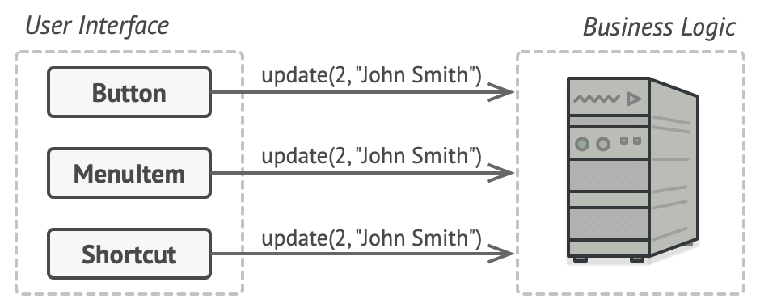

The GUI objects may access the business logic objects directly.

The Command pattern suggests that GUI objects shouldn’t send these requests directly. Instead, you should extract all of the request details, such as the object being called, the name of the method and the list of arguments into a separate command class with a single method that triggers this request.

Command objects serve as links between various GUI and business logic objects. From now on, the GUI object doesn’t need to know what business logic object will receive the request and how it’ll be processed. The GUI object just triggers the command, which handles all the details.


Accessing the business logic layer via a command.

The next step is to make your commands implement the same interface. Usually it has just a single execution method that takes no parameters. This interface lets you use various commands with the same request sender, without coupling it to concrete classes of commands. As a bonus, now you can switch command objects linked to the sender, effectively changing the sender’s behavior at runtime.

You might have noticed one missing piece of the puzzle, which is the request parameters. A GUI object might have supplied the business-layer object with some parameters. Since the command execution method doesn’t have any parameters, how would we pass the request details to the receiver? It turns out the command should be either pre-configured with this data, or capable of getting it on its own.

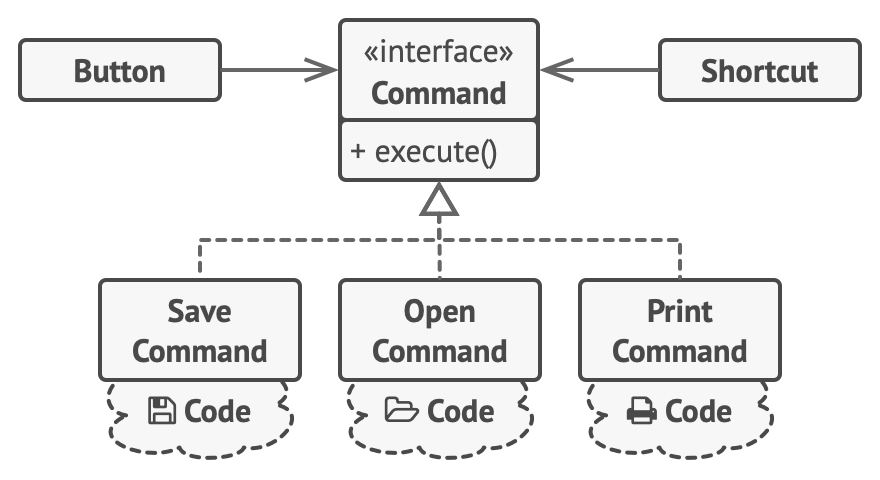

The GUI objects delegate the work to commands.

Let’s get back to our text editor. After we apply the Command pattern, we no longer need all those button subclasses to implement various click behaviors. It’s enough to put a single field into the base Button class that stores a reference to a command object and make the button execute that command on a click.

You’ll implement a bunch of command classes for every possible operation and link them with particular buttons, depending on the buttons’ intended behavior.

Other GUI elements, such as menus, shortcuts or entire dialogs, can be implemented in the same way. They’ll be linked to a command which gets executed when a user interacts with the GUI element. As you’ve probably guessed by now, the elements related to the same operations will be linked to the same commands, preventing any code duplication.

As a result, commands become a convenient middle layer that reduces coupling between the GUI and business logic layers. And that’s only a fraction of the benefits that the Command pattern can offer!

### :car: Real-World Analogy

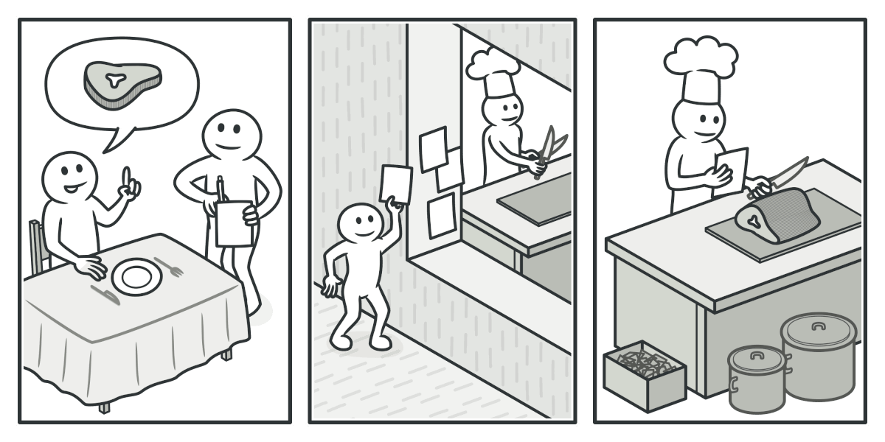

Making an order in a restaurant.

After a long walk through the city, you get to a nice restaurant and sit at the table by the window. A friendly waiter approaches you and quickly takes your order, writing it down on a piece of paper. The waiter goes to the kitchen and sticks the order on the wall. After a while, the order gets to the chef, who reads it and cooks the meal accordingly. The cook places the meal on a tray along with the order. The waiter discovers the tray, checks the order to make sure everything is as you wanted it, and brings everything to your table.

The paper order serves as a command. It remains in a queue until the chef is ready to serve it. The order contains all the relevant information required to cook the meal. It allows the chef to start cooking right away instead of running around clarifying the order details from you directly.

### :construction: Structure

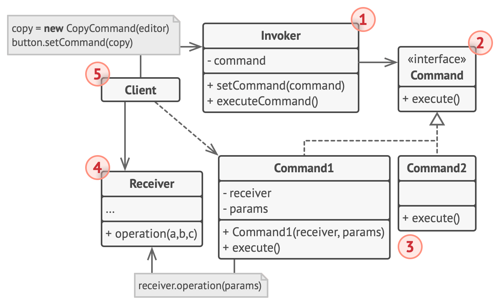

1. The **Sender** class (aka invoker) is responsible for initiating requests. This class must have a field for storing a reference to a command object. The sender triggers that command instead of sending the request directly to the receiver. Note that the sender isn’t responsible for creating the command object. Usually, it gets a pre-created command from the client via the constructor.

2. The **Command** interface usually declares just a single method for executing the command.

3. **Concrete Commands** implement various kinds of requests. A concrete command isn’t supposed to perform the work on its own, but rather to pass the call to one of the business logic objects. However, for the sake of simplifying the code, these classes can be merged.

Parameters required to execute a method on a receiving object can be declared as fields in the concrete command. You can make command objects immutable by only allowing the initialization of these fields via the constructor.

4. The **Receiver** class contains some business logic. Almost any object may act as a receiver. Most commands only handle the details of how a request is passed to the receiver, while the receiver itself does the actual work.

5. The **Client** creates and configures concrete command objects. The client must pass all of the request parameters, including a receiver instance, into the command’s constructor. After that, the resulting command may be associated with one or multiple senders.

### :hash: Pseudocode

In this example, the **Command** pattern helps to track the history of executed operations and makes it possible to revert an operation if needed.

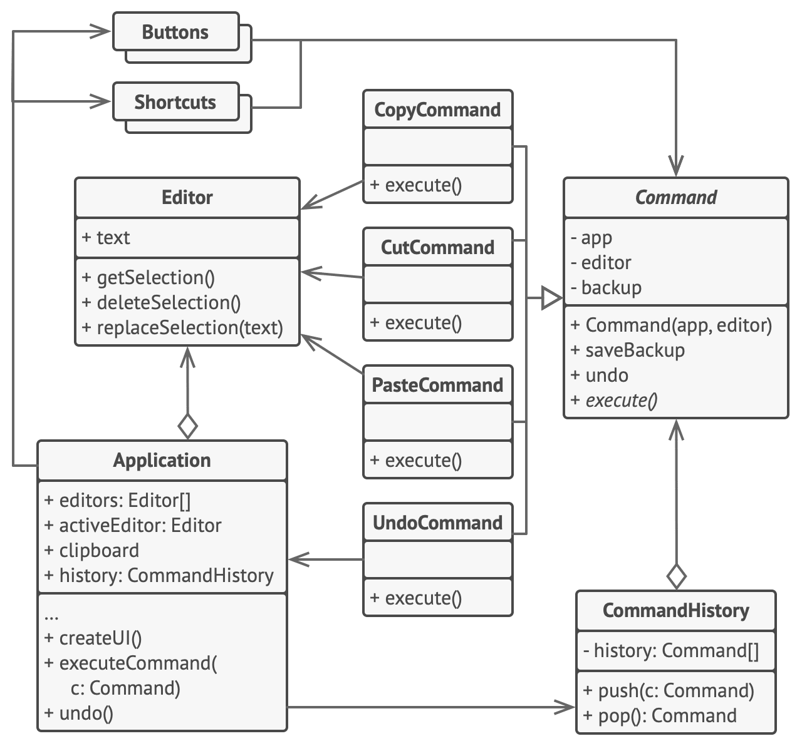

Undoable operations in a text editor.

Commands which result in changing the state of the editor (e.g., cutting and pasting) make a backup copy of the editor’s state before executing an operation associated with the command. After a command is executed, it’s placed into the command history (a stack of command objects) along with the backup copy of the editor’s state at that point. Later, if the user needs to revert an operation, the app can take the most recent command from the history, read the associated backup of the editor’s state, and restore it.

The client code (GUI elements, command history, etc.) isn’t coupled to concrete command classes because it works with commands via the command interface. This approach lets you introduce new commands into the app without breaking any existing code.

```c++
// The base command class defines the common interface for all
// concrete commands.
abstract class Command is
    protected field app: Application
    protected field editor: Editor
    protected field backup: text

    constructor Command(app: Application, editor: Editor) is
        this.app = app
        this.editor = editor

    // Make a backup of the editor's state.
    method saveBackup() is
        backup = editor.text

    // Restore the editor's state.
    method undo() is
        editor.text = backup

    // The execution method is declared abstract to force all
    // concrete commands to provide their own implementations.
    // The method must return true or false depending on whether
    // the command changes the editor's state.
    abstract method execute()

// The concrete commands go here.
class CopyCommand extends Command is
    // The copy command isn't saved to the history since it
    // doesn't change the editor's state.
    method execute() is
        app.clipboard = editor.getSelection()
        return false

class CutCommand extends Command is
    // The cut command does change the editor's state, therefore
    // it must be saved to the history. And it'll be saved as
    // long as the method returns true.
    method execute() is
        saveBackup()
        app.clipboard = editor.getSelection()
        editor.deleteSelection()
        return true

class PasteCommand extends Command is
    method execute() is
        saveBackup()
        editor.replaceSelection(app.clipboard)
        return true

// The undo operation is also a command.
class UndoCommand extends Command is
    method execute() is
        app.undo()
        return false

// The global command history is just a stack.
class CommandHistory is
    private field history: array of Command

    // Last in...
    method push(c: Command) is
        // Push the command to the end of the history array.

    // ...first out
    method pop():Command is
        // Get the most recent command from the history.


// The editor class has actual text editing operations. It plays
// the role of a receiver: all commands end up delegating
// execution to the editor's methods.
class Editor is
    field text: string
    
    method getSelection() is
        // Return selected text.

    method deleteSelection() is
        // Delete selected text.

    method replaceSelection(text) is
        // Insert the clipboard's contents at the current
        // position.


// The application class sets up object relations. It acts as a
// sender: when something needs to be done, it creates a command
// object and executes it.
class Application is
    field clipboard: string
    field editors: array of Editors
    field activeEditor: Editor
    field history: CommandHistory

    // The code which assigns commands to UI objects may look
    // like this.
    method createUI() is
        // ...
        copy = function() { executeCommand(
            new CopyCommand(this, activeEditor)) }
        copyButton.setCommand(copy)
        shortcuts.onKeyPress("Ctrl+C", copy)

        cut = function() { executeCommand(
            new CutCommand(this, activeEditor)) }
        cutButton.setCommand(cut)
        shortcuts.onKeyPress("Ctrl+X", cut)

        paste = function() { executeCommand(
            new PasteCommand(this, activeEditor)) }
        pasteButton.setCommand(paste)
        shortcuts.onKeyPress("Ctrl+V", paste)

        undo = function() { executeCommand(
            new UndoCommand(this, activeEditor)) }
        undoButton.setCommand(undo)
        shortcuts.onKeyPress("Ctrl+Z", undo)

    // Execute a command and check whether it has to be added to
    // the history.
    method executeCommand(command) is
        if (command.execute)
            history.push(command)

    // Take the most recent command from the history and run its
    // undo method. Note that we don't know the class of that
    // command. But we don't have to, since the command knows
    // how to undo its own action.
    method undo() is
        command = history.pop()
        if (command != null)
            command.undo()
```


### :bulb: Applicability

:beetle: **Use the Command pattern when you want to parametrize objects with operations.**

:sparkles: The Command pattern can turn a specific method call into a stand-alone object. This change opens up a lot of interesting uses: you can pass commands as method arguments, store them inside other objects, switch linked commands at runtime, etc.

Here’s an example: you’re developing a GUI component such as a context menu, and you want your users to be able to configure menu items that trigger operations when an end user clicks an item.

:beetle: **Use the Command pattern when you want to queue operations, schedule their execution, or execute them remotely.**

:sparkles: As with any other object, a command can be serialized, which means converting it to a string that can be easily written to a file or a database. Later, the string can be restored as the initial command object. Thus, you can delay and schedule command execution. But there’s even more! In the same way, you can queue, log or send commands over the network.

:beetle: **Use the Command pattern when you want to implement reversible operations.**

:sparkles: Although there are many ways to implement undo/redo, the Command pattern is perhaps the most popular of all.

To be able to revert operations, you need to implement the history of performed operations. The command history is a stack that contains all executed command objects along with related backups of the application’s state.

This method has two drawbacks. First, it isn’t that easy to save an application’s state because some of it can be private. This problem can be mitigated with the Memento pattern.

Second, the state backups may consume quite a lot of RAM. Therefore, sometimes you can resort to an alternative implementation: instead of restoring the past state, the command performs the inverse operation. The reverse operation also has a price: it may turn out to be hard or even impossible to implement.

### :clipboard: How to Implement

1. Declare the command interface with a single execution method.

2. Start extracting requests into concrete command classes that implement the command interface. Each class must have a set of fields for storing the request arguments along with a reference to the actual receiver object. All these values must be initialized via the command’s constructor.

3. Identify classes that will act as senders. Add the fields for storing commands into these classes. Senders should communicate with their commands only via the command interface. Senders usually don’t create command objects on their own, but rather get them from the client code.

4. Change the senders so they execute the command instead of sending a request to the receiver directly.

5. The client should initialize objects in the following order:

    - Create receivers.

    - Create commands, and associate them with receivers if needed.

    - Create senders, and associate them with specific commands.

### ⚖️ Pros and Cons

:heavy_check_mark: Single Responsibility Principle. You can decouple classes that invoke operations from classes that perform these operations.

:heavy_check_mark: Open/Closed Principle. You can introduce new commands into the app without breaking existing client code.

:heavy_check_mark: You can implement undo/redo.

:heavy_check_mark: You can implement deferred execution of operations.

:heavy_check_mark: You can assemble a set of simple commands into a complex one.

:heavy_multiplication_x: The code may become more complicated since you’re introducing a whole new layer between senders and receivers.

### :arrows_counterclockwise: Relations with Other Patterns

- **Chain of Responsibility**, **Command**, **Mediator** and **Observer** address various ways of connecting senders and receivers of requests:

    * Chain of Responsibility passes a request sequentially along a dynamic chain of potential receivers until one of them handles it.

    * Command establishes unidirectional connections between senders and receivers.

    * Mediator eliminates direct connections between senders and receivers, forcing them to communicate indirectly via a mediator object.

    * Observer lets receivers dynamically subscribe to and unsubscribe from receiving requests.

- Handlers in **Chain of Responsibility** can be implemented as **Commands**. In this case, you can execute a lot of different operations over the same context object, represented by a request.

However, there’s another approach, where the request itself is a Command object. In this case, you can execute the same operation in a series of different contexts linked into a chain.

- You can use **Command** and **Memento** together when implementing “undo”. In this case, commands are responsible for performing various operations over a target object, while mementos save the state of that object just before a command gets executed.

- **Command** and **Strategy** may look similar because you can use both to parameterize an object with some action. However, they have very different intents.

    * You can use Command to convert any operation into an object. The operation’s parameters become fields of that object. The conversion lets you defer execution of the operation, queue it, store the history of commands, send commands to remote services, etc.

    * On the other hand, Strategy usually describes different ways of doing the same thing, letting you swap these algorithms within a single context class.

- **Prototype** can help when you need to save copies of **Commands** into history.

- You can treat **Visitor** as a powerful version of the **Command** pattern. Its objects can execute operations over various objects of different classes.

---


## Iterator

**Iterator** is a behavioral design pattern that lets you traverse elements of a collection without exposing its underlying representation (list, stack, tree, etc.).

### :worried: Problem

Collections are one of the most used data types in programming. Nonetheless, a collection is just a container for a group of objects.

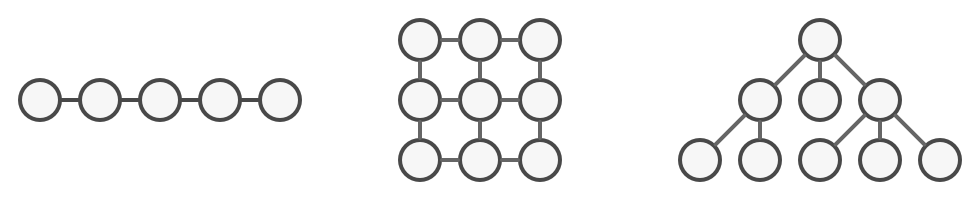

Various types of collections.

Most collections store their elements in simple lists. However, some of them are based on stacks, trees, graphs and other complex data structures.

But no matter how a collection is structured, it must provide some way of accessing its elements so that other code can use these elements. There should be a way to go through each element of the collection without accessing the same elements over and over.

This may sound like an easy job if you have a collection based on a list. You just loop over all of the elements. But how do you sequentially traverse elements of a complex data structure, such as a tree? For example, one day you might be just fine with depth-first traversal of a tree. Yet the next day you might require breadth-first traversal. And the next week, you might need something else, like random access to the tree elements.

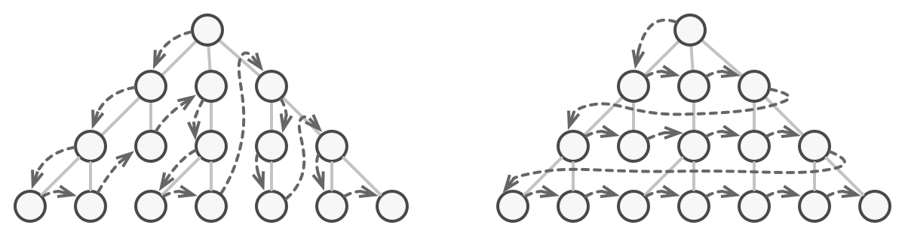

The same collection can be traversed in several different ways.

Adding more and more traversal algorithms to the collection gradually blurs its primary responsibility, which is efficient data storage. Additionally, some algorithms might be tailored for a specific application, so including them into a generic collection class would be weird.

On the other hand, the client code that’s supposed to work with various collections may not even care how they store their elements. However, since collections all provide different ways of accessing their elements, you have no option other than to couple your code to the specific collection classes.

### :smiley: Solution

The main idea of the Iterator pattern is to extract the traversal behavior of a collection into a separate object called an iterator.

In addition to implementing the algorithm itself, an iterator object encapsulates all of the traversal details, such as the current position and how many elements are left till the end. Because of this, several iterators can go through the same collection at the same time, independently of each other.

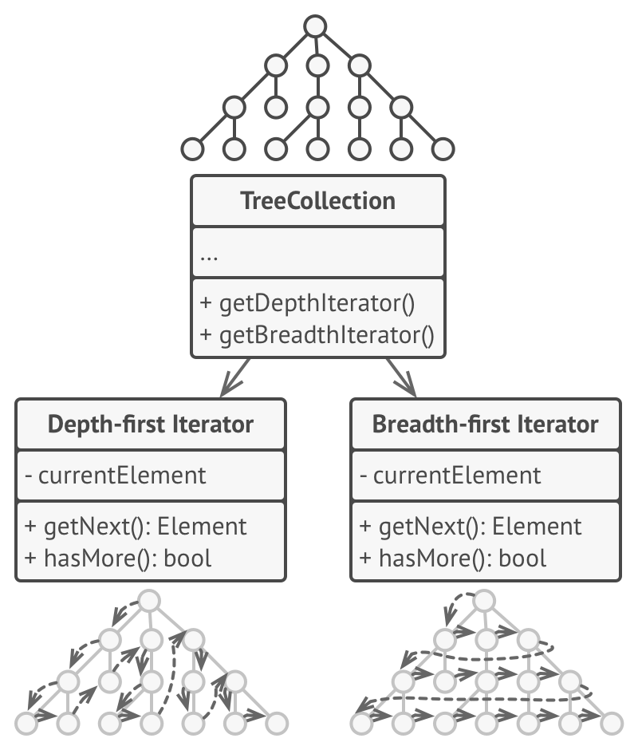

Iterators implement various traversal algorithms. Several iterator objects can traverse the same collection at the same time.

Usually, iterators provide one primary method for fetching elements of the collection. The client can keep running this method until it doesn’t return anything, which means that the iterator has traversed all of the elements.

All iterators must implement the same interface. This makes the client code compatible with any collection type or any traversal algorithm as long as there’s a proper iterator. If you need a special way to traverse a collection, you just create a new iterator class, without having to change the collection or the client.

### :car: Real-World Analogy


Various ways to walk around Rome.

You plan to visit Rome for a few days and visit all of its main sights and attractions. But once there, you could waste a lot of time walking in circles, unable to find even the Colosseum.

On the other hand, you could buy a virtual guide app for your smartphone and use it for navigation. It’s smart and inexpensive, and you could be staying at some interesting places for as long as you want.

A third alternative is that you could spend some of the trip’s budget and hire a local guide who knows the city like the back of his hand. The guide would be able to tailor the tour to your likings, show you every attraction and tell a lot of exciting stories. That’ll be even more fun; but, alas, more expensive, too.

All of these options—the random directions born in your head, the smartphone navigator or the human guide—act as iterators over the vast collection of sights and attractions located in Rome.

### :construction: Structure

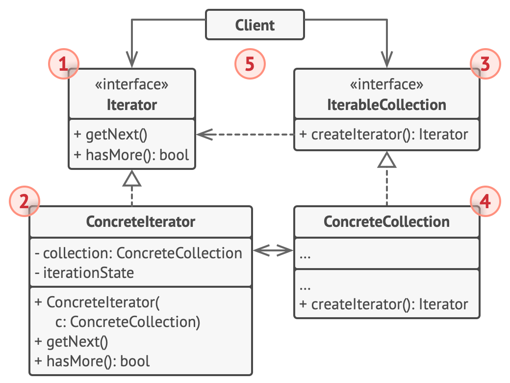

1. The **Iterator** interface declares the operations required for traversing a collection: fetching the next element, retrieving the current position, restarting iteration, etc.

2. **Concrete Iterators** implement specific algorithms for traversing a collection. The iterator object should track the traversal progress on its own. This allows several iterators to traverse the same collection independently of each other.

3. The **Collection** interface declares one or multiple methods for getting iterators compatible with the collection. Note that the return type of the methods must be declared as the iterator interface so that the concrete collections can return various kinds of iterators.

4. **Concrete Collections** return new instances of a particular concrete iterator class each time the client requests one. You might be wondering, where’s the rest of the collection’s code? Don’t worry, it should be in the same class. It’s just that these details aren’t crucial to the actual pattern, so we’re omitting them.

5. The **Client** works with both collections and iterators via their interfaces. This way the client isn’t coupled to concrete classes, allowing you to use various collections and iterators with the same client code.

Typically, clients don’t create iterators on their own, but instead get them from collections. Yet, in certain cases, the client can create one directly; for example, when the client defines its own special iterator.

### :hash: Pseudocode

In this example, the **Iterator** pattern is used to walk through a special kind of collection which encapsulates access to Facebook’s social graph. The collection provides several iterators that can traverse profiles in various ways.

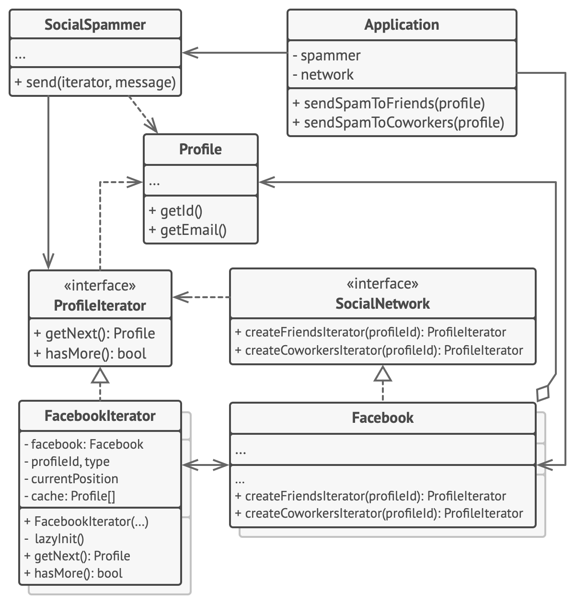

Example of iterating over social profiles.

The ‘friends’ iterator can be used to go over the friends of a given profile. The ‘colleagues’ iterator does the same, except it omits friends who don’t work at the same company as a target person. Both iterators implement a common interface which allows clients to fetch profiles without diving into implementation details such as authentication and sending REST requests.

The client code isn’t coupled to concrete classes because it works with collections and iterators only through interfaces. If you decide to connect your app to a new social network, you simply need to provide new collection and iterator classes without changing the existing code.

```c++
// The collection interface must declare a factory method for
// producing iterators. You can declare several methods if there
// are different kinds of iteration available in your program.
interface SocialNetwork is
    method createFriendsIterator(profileId):ProfileIterator
    method createCoworkersIterator(profileId):ProfileIterator

// Each concrete collection is coupled to a set of concrete
// iterator classes it returns. But the client isn't, since the
// signature of these methods returns iterator interfaces.
class Facebook implements SocialNetwork is
    // ... The bulk of the collection's code should go here ...
    
    // Iterator creation code.
    method createFriendsIterator(profileId) is
        return new FacebookIterator(this, profileId, "friends")
    method createCoworkersIterator(profileId) is
        return new FacebookIterator(this, profileId, "coworkers")

// The common interface for all iterators.
interface ProfileIterator is
    method getNext():Profile
    method hasMore():bool


// The concrete iterator class.
class FacebookIterator implements ProfileIterator is
    // The iterator needs a reference to the collection that it
    // traverses.
    private field facebook: Facebook
    private field profileId, type: string

    // An iterator object traverses the collection independently
    // from other iterators. Therefore it has to store the
    // iteration state.
    private field currentPosition
    private field cache: array of Profile

    constructor FacebookIterator(facebook, profileId, type) is
        this.facebook = facebook
        this.profileId = profileId
        this.type = type

    private method lazyInit() is
        if (cache == null)
            cache = facebook.socialGraphRequest(profileId, type)

    // Each concrete iterator class has its own implementation
    // of the common iterator interface.
    method getNext() is
        if (hasMore())
            currentPosition++
            return cache[currentPosition]
    method hasMore() is
        lazyInit()
        return currentPosition < cache.length


// Here is another useful trick: you can pass an iterator to a
// client class instead of giving it access to a whole
// collection. This way, you don't expose the collection to the
// client.
//
// And there's another ben
// The collection interface must declare a factory method for
// producing iterators. You can declare several methods if there
// are different kinds of iteration available in your program.
interface SocialNetwork is
method createFriendsIterator(profileId):ProfileIterator
method createCoworkersIterator(profileId):ProfileIterator
// Each concrete collection is coupled to a set of concrete
// iterator classes it returns. But the client isn't, since the
// signature of these methods returns iterator interfaces.
class Facebook implements SocialNetwork is
// ... The bulk of the collection's code should go here ...
// Iterator creation code.
method createFriendsIterator(profileId) is
return new FacebookIterator(this, profileId, "friends")
method createCoworkersIterator(profileId) is
return new FacebookIterator(this, profileId, "coworkers")
// The common interface for all iterators.
interface ProfileIterator is
method getNext():Profile
method hasMore():bool
// The concrete iterator class.
class FacebookIterator implements ProfileIterator is
// The iterator needs a reference to the collection that it
// traverses.
private field facebook: Facebook
private field profileId, type: string
// An iterator object traverses the collection independently
// from other iterators. Therefore it has to store the
// iteration state.
private field currentPosition
private field cache: array of Profile
constructor FacebookIterator(facebook, profileId, type) is
this.facebook = facebook
this.profileId = profileId
this.type = type
private method lazyInit() is
if (cache == null)
cache = facebook.socialGraphRequest(profileId, type)
// Each concrete iterator class has its own implementation
// of the common iterator interface.
method getNext() is
if (hasMore())
currentPosition++
return cache[currentPosition]
method hasMore() is
lazyInit()
return currentPosition < cache.length
// Here is another useful trick: you can pass an iterator to a
// client class instead of giving it access to a whole
// collection. This way, you don't expose the collection to the
// client.
//
// And there's another benefit: you can change the way the
// client works with the collection at runtime by passing it a
// different iterator. This is possible because the client code
// isn't coupled to concrete iterator classes.
class SocialSpammer is
    method send(iterator: ProfileIterator, message: string) is
        while (iterator.hasMore())
            profile = iterator.getNext()
            System.sendEmail(profile.getEmail(), message)

// The application class configures collections and iterators
// and then passes them to the client code.
class Application is
    field network: SocialNetwork
    field spammer: SocialSpammer

    method config() is
        if working with Facebook
            this.network = new Facebook()

        if working with LinkedIn
            this.network = new LinkedIn()
            this.spammer = new SocialSpammer()

    method sendSpamToFriends(profile) is
        iterator = network.createFriendsIterator(profile.getId())
        spammer.send(iterator, "Very important message")

    method sendSpamToCoworkers(profile) is
        iterator = network.createCoworkersIterator(profile.getId())
        spammer.send(iterator, "Very important message")

```

### :bulb: Applicability

:beetle: **Use the Iterator pattern when your collection has a complex data structure under the hood, but you want to hide its complexity from clients (either for convenience or security reasons).**

:sparkles: The iterator encapsulates the details of working with a complex data structure, providing the client with several simple methods of accessing the collection elements. While this approach is very convenient for the client, it also protects the collection from careless or malicious actions which the client would be able to perform if working with the collection directly.

:beetle: **Use the pattern to reduce duplication of the traversal code across your app.**

:sparkles: The code of non-trivial iteration algorithms tends to be very bulky. When placed within the business logic of an app, it may blur the responsibility of the original code and make it less maintainable. Moving the traversal code to designated iterators can help you make the code of the application more lean and clean.

:beetle: **Use the Iterator when you want your code to be able to traverse different data structures or when types of these structures are unknown beforehand.**

:sparkles: The pattern provides a couple of generic interfaces for both collections and iterators. Given that your code now uses these interfaces, it’ll still work if you pass it various kinds of collections and iterators that implement these interfaces.

### :clipboard: How to Implement

1. Declare the iterator interface. At the very least, it must have a method for fetching the next element from a collection. But for the sake of convenience you can add a couple of other methods, such as fetching the previous element, tracking the current position, and checking the end of the iteration.

2. Declare the collection interface and describe a method for fetching iterators. The return type should be equal to that of the iterator interface. You may declare similar methods if you plan to have several distinct groups of iterators.

3. Implement concrete iterator classes for the collections that you want to be traversable with iterators. An iterator object must be linked with a single collection instance. Usually, this link is established via the iterator’s constructor.

4. Implement the collection interface in your collection classes. The main idea is to provide the client with a shortcut for creating iterators, tailored for a particular collection class. The collection object must pass itself to the iterator’s constructor to establish a link between them.

5. Go over the client code to replace all of the collection traversal code with the use of iterators. The client fetches a new iterator object each time it needs to iterate over the collection elements.

### ⚖️ Pros and Cons

:heavy_check_mark: Single Responsibility Principle. You can clean up the client code and the collections by extracting bulky traversal algorithms into separate classes.

:heavy_check_mark: Open/Closed Principle. You can implement new types of collections and iterators and pass them to existing code without breaking anything.

:heavy_check_mark: You can iterate over the same collection in parallel because each iterator object contains its own iteration state.

:heavy_check_mark: For the same reason, you can delay an iteration and continue it when needed.

:heavy_multiplication_x: Applying the pattern can be an overkill if your app only works with simple collections.

:heavy_multiplication_x: Using an iterator may be less efficient than going through elements of some specialized collections directly.

### :arrows_counterclockwise: Relations with Other Patterns

- You can use **Iterators** to traverse **Composite** trees.

- You can use **Factory Method **along with **Iterator** to let collection subclasses return different types of iterators that are compatible with the collections.

- You can use **Memento** along with **Iterator** to capture the current iteration state and roll it back if necessary.

- You can use **Visitor** along with **Iterator** to traverse a complex data structure and execute some operation over its elements, even if they all have different classes.

---


## Mediator

######Also known as: Intermediary, Controller

**Mediator** is a behavioral design pattern that lets you reduce chaotic dependencies between objects. The pattern restricts direct communications between the objects and forces them to collaborate only via a mediator object.

### :worried: Problem

Say you have a dialog for creating and editing customer profiles. It consists of various form controls such as text fields, checkboxes, buttons, etc.

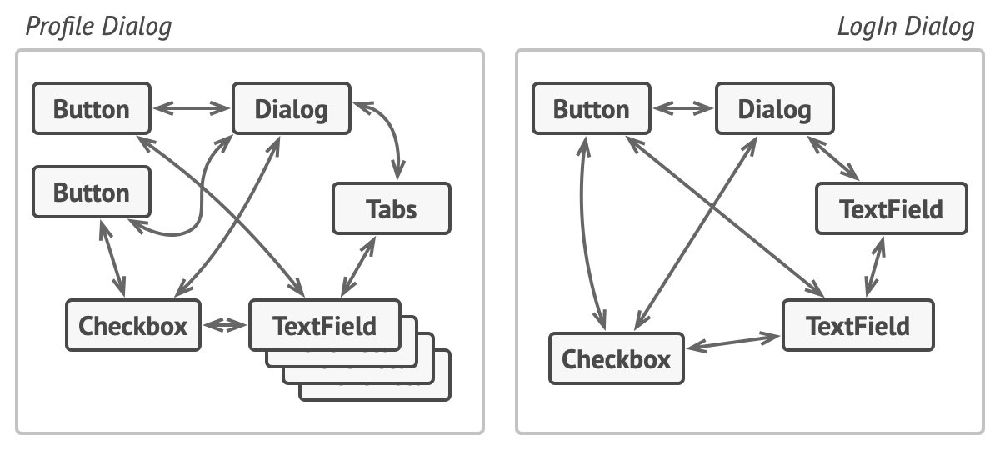

Relations between elements of the user interface can become chaotic as the application evolves.

Some of the form elements may interact with others. For instance, selecting the “I have a dog” checkbox may reveal a hidden text field for entering the dog’s name. Another example is the submit button that has to validate values of all fields before saving the data.

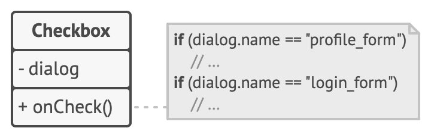

Elements can have lots of relations with other elements. Hence, changes to some elements may affect the others.

By having this logic implemented directly inside the code of the form elements you make these elements’ classes much harder to reuse in other forms of the app. For example, you won’t be able to use that checkbox class inside another form, because it’s coupled to the dog’s text field. You can use either all the classes involved in rendering the profile form, or none at all.

### :smiley: Solution


The Mediator pattern suggests that you should cease all direct communication between the components which you want to make independent of each other. Instead, these components must collaborate indirectly, by calling a special mediator object that redirects the calls to appropriate components. As a result, the components depend only on a single mediator class instead of being coupled to dozens of their colleagues.

In our example with the profile editing form, the dialog class itself may act as the mediator. Most likely, the dialog class is already aware of all of its sub-elements, so you won’t even need to introduce new dependencies into this class.

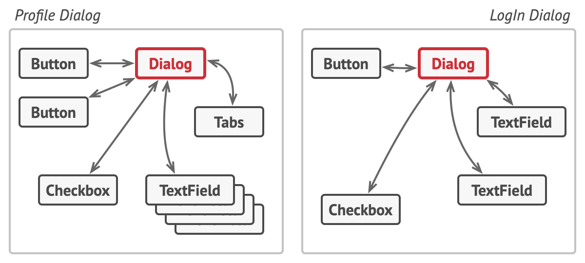

UI elements should communicate indirectly, via the mediator object.

The most significant change happens to the actual form elements. Let’s consider the submit button. Previously, each time a user clicked the button, it had to validate the values of all individual form elements. Now its single job is to notify the dialog about the click. Upon receiving this notification, the dialog itself performs the validations or passes the task to the individual elements. Thus, instead of being tied to a dozen form elements, the button is only dependent on the dialog class.

You can go further and make the dependency even looser by extracting the common interface for all types of dialogs. The interface would declare the notification method which all form elements can use to notify the dialog about events happening to those elements. Thus, our submit button should now be able to work with any dialog that implements that interface.

This way, the Mediator pattern lets you encapsulate a complex web of relations between various objects inside a single mediator object. The fewer dependencies a class has, the easier it becomes to modify, extend or reuse that class.

### :car: Real-World Analogy

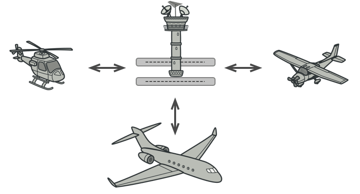

Aircraft pilots don’t talk to each other directly when deciding who gets to land their plane next. All communication goes through the control tower.

Pilots of aircraft that approach or depart the airport control area don’t communicate directly with each other. Instead, they speak to an air traffic controller, who sits in a tall tower somewhere near the airstrip. Without the air traffic controller, pilots would need to be aware of every plane in the vicinity of the airport, discussing landing priorities with a committee of dozens of other pilots. That would probably skyrocket the airplane crash statistics.

The tower doesn’t need to control the whole flight. It exists only to enforce constraints in the terminal area because the number of involved actors there might be overwhelming to a pilot.

### :construction: Structure

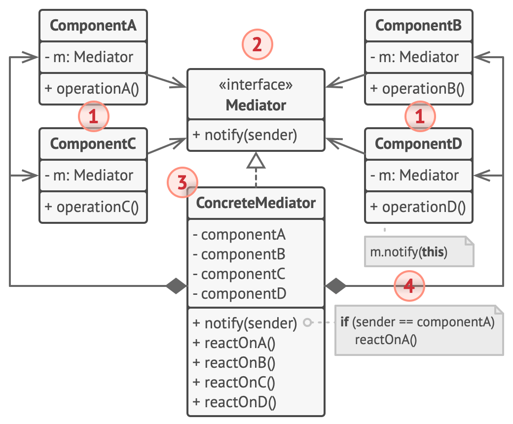

1. **Components** are various classes that contain some business logic. Each component has a reference to a mediator, declared with the type of the mediator interface. The component isn’t aware of the actual class of the mediator, so you can reuse the component in other programs by linking it to a different mediator.

2. The **Mediator** interface declares methods of communication with components, which usually include just a single notification method. Components may pass any context as arguments of this method, including their own objects, but only in such a way that no coupling occurs between a receiving component and the sender’s class.

3. **Concrete Mediators** encapsulate relations between various components. Concrete mediators often keep references to all components they manage and sometimes even manage their lifecycle.

4. Components must not be aware of other components. If something important happens within or to a component, it must only notify the mediator. When the mediator receives the notification, it can easily identify the sender, which might be just enough to decide what component should be triggered in return.

From a component’s perspective, it all looks like a total black box. The sender doesn’t know who’ll end up handling its request, and the receiver doesn’t know who sent the request in the first place.

### :hash: Pseudocode

In this example, the **Mediator** pattern helps you eliminate mutual dependencies between various UI classes: buttons, checkboxes and text labels.

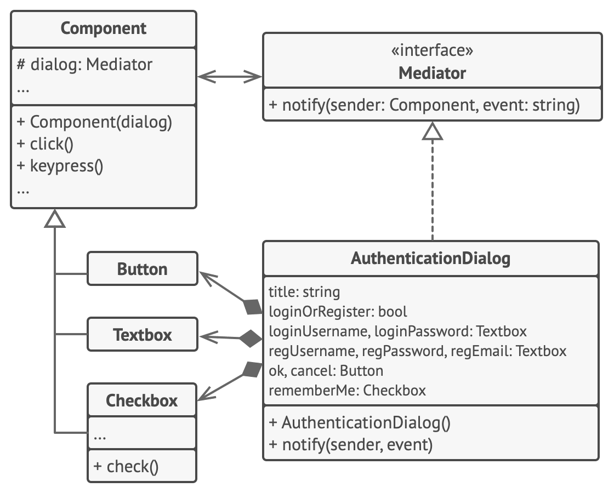

Structure of the UI dialog classes.

An element, triggered by a user, doesn’t communicate with other elements directly, even if it looks like it’s supposed to. Instead, the element only needs to let its mediator know about the event, passing any contextual info along with that notification.

In this example, the whole authentication dialog acts as the mediator. It knows how concrete elements are supposed to collaborate and facilitates their indirect communication. Upon receiving a notification about an event, the dialog decides what element should address the event and redirects the call accordingly.

```c++
// The mediator interface declares a method used by components
// to notify the mediator about various events. The mediator may
// react to these events and pass the execution to other
// components.
interface Mediator is
    method notify(sender: Component, event: string)


// The concrete mediator class. The intertwined web of
// connections between individual components has been untangled
// and moved into the mediator.
class AuthenticationDialog implements Mediator is
    private field title: string
    private field loginOrRegisterChkBx: Checkbox
    private field loginUsername, loginPassword: Textbox
    private field registrationUsername, registrationPassword,
        registrationEmail: Textbox
    private field okBtn, cancelBtn: Button
    
    constructor AuthenticationDialog() is
        // Create all component objects and pass the current
        // mediator into their constructors to establish links.

    // When something happens with a component, it notifies the
    // mediator. Upon receiving a notification, the mediator may
    // do something on its own or pass the request to another
    // component.
    method notify(sender, event) is
    if (sender == loginOrRegisterChkBx and event == "check")
        if (loginOrRegisterChkBx.checked)
            title = "Log in"
            // 1. Show login form components.
            // 2. Hide registration form components.

        else
            title = "Register"
            // 1. Show registration form components.
            // 2. Hide login form components

        if (sender == okBtn && event == "click")
            if (loginOrRegister.checked)
                // Try to find a user using login credentials.
                if (!found)
                    // Show an error message above the login
                    // field.
            else
            // 1. Create a user account using data from the
            // registration fields.
            // 2. Log that user in.
            // ...


// Components communicate with a mediator using the mediator
// interface. Thanks to that, you can use the same components in
// other contexts by linking them with different mediator
// objects.
class Component is
    field dialog: Mediator

    constructor Component(dialog) is
        this.dialog = dialog

    method click() is
        dialog.notify(this, "click")
    
    method keypress() is
        dialog.notify(this, "keypress")

// Concrete components don't talk to each other. They have only
// one communication channel, which is sending notifications to
// the mediator.
class Button extends Component is
    // ...

class Textbox extends Component is
    // ...

class Checkbox extends Component is
    method check() is
        dialog.notify(this, "check")
// ...

```

### :bulb: Applicability

:beetle: **Use the Mediator pattern when it’s hard to change some of the classes because they are tightly coupled to a bunch of other classes.**

:sparkles: The pattern lets you extract all the relationships between classes into a separate class, isolating any changes to a specific component from the rest of the components.

:beetle: **Use the pattern when you can’t reuse a component in a different program because it’s too dependent on other components.**

:sparkles: After you apply the Mediator, individual components become unaware of the other components. They could still communicate with each other, albeit indirectly, through a mediator object. To reuse a component in a different app, you need to provide it with a new mediator class.

:beetle: **Use the Mediator when you find yourself creating tons of component subclasses just to reuse some basic behavior in various contexts.**

:sparkles: Since all relations between components are contained within the mediator, it’s easy to define entirely new ways for these components to collaborate by introducing new mediator classes, without having to change the components themselves.

### :clipboard: How to Implement

1. Identify a group of tightly coupled classes which would benefit from being more independent (e.g., for easier maintenance or simpler reuse of these classes).

2. Declare the mediator interface and describe the desired communication protocol between mediators and various components. In most cases, a single method for receiving notifications from components is sufficient.

This interface is crucial when you want to reuse component classes in different contexts. As long as the component works with its mediator via the generic interface, you can link the component with a different implementation of the mediator.

3. Implement the concrete mediator class. This class would benefit from storing references to all of the components it manages.

4. **You can go even further and make the mediator responsible for the creation and destruction of component objects. After this, the mediator may resemble a ** or a **.

5. Components should store a reference to the mediator object. The connection is usually established in the component’s constructor, where a mediator object is passed as an argument.

6. Change the components’ code so that they call the mediator’s notification method instead of methods on other components. Extract the code that involves calling other components into the mediator class. Execute this code whenever the mediator receives notifications from that component.

### ⚖️ Pros and Cons

:heavy_check_mark: Single Responsibility Principle. You can extract the communications between various components into a single place, making it easier to comprehend and maintain.

:heavy_check_mark: Open/Closed Principle. You can introduce new mediators without having to change the actual components.

:heavy_check_mark: You can reduce coupling between various components of a program.

:heavy_check_mark: You can reuse individual components more easily.

:heavy_multiplication_x: Over time a mediator can evolve into a God Object.

### :arrows_counterclockwise: Relations with Other Patterns

- **Chain of Responsibility**, **Command**, **Mediator** and **Observer** address various ways of connecting senders and receivers of requests:

    * Chain of Responsibility passes a request sequentially along a dynamic chain of potential receivers until one of them handles it.

    * Command establishes unidirectional connections between senders and receivers.

    * Mediator eliminates direct connections between senders and receivers, forcing them to communicate indirectly via a mediator object.

    * Observer lets receivers dynamically subscribe to and unsubscribe from receiving requests.

- **Facade** and **Mediator** have similar jobs: they try to organize collaboration between lots of tightly coupled classes.

    * Facade defines a simplified interface to a subsystem of objects, but it doesn’t introduce any new functionality. The subsystem itself is unaware of the facade. Objects within the subsystem can communicate directly.

    * Mediator centralizes communication between components of the system. The components only know about the mediator object and don’t communicate directly.

- The difference between **Mediator** and **Observer** is often elusive. In most cases, you can implement either of these patterns; but sometimes you can apply both simultaneously. Let’s see how we can do that.

The primary goal of Mediator is to eliminate mutual dependencies among a set of system components. Instead, these components become dependent on a single mediator object. The goal of Observer is to establish dynamic one-way connections between objects, where some objects act as subordinates of others.

There’s a popular implementation of the Mediator pattern that relies on Observer. The mediator object plays the role of publisher, and the components act as subscribers which subscribe to and unsubscribe from the mediator’s events. When Mediator is implemented this way, it may look very similar to Observer.

When you’re confused, remember that you can implement the Mediator pattern in other ways. For example, you can permanently link all the components to the same mediator object. This implementation won’t resemble Observer but will still be an instance of the Mediator pattern.

Now imagine a program where all components have become publishers, allowing dynamic connections between each other. There won’t be a centralized mediator object, only a distributed set of observers.

---


## Memento

###### Also known as: Snapshot

**Memento** is a behavioral design pattern that lets you save and restore the previous state of an object without revealing the details of its implementation.

### :worried: Problem

Imagine that you’re creating a text editor app. In addition to simple text editing, your editor can format text, insert inline images, etc.

At some point, you decided to let users undo any operations carried out on the text. This feature has become so common over the years that nowadays people expect every app to have it. For the implementation, you chose to take the direct approach. Before performing any operation, the app records the state of all objects and saves it in some storage. Later, when a user decides to revert an action, the app fetches the latest snapshot from the history and uses it to restore the state of all objects.

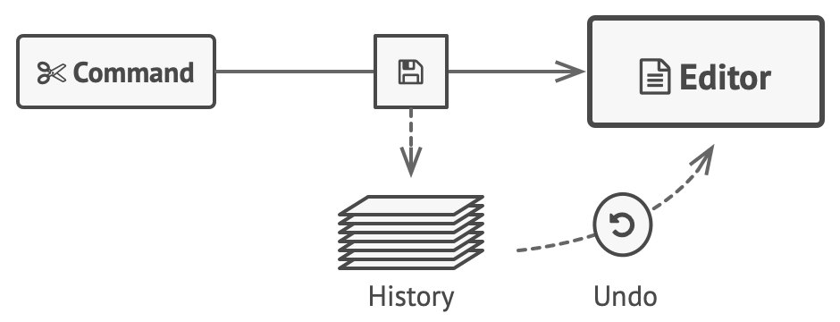

Before executing an operation, the app saves a snapshot of the objects’ state, which can later be used to restore objects to their previous state.

Let’s think about those state snapshots. How exactly would you produce one? You’d probably need to go over all the fields in an object and copy their values into storage. However, this would only work if the object had quite relaxed access restrictions to its contents. Unfortunately, most real objects won’t let others peek inside them that easily, hiding all significant data in private fields.

Ignore that problem for now and let’s assume that our objects behave like hippies: preferring open relations and keeping their state public. While this approach would solve the immediate problem and let you produce snapshots of objects’ states at will, it still has some serious issues. In the future, you might decide to refactor some of the editor classes, or add or remove some of the fields. Sounds easy, but this would also require changing the classes responsible for copying the state of the affected objects.

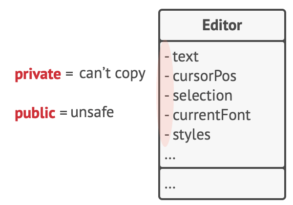

How to make a copy of the object’s private state?

But there’s more. Let’s consider the actual “snapshots” of the editor’s state. What data does it contain? At a bare minimum, it must contain the actual text, cursor coordinates, current scroll position, etc. To make a snapshot, you’d need to collect these values and put them into some kind of container.

Most likely, you’re going to store lots of these container objects inside some list that would represent the history. Therefore the containers would probably end up being objects of one class. The class would have almost no methods, but lots of fields that mirror the editor’s state. To allow other objects to write and read data to and from a snapshot, you’d probably need to make its fields public. That would expose all the editor’s states, private or not. Other classes would become dependent on every little change to the snapshot class, which would otherwise happen within private fields and methods without affecting outer classes.

It looks like we’ve reached a dead end: you either expose all internal details of classes, making them too fragile, or restrict access to their state, making it impossible to produce snapshots. Is there any other way to implement the "undo"?

### :smiley: Solution

All problems that we’ve just experienced are caused by broken encapsulation. Some objects try to do more than they are supposed to. To collect the data required to perform some action, they invade the private space of other objects instead of letting these objects perform the actual action.

The Memento pattern delegates creating the state snapshots to the actual owner of that state, the originator object. Hence, instead of other objects trying to copy the editor’s state from the “outside,” the editor class itself can make the snapshot since it has full access to its own state.

The pattern suggests storing the copy of the object’s state in a special object called memento. The contents of the memento aren’t accessible to any other object except the one that produced it. Other objects must communicate with mementos using a limited interface which may allow fetching the snapshot’s metadata (creation time, the name of the performed operation, etc.), but not the original object’s state contained in the snapshot.

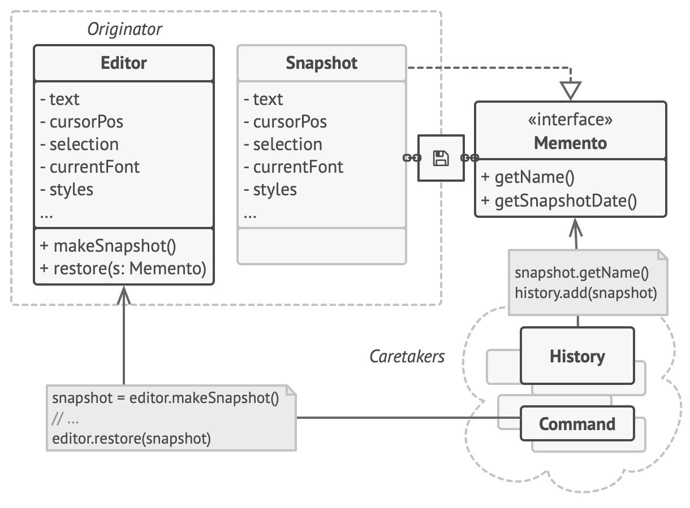

The originator has full access to the memento, whereas the caretaker can only access the metadata.

Such a restrictive policy lets you store mementos inside other objects, usually called caretakers. Since the caretaker works with the memento only via the limited interface, it’s not able to tamper with the state stored inside the memento. At the same time, the originator has access to all fields inside the memento, allowing it to restore its previous state at will.

In our text editor example, we can create a separate history class to act as the caretaker. A stack of mementos stored inside the caretaker will grow each time the editor is about to execute an operation. You could even render this stack within the app’s UI, displaying the history of previously performed operations to a user.

When a user triggers the undo, the history grabs the most recent memento from the stack and passes it back to the editor, requesting a roll-back. Since the editor has full access to the memento, it changes its own state with the values taken from the memento.

### :construction: Structure

**Implementation based on nested classes**

The classic implementation of the pattern relies on support for nested classes, available in many popular programming languages (such as C++, C#, and Java).

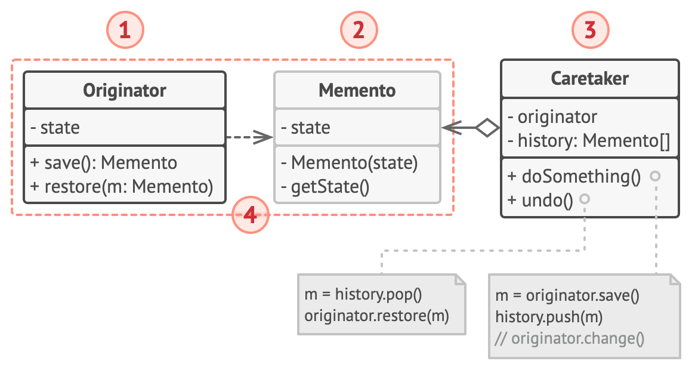

1. The **Originator** class can produce snapshots of its own state, as well as restore its state from snapshots when needed.

2. The **Memento** is a value object that acts as a snapshot of the originator’s state. It’s a common practice to make the memento immutable and pass it the data only once, via the constructor.

3. The **Caretaker** knows not only “when” and “why” to capture the originator’s state, but also when the state should be restored.

A caretaker can keep track of the originator’s history by storing a stack of mementos. When the originator has to travel back in history, the caretaker fetches the topmost memento from the stack and passes it to the originator’s restoration method.

4. In this implementation, the memento class is nested inside the originator. This lets the originator access the fields and methods of the memento, even though they’re declared private. On the other hand, the caretaker has very limited access to the memento’s fields and methods, which lets it store mementos in a stack but not tamper with their state.

**Implementation based on an intermediate interface**

There’s an alternative implementation, suitable for programming languages that don’t support nested classes (yeah, PHP, I’m talking about you).

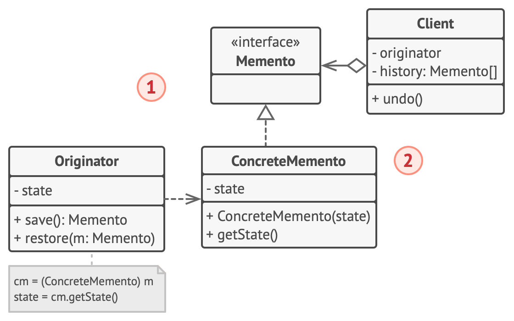

1. In the absence of nested classes, you can restrict access to the memento’s fields by establishing a convention that caretakers can work with a memento only through an explicitly declared intermediary interface, which would only declare methods related to the memento’s metadata.

2. On the other hand, originators can work with a memento object directly, accessing fields and methods declared in the memento class. The downside of this approach is that you need to declare all members of the memento public.

**Implementation with even stricter encapsulation**

There’s another implementation which is useful when you don’t want to leave even the slightest chance of other classes accessing the state of the originator through the memento.


1. This implementation allows having multiple types of originators and mementos. Each originator works with a corresponding memento class. Neither originators nor mementos expose their state to anyone.

2. Caretakers are now explicitly restricted from changing the state stored in mementos. Moreover, the caretaker class becomes independent from the originator because the restoration method is now defined in the memento class.

3. Each memento becomes linked to the originator that produced it. The originator passes itself to the memento’s constructor, along with the values of its state. Thanks to the close relationship between these classes, a memento can restore the state of its originator, given that the latter has defined the appropriate setters.

### :hash: Pseudocode

This example uses the **Memento** pattern alongside the Command pattern for storing snapshots of the complex text editor’s state and restoring an earlier state from these snapshots when needed.

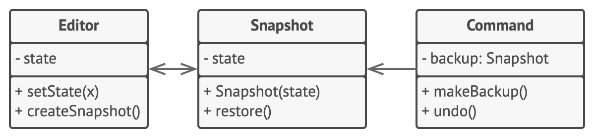

Saving snapshots of the text editor’s state.

The command objects act as caretakers. They fetch the editor’s memento before executing operations related to commands. When a user attempts to undo the most recent command, the editor can use the memento stored in that command to revert itself to the previous state.

The memento class doesn’t declare any public fields, getters or setters. Therefore no object can alter its contents. Mementos are linked to the editor object that created them. This lets a memento restore the linked editor’s state by passing the data via setters on the editor object. Since mementos are linked to specific editor objects, you can make your app support several independent editor windows with a centralized undo stack.

```c++
// The originator holds some important data that may change over
// time. It also defines a method for saving its state inside a
// memento and another method for restoring the state from it.
class Editor is
    private field text, curX, curY, selectionWidth

    method setText(text) is
        this.text = text
    
    method setCursor(x, y) is
        this.curX = x
        this.curY = y
    
    method setSelectionWidth(width) is
        this.selectionWidth = width
        
    // Saves the current state inside a memento.
    method createSnapshot():Snapshot is
        // Memento is an immutable object; that's why the
        // originator passes its state to the memento's
        // constructor parameters.
        return new Snapshot(this, text, curX, curY, selectionWidth)
        // The memento class stores the past state of the editor.

    
class Snapshot is
    private field editor: Editor
    private field text, curX, curY, selectionWidth

    constructor Snapshot(editor, text, curX, curY, selectionWidth) is
        this.editor = editor
        this.text = text
        this.curX = x
        this.curY = y
        this.selectionWidth = selectionWidth

    // At some point, a previous state of the editor can be
    // restored using a memento object.
    method restore() is
        editor.setText(text)
        editor.setCursor(curX, curY)
        editor.setSelectionWidth(selectionWidth)

// A command object can act as a caretaker. In that case, the
// command gets a memento just before it changes the
// originator's state. When undo is requested, it restores the
// originator's state from a memento.
class Command is
    private field backup: Snapshot
    method makeBackup() is
        backup = editor.createSnapshot()
        method undo() is
        if (backup != null)
            backup.restore()
        // ...

```

### :bulb: Applicability

:beetle: **Use the Memento pattern when you want to produce snapshots of the object’s state to be able to restore a previous state of the object.**

:sparkles: The Memento pattern lets you make full copies of an object’s state, including private fields, and store them separately from the object. While most people remember this pattern thanks to the “undo” use case, it’s also indispensable when dealing with transactions (i.e., if you need to roll back an operation on error).

:beetle: **Use the pattern when direct access to the object’s fields/getters/setters violates its encapsulation.**

:sparkles: The Memento makes the object itself responsible for creating a snapshot of its state. No other object can read the snapshot, making the original object’s state data safe and secure.

### :clipboard: How to Implement

1. Determine what class will play the role of the originator. It’s important to know whether the program uses one central object of this type or multiple smaller ones.

2. Create the memento class. One by one, declare a set of fields that mirror the fields declared inside the originator class.

3. Make the memento class immutable. A memento should accept the data just once, via the constructor. The class should have no setters.

4. If your programmin4g language supports nested classes, nest the memento inside the originator. If not, extract a blank interface from the memento class and make all other objects use it to refer to the memento. You may add some metadata operations to the interface, but nothing that exposes the originator’s state.

5. Add a method for producing mementos to the originator class. The originator should pass its state to the memento via one or multiple arguments of the memento’s constructor.

The return type of the method should be of the interface you extracted in the previous step (assuming that you extracted it at all). Under the hood, the memento-producing method should work directly with the memento class.

6. Add a method for restoring the originator’s state to its class. It should accept a memento object as an argument. If you extracted an interface in the previous step, make it the type of the parameter. In this case, you need to typecast the incoming object to the memento class, since the originator needs full access to that object.

7. The caretaker, whether it represents a command object, a history, or something entirely different, should know when to request new mementos from the originator, how to store them and when to restore the originator with a particular memento.

8. The link between caretakers and originators may be moved into the memento class. In this case, each memento must be connected to the originator that had created it. The restoration method would also move to the memento class. However, this would all make sense only if the memento class is nested into originator or the originator class provides sufficient setters for overriding its state.

### ⚖️ Pros and Cons

:heavy_check_mark: You can produce snapshots of the object’s state without violating its encapsulation.

:heavy_check_mark: You can simplify the originator’s code by letting the caretaker maintain the history of the originator’s state.

:heavy_multiplication_x: The app might consume lots of RAM if clients create mementos too often.

:heavy_multiplication_x: Caretakers should track the originator’s lifecycle to be able to destroy obsolete mementos.

:heavy_multiplication_x: Most dynamic programming languages, such as PHP, Python and JavaScript, can’t guarantee that the state within the memento stays untouched.

### :arrows_counterclockwise: Relations with Other Patterns

- You can use **Command** and **Memento** together when implementing “undo”. In this case, commands are responsible for performing various operations over a target object, while mementos save the state of that object just before a command gets executed.

- You can use **Memento** along with **Iterator** to capture the current iteration state and roll it back if necessary.

- Sometimes **Prototype** can be a simpler alternative to **Memento**. This works if the object, the state of which you want to store in the history, is fairly straightforward and doesn’t have links to external resources, or the links are easy to re-establish.

---

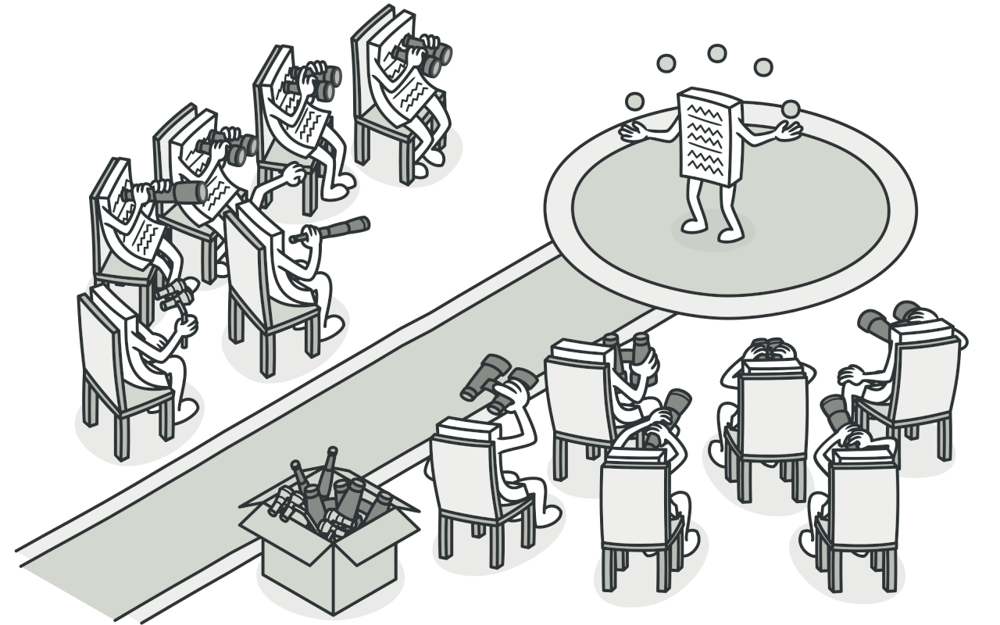

### Observer

######Also known as: Event-Subscriber, Listener

**Observer** is a behavioral design pattern that lets you define a subscription mechanism to notify multiple objects about any events that happen to the object they’re observing.

### :worried: Problem

Imagine that you have two types of objects: a `Customer` and a Store. The customer is very interested in a particular brand of product (say, it’s a new model of the iPhone) which should become available in the store very soon.

The customer could visit the store every day and check product availability. But while the product is still en route, most of these trips would be pointless.


Visiting the store vs. sending spam

On the other hand, the store could send tons of emails (which might be considered spam) to all customers each time a new product becomes available. This would save some customers from endless trips to the store. At the same time, it’d upset other customers who aren’t interested in new products.

It looks like we’ve got a conflict. Either the customer wastes time checking product availability or the store wastes resources notifying the wrong customers.

### :smiley: Solution

The object that has some interesting state is often called subject, but since it’s also going to notify other objects about the changes to its state, we’ll call it publisher. All other objects that want to track changes to the publisher’s state are called subscribers.

The Observer pattern suggests that you add a subscription mechanism to the publisher class so individual objects can subscribe to or unsubscribe from a stream of events coming from that publisher. Fear not! Everything isn’t as complicated as it sounds. In reality, this mechanism consists of 1) an array field for storing a list of references to subscriber objects and 2) several public methods which allow adding subscribers to and removing them from that list.

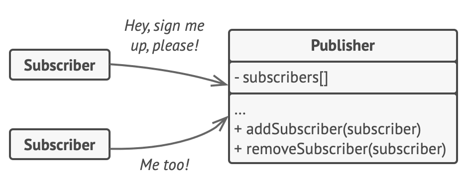

A subscription mechanism lets individual objects subscribe to event notifications.

Now, whenever an important event happens to the publisher, it goes over its subscribers and calls the specific notification method on their objects.

Real apps might have dozens of different subscriber classes that are interested in tracking events of the same publisher class. You wouldn’t want to couple the publisher to all of those classes. Besides, you might not even know about some of them beforehand if your publisher class is supposed to be used by other people.

That’s why it’s crucial that all subscribers implement the same interface and that the publisher communicates with them only via that interface. This interface should declare the notification method along with a set of parameters that the publisher can use to pass some contextual data along with the notification.

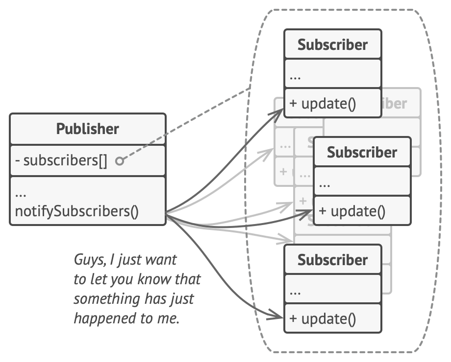

Publisher notifies subscribers by calling the specific notification method on their objects.

If your app has several different types of publishers and you want to make your subscribers compatible with all of them, you can go even further and make all publishers follow the same interface. This interface would only need to describe a few subscription methods. The interface would allow subscribers to observe publishers’ states without coupling to their concrete classes.

### :car: Real-World Analogy


Magazine and newspaper subscriptions.

If you subscribe to a newspaper or magazine, you no longer need to go to the store to check if the next issue is available. Instead, the publisher sends new issues directly to your mailbox right after publication or even in advance.

The publisher maintains a list of subscribers and knows which magazines they’re interested in. Subscribers can leave the list at any time when they wish to stop the publisher sending new magazine issues to them.

### :construction: Structure


1. The **Publisher** issues events of interest to other objects. These events occur when the publisher changes its state or executes some behaviors. Publishers contain a subscription infrastructure that lets new subscribers join and current subscribers leave the list.

2. When a new event happens, the publisher goes over the subscription list and calls the notification method declared in the subscriber interface on each subscriber object.

3. The **Subscriber** interface declares the notification interface. In most cases, it consists of a single update method. The method may have several parameters that let the publisher pass some event details along with the update.

4. **Concrete Subscribers** perform some actions in response to notifications issued by the publisher. All of these classes must implement the same interface so the publisher isn’t coupled to concrete classes.

5. Usually, subscribers need some contextual information to handle the update correctly. For this reason, publishers often pass some context data as arguments of the notification method. The publisher can pass itself as an argument, letting subscriber fetch any required data directly.

6. The **Client** creates publisher and subscriber objects separately and then registers subscribers for publisher updates.

### :hash: Pseudocode

In this example, the **Observer** pattern lets the text editor object notify other service objects about changes in its state.

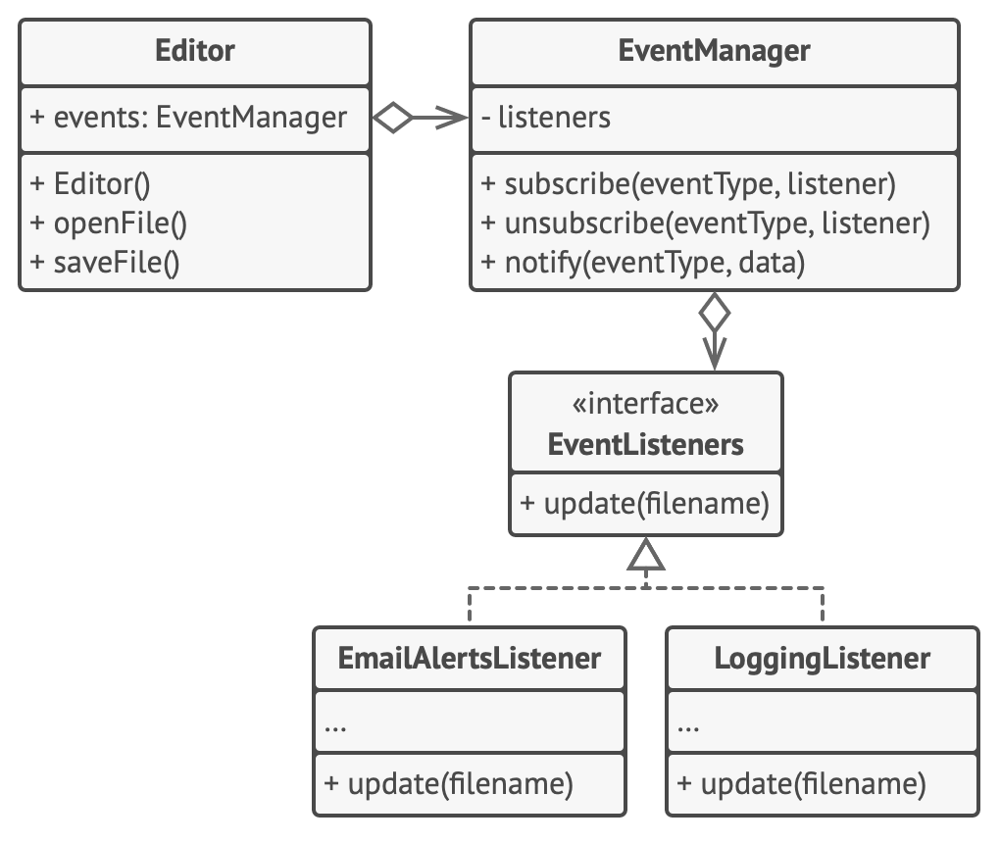

Notifying objects about events that happen to other objects.

The list of subscribers is compiled dynamically: objects can start or stop listening to notifications at runtime, depending on the desired behavior of your app.

In this implementation, the editor class doesn’t maintain the subscription list by itself. It delegates this job to the special helper object devoted to just that. You could upgrade that object to serve as a centralized event dispatcher, letting any object act as a publisher.

Adding new subscribers to the program doesn’t require changes to existing publisher classes, as long as they work with all subscribers through the same interface.

```c++
// The base publisher class includes subscription management
// code and notification methods.
class EventManager is
    private field listeners: hash map of event types and listeners

    method subscribe(eventType, listener) is
        listeners.add(eventType, listener)

    method unsubscribe(eventType, listener) is
        listeners.remove(eventType, listener)

    method notify(eventType, data) is
        foreach (listener in listeners.of(eventType)) do
            listener.update(data)

// The concrete publisher contains real business logic that's
// interesting for some subscribers. We could derive this class
// from the base publisher, but that isn't always possible in
// real life because the concrete publisher might already be a
// subclass. In this case, you can patch the subscription logic
// in with composition, as we did here.
class Editor is
    public field events: EventManager
    private field file: File

    constructor Editor() is
        events = new EventManager()

    // Methods of business logic can notify subscribers about
    // changes.
    method openFile(path) is
        this.file = new File(path)
        events.notify("open", file.name)

    method saveFile() is
        file.write()
        events.notify("save", file.name)

    // ...


// Here's the subscriber interface. If your programming language
// supports functional types, you can replace the whole
// subscriber hierarchy with a set of functions.
interface EventListener is
    method update(filename)

// Concrete subscribers react to updates issued by the publisher
// they are attached to.
class LoggingListener implements EventListener is
    private field log: File
    private field message: string

    constructor LoggingListener(log_filename, message) is
        this.log = new File(log_filename)
        this.message = message
    
    method update(filename) is
        log.write(replace('%s',filename,message))

class EmailAlertsListener implements EventListener is
    private field email: string
    private field message: string

    constructor EmailAlertsListener(email, message) is
        this.email = email
        this.message = message

    method update(filename) is
        system.email(email, replace('%s',filename,message))


// An application can configure publishers and subscribers at
// runtime.
class Application is
    method config() is
        editor = new Editor()
        
        logger = new LoggingListener(
            "/path/to/log.txt",
            "Someone has opened the file: %s")
        editor.events.subscribe("open", logger)

        emailAlerts = new EmailAlertsListener(
            "admin@example.com",
            "Someone has changed the file: %s")
        editor.events.subscribe("save", emailAlerts)

```


### :bulb: Applicability

:beetle: **Use the Observer pattern when changes to the state of one object may require changing other objects, and the actual set of objects is unknown beforehand or changes dynamically.**

:sparkles: You can often experience this problem when working with classes of the graphical user interface. For example, you created custom button classes, and you want to let the clients hook some custom code to your buttons so that it fires whenever a user presses a button.

The Observer pattern lets any object that implements the subscriber interface subscribe for event notifications in publisher objects. You can add the subscription mechanism to your buttons, letting the clients hook up their custom code via custom subscriber classes.

:beetle: **Use the pattern when some objects in your app must observe others, but only for a limited time or in specific cases.**

:sparkles: The subscription list is dynamic, so subscribers can join or leave the list whenever they need to.

### :clipboard: How to Implement

1. Look over your business logic and try to break it down into two parts: the core functionality, independent from other code, will act as the publisher; the rest will turn into a set of subscriber classes.

2. Declare the subscriber interface. At a bare minimum, it should declare a single `update` method.

3. Declare the publisher interface and describe a pair of methods for adding a subscriber object to and removing it from the list. Remember that publishers must work with subscribers only via the subscriber interface.

4. Decide where to put the actual subscription list and the implementation of subscription methods. Usually, this code looks the same for all types of publishers, so the obvious place to put it is in an abstract class derived directly from the publisher interface. Concrete publishers extend that class, inheriting the subscription behavior.

However, if you’re applying the pattern to an existing class hierarchy, consider an approach based on composition: put the subscription logic into a separate object, and make all real publishers use it.

5. Create concrete publisher classes. Each time something important happens inside a publisher, it must notify all its subscribers.

6. Implement the update notification methods in concrete subscriber classes. Most subscribers would need some context data about the event. It can be passed as an argument of the notification method.

But there’s another option. Upon receiving a notification, the subscriber can fetch any data directly from the notification. In this case, the publisher must pass itself via the update method. The less flexible option is to link a publisher to the subscriber permanently via the constructor.

7. The client must create all necessary subscribers and register them with proper publishers.

### ⚖️ Pros and Cons

:heavy_check_mark: Open/Closed Principle. You can introduce new subscriber classes without having to change the publisher’s code (and vice versa if there’s a publisher interface).

:heavy_check_mark: You can establish relations between objects at runtime.

:heavy_multiplication_x: Subscribers are notified in random order.

### :arrows_counterclockwise: Relations with Other Patterns

- **Chain of Responsibility**, **Command**, **Mediator** and **Observer** address various ways of connecting senders and receivers of requests:

    * Chain of Responsibility passes a request sequentially along a dynamic chain of potential receivers until one of them handles it.

    * Command establishes unidirectional connections between senders and receivers.

    * Mediator eliminates direct connections between senders and receivers, forcing them to communicate indirectly via a mediator object.

    * Observer lets receivers dynamically subscribe to and unsubscribe from receiving requests.

- The difference between **Mediator** and **Observer** is often elusive. In most cases, you can implement either of these patterns; but sometimes you can apply both simultaneously. Let’s see how we can do that.

The primary goal of Mediator is to eliminate mutual dependencies among a set of system components. Instead, these components become dependent on a single mediator object. The goal of Observer is to establish dynamic one-way connections between objects, where some objects act as subordinates of others.

There’s a popular implementation of the Mediator pattern that relies on Observer. The mediator object plays the role of publisher, and the components act as subscribers which subscribe to and unsubscribe from the mediator’s events. When Mediator is implemented this way, it may look very similar to Observer.

When you’re confused, remember that you can implement the Mediator pattern in other ways. For example, you can permanently link all the components to the same mediator object. This implementation won’t resemble Observer but will still be an instance of the Mediator pattern.

Now imagine a program where all components have become publishers, allowing dynamic connections between each other. There won’t be a centralized mediator object, only a distributed set of observers.

---


## State

**State** is a behavioral design pattern that lets an object alter its behavior when its internal state changes. It appears as if the object changed its class.

### :worried: Problem


The State pattern is closely related to the concept of a **[Finite-State Machine](https://en.wikipedia.org/wiki/Finite-state_machine)**.

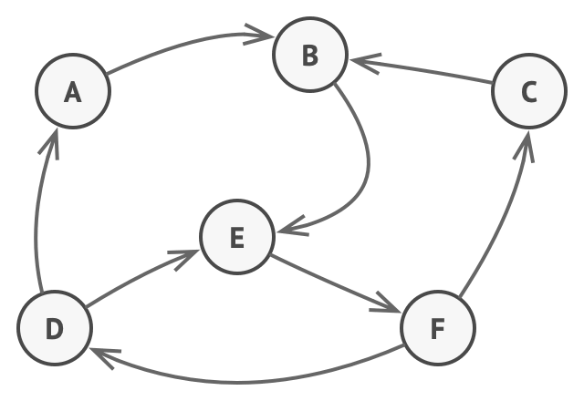

Finite-State Machine.

The main idea is that, at any given moment, there’s a finite number of states which a program can be in. Within any unique state, the program behaves differently, and the program can be switched from one state to another instantaneously. However, depending on a current state, the program may or may not switch to certain other states. These switching rules, called transitions, are also finite and predetermined.

You can also apply this approach to objects. Imagine that we have a Document class. A `document` can be in one of three states: `Draft`, `Moderation` and `Published`. The `publish` method of the document works a little bit differently in each state:

- In `Draft`, it moves the document to moderation.

- In `Moderation`, it makes the document public, but only if the current user is an administrator.

- In `Published`, it doesn’t do anything at all.

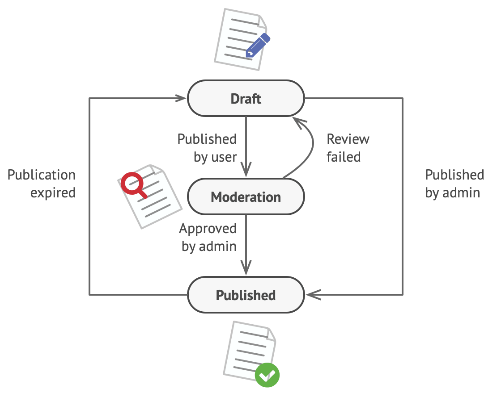

Possible states and transitions of a document object.

State machines are usually implemented with lots of conditional operators (`if` or `switch`) that select the appropriate behavior depending on the current state of the object. Usually, this “state” is just a set of values of the object’s fields. Even if you’ve never heard about finite-state machines before, you’ve probably implemented a state at least once. Does the following code structure ring a bell?

```c++
class Document is
    field state: string
    // ...
    method publish() is
        switch (state)
            "draft":
                state = "moderation"
                break
            "moderation":
                if (currentUser.role == 'admin')
                    state = "published"
                break
            "published":
                // Do nothing.
                break
    // ...

```

The biggest weakness of a state machine based on conditionals reveals itself once we start adding more and more states and state-dependent behaviors to the `Document` class. Most methods will contain monstrous conditionals that pick the proper behavior of a method according to the current state. Code like this is very difficult to maintain because any change to the transition logic may require changing state conditionals in every method.

The problem tends to get bigger as a project evolves. It’s quite difficult to predict all possible states and transitions at the design stage. Hence, a lean state machine built with a limited set of conditionals can grow into a bloated mess over time.

### :smiley: Solution

The State pattern suggests that you create new classes for all possible states of an object and extract all state-specific behaviors into these classes.

Instead of implementing all behaviors on its own, the original object, called context, stores a reference to one of the state objects that represents its current state, and delegates all the state-related work to that object.

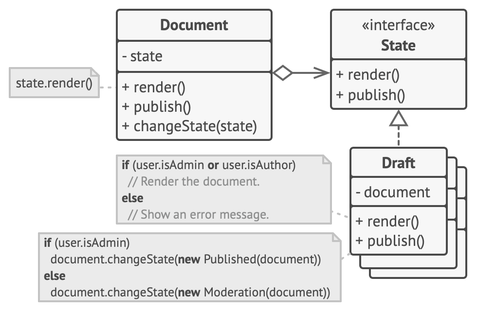

Document delegates the work to a state object.

To transition the context into another state, replace the active state object with another object that represents that new state. This is possible only if all state classes follow the same interface and the context itself works with these objects through that interface.

This structure may look similar to the **Strategy** pattern, but there’s one key difference. In the State pattern, the particular states may be aware of each other and initiate transitions from one state to another, whereas strategies almost never know about each other.

### :car: Real-World Analogy

The buttons and switches in your smartphone behave differently depending on the current state of the device:

- When the phone is unlocked, pressing buttons leads to executing various functions.

- When the phone is locked, pressing any button leads to the unlock screen.

- When the phone’s charge is low, pressing any button shows the charging screen.

### :construction: Structure

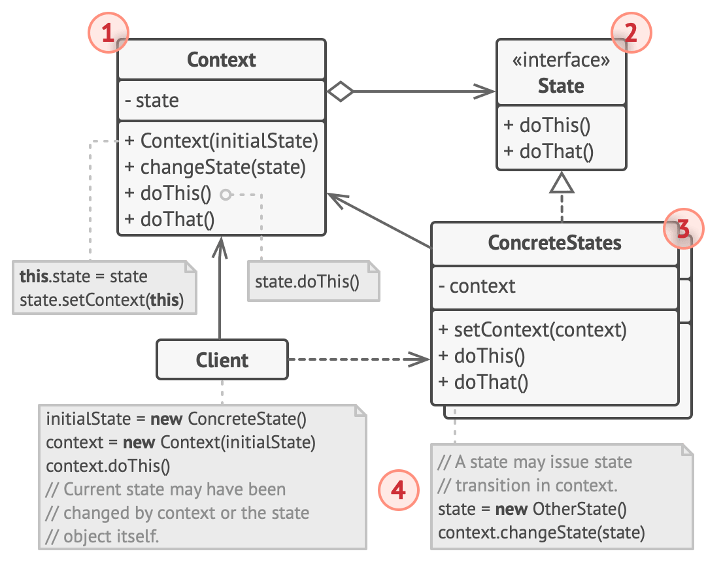

1. **Context** stores a reference to one of the concrete state objects and delegates to it all state-specific work. The context communicates with the state object via the state interface. The context exposes a setter for passing it a new state object.

2. The **State** interface declares the state-specific methods. These methods should make sense for all concrete states because you don’t want some of your states to have useless methods that will never be called.

3. **Concrete States** provide their own implementations for the state-specific methods. To avoid duplication of similar code across multiple states, you may provide intermediate abstract classes that encapsulate some common behavior.

State objects may store a backreference to the context object. Through this reference, the state can fetch any required info from the context object, as well as initiate state transitions.

4. Both context and concrete states can set the next state of the context and perform the actual state transition by replacing the state object linked to the context.

### :hash: Pseudocode


In this example, the **State** pattern lets the same controls of the media player behave differently, depending on the current playback state.

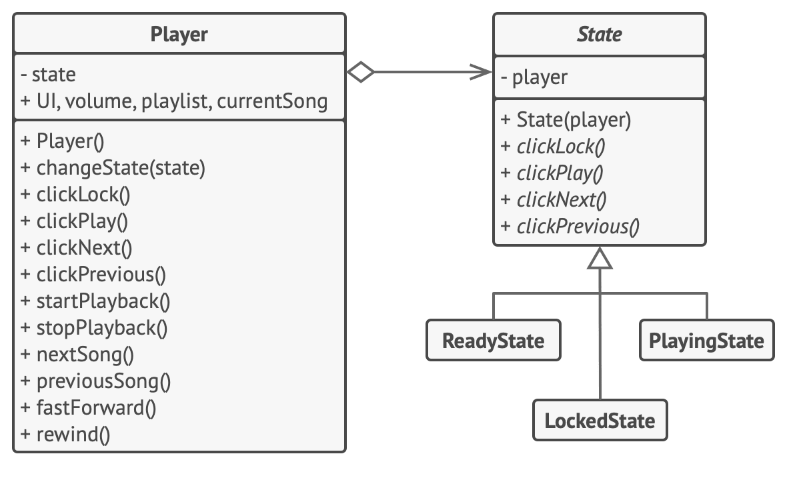

Example of changing object behavior with state objects.

The main object of the player is always linked to a state object that performs most of the work for the player. Some actions replace the current state object of the player with another, which changes the way the player reacts to user interactions.

```c++
// The AudioPlayer class acts as a context. It also maintains a
// reference to an instance of one of the state classes that
// represents the current state of the audio player.
class AudioPlayer is
    field state: State
    field UI, volume, playlist, currentSong

    constructor AudioPlayer() is
        this.state = new ReadyState(this)

        // Context delegates handling user input to a state
        // object. Naturally, the outcome depends on what state
        // is currently active, since each state can handle the
        // input differently.
        UI = new UserInterface()
        UI.lockButton.onClick(this.clickLock)
        UI.playButton.onClick(this.clickPlay)
        UI.nextButton.onClick(this.clickNext)
        UI.prevButton.onClick(this.clickPrevious)

    // Other objects must be able to switch the audio player's
    // active state.
    method changeState(state: State) is
        this.state = state
        
    // UI methods delegate execution to the active state.
    method clickLock() is
        state.clickLock()
    method clickPlay() is
        state.clickPlay()
    method clickNext() is
        state.clickNext()
    method clickPrevious() is
        state.clickPrevious()

    // A state may call some service methods on the context.
    method startPlayback() is
        // ...
    method stopPlayback() is
        // ...
    method nextSong() is
        // ...
    method previousSong() is
        // ...
    method fastForward(time) is
        // ...
    method rewind(time) is
        // ...


// The base state class declares methods that all concrete
// states should implement and also provides a backreference to
// the context object associated with the state. States can use
// the backreference to transition the context to another state.
abstract class State is
    protected field player: AudioPlayer

    // Context passes itself through the state constructor. This
    // may help a state fetch some useful context data if it's
    // needed.
    constructor State(player) is
        this.player = player

    abstract method clickLock()
    abstract method clickPlay()
    abstract method clickNext()
    abstract method clickPrevious()


// Concrete states implement various behaviors associated with a
// state of the context.
class LockedState extends State is

    // When you unlock a locked player, it may assume one of two
    // states.
    method clickLock() is
        if (player.playing)
            player.changeState(new PlayingState(player))
        else
            player.changeState(new ReadyState(player))

    method clickPlay() is
        // Locked, so do nothing.

    method clickNext() is
        // Locked, so do nothing.

    method clickPrevious() is
        // Locked, so do nothing.

// They can also trigger state transitions in the context.
class ReadyState extends State is
    method clickLock() is
        player.changeState(new LockedState(player))

    method clickPlay() is
        player.startPlayback()
        player.changeState(new PlayingState(player))

    method clickNext() is
        player.nextSong()

    method clickPrevious() is
        player.previousSong()

class PlayingState extends State is
    method clickLock() is
        player.changeState(new LockedState(player))

    method clickPlay() is
        player.stopPlayback()
        player.changeState(new ReadyState(player))
    
    method clickNext() is
        if (event.doubleclick)
            player.nextSong()
        else
            player.fastForward(5)
    
    method clickPrevious() is
        if (event.doubleclick)
            player.previous()
        else
            player.rewind(5)

```

### :bulb: Applicability

:beetle: **Use the State pattern when you have an object that behaves differently depending on its current state, the number of states is enormous, and the state-specific code changes frequently.**

:sparkles: The pattern suggests that you extract all state-specific code into a set of distinct classes. As a result, you can add new states or change existing ones independently of each other, reducing the maintenance cost.

:beetle: **Use the pattern when you have a class polluted with massive conditionals that alter how the class behaves according to the current values of the class’s fields.**

:sparkles: The State pattern lets you extract branches of these conditionals into methods of corresponding state classes. While doing so, you can also clean temporary fields and helper methods involved in state-specific code out of your main class.

:beetle: **Use State when you have a lot of duplicate code across similar states and transitions of a condition-based state machine.**

:sparkles: The State pattern lets you compose hierarchies of state classes and reduce duplication by extracting common code into abstract base classes.

### :clipboard: How to Implement


1. Decide what class will act as the context. It could be an existing class which already has the state-dependent code; or a new class, if the state-specific code is distributed across multiple classes.


2. Declare the state interface. Although it may mirror all the methods declared in the context, aim only for those that may contain state-specific behavior.


3. For every actual state, create a class that derives from the state interface. Then go over the methods of the context and extract all code related to that state into your newly created class.

While moving the code to the state class, you might discover that it depends on private members of the context. There are several workarounds:

- Make these fields or methods public.

- Turn the behavior you’re extracting into a public method in the context and call it from the state class. This way is ugly but quick, and you can always fix it later.

- Nest the state classes into the context class, but only if your programming language supports nesting classes.

4. In the context class, add a reference field of the state interface type and a public setter that allows overriding the value of that field.

5. Go over the method of the context again and replace empty state conditionals with calls to corresponding methods of the state object.

6. To switch the state of the context, create an instance of one of the state classes and pass it to the context. You can do this within the context itself, or in various states, or in the client. Wherever this is done, the class becomes dependent on the concrete state class that it instantiates.

### ⚖️ Pros and Cons

:heavy_check_mark: Single Responsibility Principle. Organize the code related to particular states into separate classes.

:heavy_check_mark: Open/Closed Principle. Introduce new states without changing existing state classes or the context.

:heavy_check_mark: Simplify the code of the context by eliminating bulky state machine conditionals.

:heavy_multiplication_x: Applying the pattern can be overkill if a state machine has only a few states or rarely changes.

### :arrows_counterclockwise: Relations with Other Patterns

- **Bridge**, **State**, **Strategy** (and to some degree **Adapter**) have very similar structures. Indeed, all of these patterns are based on composition, which is delegating work to other objects. However, they all solve different problems. A pattern isn’t just a recipe for structuring your code in a specific way. It can also communicate to other developers the problem the pattern solves.

- **State** can be considered as an extension of **Strategy**. Both patterns are based on composition: they change the behavior of the context by delegating some work to helper objects. Strategy makes these objects completely independent and unaware of each other. However, State doesn’t restrict dependencies between concrete states, letting them alter the state of the context at will.


<!--
### :worried: Problem
### :smiley: Solution
### :car: Real-World Analogy
### :construction: Structure
### :hash: Pseudocode
### :bulb: Applicability
:beetle:
:sparkles:
### :clipboard: How to Implement
### ⚖️ Pros and Cons
:heavy_check_mark:
:heavy_multiplication_x:
### :arrows_counterclockwise: Relations with Other Patterns
-->

[^1]: “Gang of Four” is a nickname given to the four authors of the original book about design patterns: Design Patterns: Elements of Reusable Object-Oriented Software https://refactoring.guru/gof-book.
[^2]: Aggregation: object A contains objects B; B can live without A. Composition: object A consists of objects B; A manages life cycle of B; B can’t live without A.
