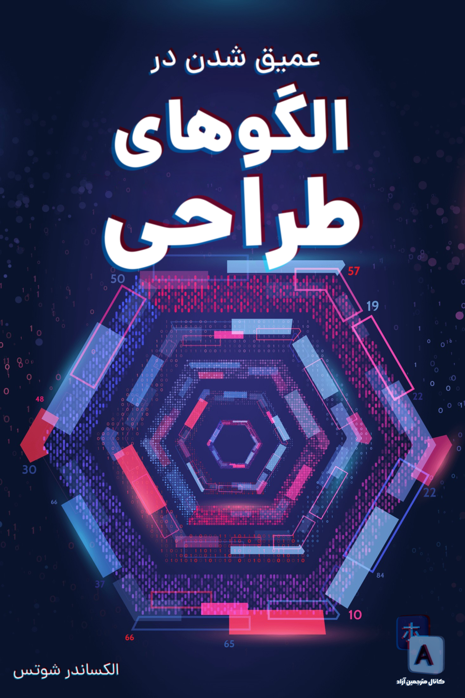

# didp-persian
ترجمه آزاد کتاب Dive into Design Patterns

قبل از شروع فهرست کتاب، اگر مایل به مشارکت هستید، [نحوه مشارکت](CONTRIBUTING.md) را حتما مطالعه کنید.

شما می توانید برای کمک کردن و خشنود کردن و انگیزه دادن به تیم ما، اهدای مالی به خیریه‌ی محک داشته باشید.
لینک درگاه خیریه محک در سمت راست صفحه درج شده است. لازم به ذکر است که اگر مبلغی را اهدا کرده اید چون ما بی خبر از آن کار هستیم، یک رسید از آن داخل [گروه تلگرامی ما](https://t.me/dfp_farsi) آپلود کنید.

همچنین می‌توانید برای دانلود کتاب (نسخه اصلی) یا مطالعه‌ی آنلاین آن از [این لینک](https://drive.google.com/file/d/15PVeuC_Jgcltq2d0ObnQcxlhyCqDGJcx/view?usp=sharing) اقدام کنید

## فهرست مطالب

- مقدمه ای بر OOP
- مقدمه ای بر الگوهای طراحی

  
اصول طراحی نرم‌افزار

   

  - اصول طراحی
  - اصول SOLID 

  
الگوهای طراحی سازنده

   

  - Factory Method
  - Abstract Factory
  - Builder
  - Prototype
  - Singleton

  
الگوهای طراحی ساختاری

   

  - Adapter
  - Bridge
  - Composite
  - Decorator
  - Facade
  - Flyweight
  - Proxy

  
الگوهای طراحی رفتاری

   

  - chain of responsibility
  - Command
  - Iterator
  - Mediator
  - Memento
  - Observer
  - State
  - Strategy
  - Template Method
  - Visitor

- نتیجه گیری

| تاریخ اتمام ترجمه      | مترجم | سرفصل     |
| :---:        |    :----:   |          :---: |
|  15 مرداد  | SepehrRasouli | Introduction to OOP |
|-|رزرو نشده| Introduction to design patterns |
|-|رزرو نشده| Software design principle |
|-|رزرو نشده| Design principle |
|  15 شهریور  | MohammadMahdi-Akhondi | SOLID principle |
|-|رزرو نشده| Factory method |
|-|رزرو نشده| Abstract factoy |
|-|رزرو نشده| Builder |
|-|رزرو نشده| Prototype |
|-|رزرو نشده| Singleton |
|-|رزرو نشده| Adapter |
|-|رزرو نشده| Bridge |
|  7 شهریور  | mehrdadbn9 | Composite |
|  15 شهریور  | MohammadMahdi-Akhondi | Decorator |
|-|رزرو نشده| Facade |
|-|رزرو نشده| Flyweight |
|-|رزرو نشده| Proxy |
|-|رزرو نشده| Chain of responsibility |
|-|رزرو نشده| Command |
|-|رزرو نشده| Iterator |
|-|رزرو نشده| Mediator |
|-|رزرو نشده| Memento |
|-|رزرو نشده| Observer |
|-|رزرو نشده| State |
|-|رزرو نشده| Strategy |
|-|رزرو نشده| Template method |
|-|رزرو نشده| Visitor & Conclusion|

## ممنون از افرادی که در ترجمه این کتاب مشارکت داشتند :

